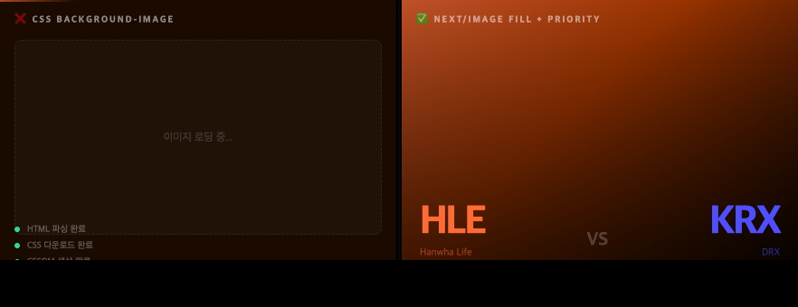
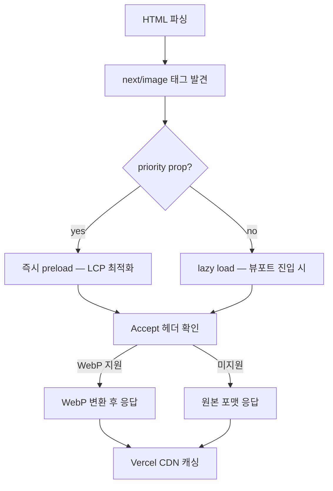

# CSS `backgroundImage`의 한계, `next/image`로 교체하면 얻는 것

> 작성일: 2026-05-07  
> 태그: #성능튜닝 #nextjs #tailwind  
> 출발점: 경기 상세·팀 상세 페이지 배경 이미지를 CSS `backgroundImage`에서 `next/image`로 교체 (Phase 4)  
> 원본 기록: [../backlog.md](../backlog.md)

---

## 한 줄 요약

CSS `background-image`는 브라우저가 CSSOM을 다 파싱해야 비로소 이미지 요청을 보낸다


> 왼쪽: CSS background-image — CSSOM 파싱 후에야 이미지 요청, 그동안 빈 화면. 오른쪽: next/image priority — HTML 파싱 즉시 preload, 팀 배경이 바로 렌더링됨. — `next/image`로 교체하면 WebP 자동변환 + CDN 캐싱 + LCP 개선을 공짜로 얻는다.

---

## 배경 지식

### CSS `background-image`가 느린 이유

브라우저 렌더링 파이프라인에서 이미지 요청 타이밍이 중요하다.

```
HTML 파싱 → DOM 생성
CSS 다운로드 → CSSOM 생성
DOM + CSSOM → Render Tree
Render Tree → "background-image: url(...)" 발견
→ 이때서야 이미지 요청 시작 ← 여기가 문제
```

반면 `` 태그 (또는 `next/image`)는 HTML 파싱 단계에서 바로 발견되므로 CSS 로딩과 병렬로 요청이 나간다.

Google 측정 기준, 이 **resource load delay** 차이가 중앙값 기준 약 400ms라고 한다. LCP 이미지가 배경으로 박혀 있으면 CWV 점수에 직격탄을 맞는다. CoreDash 데이터에서 hero 배경을 ``로 바꾼 것만으로 LCP 중앙값 35% 개선 사례가 있다.

### `` vs `background-image` 주요 차이

| 항목 | `` / `next/image` | CSS `background-image` |
|---|---|---|
| 브라우저 발견 시점 | HTML 파싱 즉시 | CSSOM 파싱 완료 후 |
| `loading="lazy"` | ✅ 네이티브 지원 | ❌ JS 라이브러리 필요 |
| `fetchpriority="high"` | ✅ 지원 | ❌ 미지원 |
| LCP 후보 | ✅ 자동 인식 | ⚠️ 조건부 (일부 브라우저만) |
| WebP 자동변환 | next/image 사용 시 자동 | ❌ 직접 처리 |
| CDN 캐싱 | next/image 기본 제공 | ❌ 직접 설정 |

### `next/image`가 해주는 것 3가지

**1. WebP/AVIF 자동변환**  
요청의 `Accept` 헤더를 보고 브라우저가 지원하면 자동으로 WebP나 AVIF로 변환해서 응답한다. Sharp 압축 + 포맷 변환 합산 시 원본 대비 **60~80% 파일 크기 절감** 효과가 나온다고 알려져 있다. PNG·JPEG 원본을 WebP로 바꾸는 것만으로도 25~35% 절감.

**2. CDN 캐싱**  
Vercel 배포 시 `/_next/image?url=...&w=1920&q=75` 형태의 최적화 URL이 자동 생성되고, Vercel Edge Network(CDN)가 이 결과를 캐싱한다. 두 번째 요청부터는 캐시에서 바로 응답. 별도 CDN 설정 불필요.

**3. `sizes` + `srcset` 자동 생성**  
`sizes="100vw"` 를 주면 Next.js가 디바이스 해상도별 srcset을 자동으로 만든다. 1080px 화면에서 4K 이미지를 내려받는 낭비가 사라진다.

---

## 동작 원리 / 메커니즘

### `fill` + `sizes="100vw"` 조합 흐름

```tsx
// MatchBackground.tsx — 핵심 패턴
<div className="absolute inset-0">  {/* 부모가 position:relative, 크기 확정 */}
  <Image
    src={imgA}
    alt=""
    fill                        // position:absolute + inset:0 적용
    sizes="100vw"               // srcset 생성 힌트 (뷰포트 전체 너비)
    priority                    // LCP 대상 → preload, lazy 비활성화
    style={{ objectFit: "cover", filter: "brightness(0.18) saturate(1.2)" }}
  />
</div>
```

`fill` prop은 내부적으로 `position: absolute; inset: 0`을 이미지에 적용한다. 부모 div가 `position: relative`이고 크기를 가져야 한다 — `absolute inset-0`으로 처리.



### 크로스페이드 패턴 (팀 A↔B 전환)

CSS `backgroundImage`로 크로스페이드를 구현하려면 JavaScript로 opacity를 토글하거나 두 개의 div를 겹치는 트릭이 필요하다. `next/image`로 바꿔도 동일한 구조다 — 이미지 두 장을 absolute로 겹쳐두고 opacity만 토글.

```tsx
{/* teamA 이미지 — 항상 렌더링, opacity로 표시/숨김 */}
<div style={{ opacity: bgTeam === "team_a" ? 1 : 0, transition: "opacity 1.2s ease" }}>
  <Image src={imgA} fill sizes="100vw" priority ... />
</div>

{/* teamB 이미지 */}
<div style={{ opacity: bgTeam === "team_b" ? 1 : 0, transition: "opacity 1.2s ease" }}>
  <Image src={imgB} fill sizes="100vw" priority ... />
</div>
```

왜 두 이미지 모두 `priority`? 경기 페이지 진입 시 어떤 팀이 먼저 보일지 모르므로 둘 다 preload. 배경 이미지는 LCP 후보이기도 하다.

---

## 어떤 상황에서 마주쳤나

`MatchBackground.tsx` 초기 구현은 CSS `backgroundImage` 방식이었을 가능성이 높다 (혹은 plain `` + absolute). Phase 4에서 `next/image`의 `fill` prop으로 교체하면서:

- `src/app/matches/[id]/_components/MatchBackground.tsx` — 경기 A팀/B팀 로고 배경, 크로스페이드
- `src/app/teams/[slug]/page.tsx:195-215` — 팀 슬러그 기반 히어로 배경 이미지

두 곳 모두 동일한 패턴: `fixed inset-0 -z-10` 컨테이너 안에 `absolute inset-0` div + `Image fill`.

---

## 해당 상황을 반복하지 않으려면 어떤 조치를 취해야 하나?

**전체화면 배경 이미지는 처음부터 `next/image fill`로 시작한다.**

체크리스트:
- `fill` prop → 부모에 `position: relative` (또는 Tailwind `relative`) + 명시적 크기 필요
- `sizes="100vw"` → 뷰포트 전체 너비 이미지라면 이게 기본값
- LCP 대상 이미지면 `priority` → preload로 처리됨
- `objectFit: "cover"` → CSS `background-size: cover`와 동일 효과

CSS `backgroundImage`를 쓸 합당한 이유가 없다면 무조건 `next/image`.

---

## 헷갈렸던 부분 / 함정

**"fill 쓰면 부모 크기가 필요하다는 게 뭔 소리?"**  
처음엔 `fill`이 알아서 화면 꽉 채워주는 줄 알았다. 실제로는 `position: absolute; inset: 0`을 적용하는 것이고, `position: relative`인 조상 요소의 크기를 따라간다. 부모가 `0 x 0`이면 이미지도 안 보인다. → `absolute inset-0` 부모 div를 꼭 만들어줘야 한다.

**"`priority` 없어도 되지 않나?"**  
배경 이미지는 `priority` 없으면 lazy load 대상이 된다. 화면에 진입 즉시 보여야 하는 배경인데 lazy되면 빈 배경이 잠깐 깜빡인다. 전체화면 배경은 `priority` 필수.

**"alt="" 비워도 되나?"**  
장식용 이미지(배경)는 alt를 빈 문자열로 남겨도 된다. 스크린 리더가 무시한다. alt 없으면 Next.js가 경고를 뱉으니 `alt=""`로 명시.

**"CSS backgroundImage에서 크로스페이드가 더 간단하지 않나?"**  
단일 div의 `background-image`를 바꿀 때는 트랜지션이 안 먹는다 (`background-image`는 interpolatable하지 않음). 어차피 두 div를 겹쳐서 opacity 토글하는 방식이 필요 — 그럼 `next/image`로 하는 게 성능도 낫고 구조도 동일하다.

---

## 응용·확장

- **OG 이미지**: `src/app/api/og/route.ts`에서 Vercel OG(`@vercel/og`)가 있음 — 여기서도 동적 이미지를 WebP로 자동 최적화함
- **`next.config.js` remotePatterns**: 외부 URL 이미지를 `next/image`로 쓰려면 도메인 허용 필요. `TEAM_IMAGE`가 로컬 파일이라면 무관
- **AVIF**: Next.js는 WebP보다 더 작은 AVIF도 지원. `next.config.js`의 `formats` 옵션으로 우선순위 설정 가능
- **blur placeholder**: `placeholder="blur"` + `blurDataURL` 로 skeleton 없이 부드러운 로딩 처리 가능 (배경 이미지에 특히 어울림)

---

## 참고 자료

- [Next.js Image Component API Reference](https://nextjs.org/docs/app/api-reference/components/image) — fill, sizes, priority prop 공식 설명
- [How To Fix LCP for Background Images — DebugBear](https://www.debugbear.com/blog/largest-contentful-paint-background-images) — CSS background의 LCP 문제 실측 데이터
- [Background images are evil — CoreWebVitals.io](https://www.corewebvitals.io/pagespeed/background-images-are-evil) — hero 배경을 img로 바꿔 LCP 35% 개선 사례
- [Image performance — web.dev](https://web.dev/learn/performance/image-performance) — 전반적인 이미지 성능 가이드
