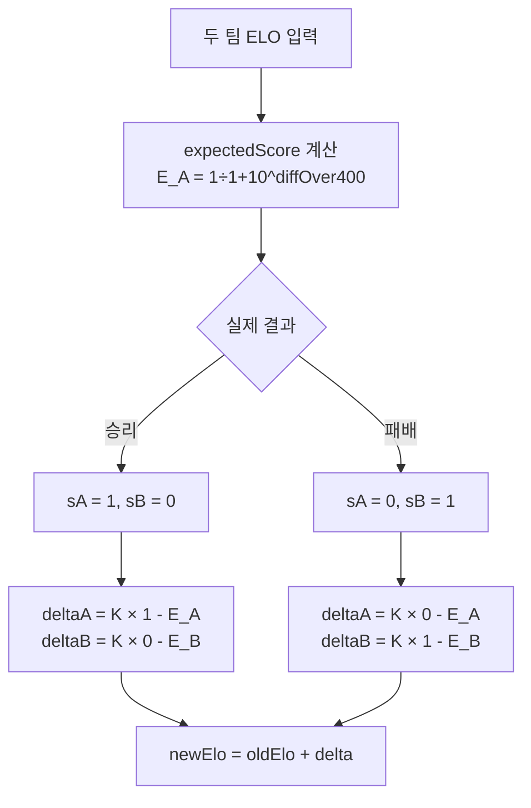
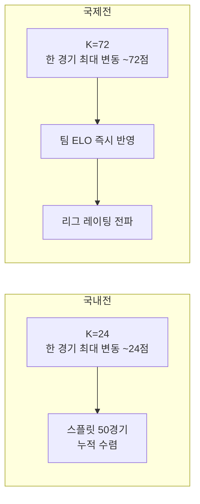

# 제목 — "ELO 알고리즘 기초와 K팩터"

> 작성일: 2026-05-07  
> 태그: #개념정리 #typescript #elo #lck  
> 출발점: FanClash에 ELO 시스템을 처음 도입하고 국내전/국제전 K팩터를 다르게 설정하게 된 이유  
> 원본 기록: [../06-dev-log.md](../06-dev-log.md) — Phase 2 "4월 29일 ELO 첫 도입", Phase 4 "ELO 최종 안정화"  
> 코드 참고: [../../src/lib/elo.ts](../../src/lib/elo.ts)

---

## 한 줄 요약

ELO는 "예상보다 잘하면 올라가고, 예상보다 못하면 내려간다"는 공식이고, K팩터는 그 올라가고 내려가는 폭을 조절하는 감도 값이다. 국제전에 K×3을 쓰는 건 국제전 한 경기가 국내전 3경기분의 정보량을 담고 있기 때문이다.

---

## 배경 지식

### ELO란 무엇인가

1960년대 아르파드 엘로(Arpad Elo) 물리학 교수가 체스 플레이어 순위를 매기기 위해 고안한 수치 시스템. 핵심 아이디어: **"현재 레이팅 차이로 예상 승률을 계산하고, 실제 결과가 그 예상에서 얼마나 벗어났는지만큼 레이팅을 조정한다."**

체스에서 시작했지만 지금은 게임(LOL 솔로랭크), 스포츠(축구 FIFA랭킹), e스포츠 단체전까지 폭넓게 쓰인다.

### 핵심 전제

레이팅 차이 400점 = 약 10배 승률 차이. 예를 들어:
- A(1700) vs B(1300): 차이 400점 → A 승률 약 91%
- A(1600) vs B(1500): 차이 100점 → A 승률 약 64%
- A(1500) vs B(1500): 차이 0점 → 양쪽 50%

이 "10배 법칙"은 로지스틱 함수(`10^(diff/400)`)에서 나온다. 400이라는 숫자는 체스 커뮤니티에서 경험적으로 정해진 상수다.

---

## 동작 원리 / 메커니즘

### Step 1 — 예상 점수(Expected Score) 계산

```
E_A = 1 / (1 + 10^((R_B - R_A) / 400))
```

- `R_A`, `R_B`: 각 팀의 현재 ELO
- 결과값은 0~1 사이의 확률 (1 = 확실한 승리, 0.5 = 반반)
- 코드: `src/lib/elo.ts:35` `expectedScore()`

```typescript
export function expectedScore(rA: number, rB: number): number {
  return 1 / (1 + 10 ** ((rB - rA) / 400))
}
```

### Step 2 — 실제 결과(Actual Score)

| 결과 | 점수 |
|---|---|
| 승리 | 1 |
| 패배 | 0 |
| 무승부 | 0.5 (e스포츠엔 없음) |

### Step 3 — ELO 변화량 계산

```
ΔR = K × (실제 점수 - 예상 점수)
```

- 이기면 `실제 점수 = 1`, 예상보다 잘했으면 양수 → 레이팅 올라감
- 지면 `실제 점수 = 0`, 예상보다 못했으면 음수 → 레이팅 내려감
- **이긴 팀과 진 팀의 절댓값이 같다** (제로섬)

### 실제 계산 예시

T1(1600) vs GEN(1500)일 때:

```
E_T1 = 1 / (1 + 10^((1500 - 1600) / 400))
     = 1 / (1 + 10^(-0.25))
     = 1 / (1 + 0.562)
     ≈ 0.640  (T1 예상 승률 64%)

T1이 이겼을 때, K=24라면:
ΔT1 = 24 × (1 - 0.640) = 24 × 0.360 ≈ +9
ΔGEN = 24 × (0 - 0.360) = 24 × (-0.360) ≈ -9

T1이 졌을 때, K=24라면:
ΔT1 = 24 × (0 - 0.640) = 24 × (-0.640) ≈ -15
ΔGEN = 24 × (1 - 0.360) = 24 × 0.640 ≈ +15
```

→ 강팀이 이기면 조금 오르고, 강팀이 지면 많이 내려간다. 합리적.



---

## K팩터 — "감도 조절 나사"

### K팩터가 뭔가

K가 크면 한 경기로 레이팅이 크게 흔들리고, K가 작으면 천천히 움직인다.

| K 값 | 특성 |
|---|---|
| 작은 K (10~15) | 안정적, 실력을 충분히 쌓인 뒤 정확해짐, 이변에 둔감 |
| 큰 K (40~80) | 민감, 신규 플레이어나 중요 대회에 적합, 이변에 반응 빠름 |

FIDE(체스 국제연맹) 기준:
- 신입 30경기: K=40 (레이팅 미정, 빠르게 수렴시킴)
- 일반 플레이어: K=20
- 엘리트(2400+): K=10 (이미 레이팅이 정확하니 안정 유지)

### FanClash의 K팩터 설계

`src/lib/elo.ts:27` `kFactor()`:

```typescript
const K_BASE = 24
const INTL_K_MULTIPLIER = 3.0

export function kFactor(elo: number, intl: boolean): number {
  const base = intl ? K_BASE * INTL_K_MULTIPLIER : K_BASE  // 72 또는 24
  if (elo >= 1600) return base * 0.70   // 강팀: 안정
  if (elo >= 1500) return base * 0.85   // 중상위: 약간 안정
  if (elo <= 1250) return base * 1.15   // 약팀: 민감 (실력 파악 아직 중)
  return base                            // 기본
}
```

유효 K값 범위 (국내전 기준, 반올림):

| ELO 구간 | 유효 K |
|---|---|
| 1600+ (강팀) | 24 × 0.70 = **16.8** |
| 1500~1599 | 24 × 0.85 = **20.4** |
| 1251~1499 | **24** (기본) |
| ~1250 (약팀) | 24 × 1.15 = **27.6** |

국제전이면 전부 ×3.

---

## 왜 국내전 24, 국제전 72인가

### 국내전 K=24를 기준으로 잡은 이유

체스 표준 K=20을 출발점으로 삼되, e스포츠는 체스보다 팀 컨디션·패치 변수가 크기 때문에 약간 높은 24로 설정. 한 경기로 레이팅이 과도하게 흔들리지 않으면서, 스플릿 동안 충분히 수렴하는 값으로 경험적으로 정했다.

LCK는 스플릿당 약 50~60경기 → K=24면 스플릿 종료 시 레이팅 수렴 충분.

### 국제전 K=72 (= 24 × 3)를 쓰는 이유

두 가지 근거:

**1. 정보량 차이**  
국내전은 "같은 리그 안 팀끼리" 붙는다. 이미 비슷한 환경에서 많이 만났으니 ELO 예측이 상대적으로 정확하다. 반면 국제전은 **리그 간 첫 교차 정보**다. 서로 얼마나 강한지 처음 드러나는 순간이므로 레이팅 업데이트를 강하게 해야 실력이 빠르게 반영된다.

**2. 리그 레이팅 전파**  
FanClash는 팀 개인 ELO 외에 **리그 레이팅**이 별도로 있다. 국제전 결과는 팀 ELO뿐 아니라 해당 리그 전체 레이팅에도 전파된다. 강한 K=72로 팀 ELO가 크게 움직이고, 그 차이가 리그 레이팅 보정에도 연쇄적으로 작용한다.



### 3배라는 숫자의 근거

Riot Games의 공개 자료나 표준 스펙이 있는 건 아니다. 국제전이 단순히 "중요한 경기"가 아니라 **완전히 다른 정보를 담은 교차 샘플**이라는 논리로, LCK 팬덤 커뮤니티 및 e스포츠 랭킹 시스템들이 경험적으로 수렴한 값이 2~3배 범위다. 여기선 3.0 선택.

---

## 추가 보정 — 폼 & 마진

K 위에 두 가지 곱수가 더 있다 (최종 K = kFactor × margin × formMultiplier):

### 폼 보정 (formMultiplier)

```typescript
export function formMultiplier(recentResults: boolean[]): number {
  if (recentResults.length === 0) return 1.0
  const wins = recentResults.filter(Boolean).length
  return 0.8 + (wins / recentResults.length) * 0.4
}
```

최근 5경기 기반. 5연승이면 `0.8 + 1.0×0.4 = 1.2`, 5연패면 `0.8 + 0×0.4 = 0.8`. 핫폼 팀은 감도 높여서 레이팅이 빨리 반영되고, 냉각기 팀은 둔하게 움직인다.

범위: 0.8 ~ 1.2 (±20%)

### 마진 보정 (marginMultiplier)

```typescript
export function marginMultiplier(scoreW: number, scoreL: number): number {
  return scoreW - scoreL >= 2 ? 1.15 : 1.0
}
```

3:0, 3:1처럼 2경기 이상 차이나는 대승이면 ×1.15. 단순 승리보다 압도적인 경우 정보량이 더 많다는 논리. 15% 추가.

---

## 어떤 상황에서 마주쳤나

Phase 2 (2026-04-29): ELO 첫 도입 당시 K=24 단일값으로 시작. 국내전/국제전 구분 없었음.

Phase 3~4 (2026-05-01~07): 리그 확장(LPL/LEC/LCS)하면서 국제전 결과가 국내 ELO에 충분히 반영 안 된다는 문제 인식 → `INTL_K_MULTIPLIER = 3.0` 도입 + 리그 레이팅 분리 구조 추가.

---

## 해당 상황을 반복하지 않으려면 어떤 조치를 취해야 하나?

- ELO 관련 수치를 직접 손대지 말고 반드시 `src/lib/elo.ts`의 함수만 사용 (`CLAUDE.md` 규칙)
- 국제전 여부 판정은 `isInternational(matchDate)` 에서만. 날짜 범위 수정 필요할 때는 `INTL_PERIODS` 배열만 건드린다
- K팩터 튜닝할 때는 `K_BASE`와 `INTL_K_MULTIPLIER`만 수정. 함수 구조는 건드리지 않음

---

## 헷갈렸던 부분 / 함정

- **"이긴 팀이 올라가는 폭 = 진 팀이 내려가는 폭"이라 착각했음**
  → 사실 둘의 K가 다를 수 있다 (ELO 구간에 따라 계수가 다름). 이긴 팀 K와 진 팀 K가 독립적으로 계산된다. 제로섬이 아닐 수 있다.

  예: T1(1600, K=16.8)이 약팀(1250, K=27.6)을 이기면  
  ΔT1 ≈ +3, Δ약팀 ≈ -25 → 총 -22점이 사라짐 (레이팅 전체 총량은 보존 아님)

- **K가 클수록 좋다고 생각했음**
  → 이미 충분한 경기 수를 쌓은 팀에게 높은 K는 노이즈를 증폭한다. 한 번의 이변에 레이팅이 과도하게 흔들린다. 그래서 강팀(1600+)은 `×0.70`으로 K를 줄인다.

- **국제전 K×3이 단순히 "중요도"를 높이는 것이라고 생각했음**
  → 더 정확히는 "리그 간 교차 샘플의 정보량"을 반영하는 것. 처음 만나는 상대방에 대한 정보이므로 업데이트 강도를 높여야 레이팅이 빠르게 수렴한다.

---

## 응용·확장

- **시뮬레이션에서 ELO 활용**: `src/lib/simulation.ts`에서 `winProbability(eloA, eloB)`를 사용해 50,000회 몬테카를로 시뮬레이션으로 LCK 진출 확률 계산. ELO가 정확할수록 시뮬레이션 결과도 정확해진다.
- **앵커 역산**: GPL 같은 국제전 성적이 기록된 시점부터 초기 ELO를 역산해서 할당하는 "앵커 보정" → [anchor 소급 보정 노트](./2026-05-07-anchor-소급보정과-선형분산.md)
- **더 파볼 것**: Glicko-2 (K를 고정 않고 신뢰도 불확실성까지 함께 트래킹), TrueSkill (팀전에 특화된 마이크로소프트 시스템)

---

## 참고 자료

- [Elo rating system — Wikipedia](https://en.wikipedia.org/wiki/Elo_rating_system) — 공식과 역사 서술 가장 정확
- [FIDE K-factor rules](https://www.chess.com/terms/elo-rating-chess) — 체스 표준 K값 기준 (K=10/20/40)
- [Global Power Rankings in Esports](https://boostroyal.com/blog/global-power-rankings-in-esports-the-rating-system-explained) — e스포츠 ELO 적용 사례
- [Optimizing K-factor in Elo Rating Systems (ResearchGate)](https://www.researchgate.net/publication/397318383_Optimizing_K-factor_in_Elo_Rating_Systems) — K팩터 최적화 연구
