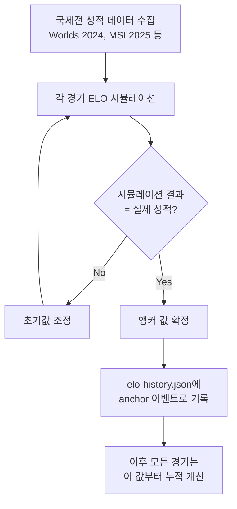
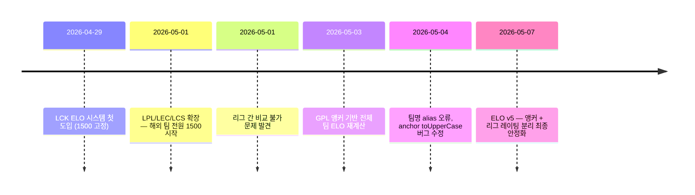

# 제목 — "1500 고정값의 한계, GPL 앵커로 초기 ELO를 역산하는 방식"

> 작성일: 2026-05-07  
> 태그: #설계결정 #elo #lck  
> 출발점: 다국화 확장 시 1500 고정 초기값으로는 리그 간 실력 격차가 반영되지 않는 문제  
> 원본 기록: [../06-dev-log.md](../06-dev-log.md) — Phase 3 "ELO 앵커 도입과 고통" 섹션

## 한 줄 요약

1500은 "아무것도 모를 때 쓰는 값"이고, GPL 앵커는 "이미 알고 있는 성적으로 시작점을 역산하는 값"이다.

---

## 배경 지식

### ELO에서 초기값이 왜 중요한가

ELO는 **상대적 실력 차이**를 추적한다. 두 팀이 붙으면 기댓값과 실제 결과의 차이만큼 점수가 이동한다.

```
expectedScore(A, B) = 1 / (1 + 10^((B - A) / 400))
deltaA = K * (실제결과 - 기댓값)
```

K=24 기준으로, 1500 vs 1500이면 승자 +12 / 패자 -12. 격차가 클수록 이변 보정이 크다.

문제는 **수렴 속도**다. LCK에서 Gen.G가 T1을 압도하는 시즌이 있어도, 둘 다 1500에서 시작하면 수십 경기를 거쳐야 실력 차이가 숫자에 반영된다. "초기값이 틀리면 수렴까지 잡음이 많다."

### GPL이란

GPL = Global Power Level. 국제전(Worlds, MSI) 성적에서 역산한 리그별/팀별 절대 실력 수치.

이 프로젝트에서는 **과거 국제전 경기 데이터를 직접 시뮬레이션**해서 "그 성적이 나오려면 초기값이 얼마여야 하는가"를 역산했다.

```
역산 흐름:
과거 국제전 결과 (W/L 기록)
  → 각 경기에서 ELO 변동 시뮬레이션
  → 시뮬레이션 결과가 실제 성적에 수렴하는 초기값 탐색
  → 그 값을 앵커(anchor)로 고정
```

---

## 동작 원리 / 메커니즘

### 앵커 이벤트가 하는 일

`data/elo-history.json`의 이벤트 목록에서 `type: "anchor"` 이벤트가 등장하면, 그 시점 이후 **모든 팀의 ELO 기준점이 한 번에 교체**된다.

```json
{
  "date": "2024-09-08",
  "type": "anchor",
  "anchorLabel": "2024 Split 2",
  "eloAfter": {
    "geng": 1663,
    "blg": 1602,
    "hle": 1572,
    "t1": 1507,
    "lr":  1044
  }
}
```

1500 고정값이 아니라, 팀마다 **다른 시작점**을 갖게 된다.

### 실제 분포

첫 앵커(2024 Split 2) 기준 50팀의 초기 ELO 분포:

| 항목 | 값 |
|---|---|
| 최솟값 | 1044 (LR, Fnatic Academy 계열) |
| 최댓값 | 1663 (Gen.G, LCK 정상) |
| 평균 | 1321 |
| 1500 초과 팀 수 | 약 8팀 |

1500이 **기준선이 아님**. 대부분 팀은 1500 아래. 국제전에서 두각을 드러낸 팀만 1500 이상.



### 국제전 leagueRatingDelta 전파

앵커가 초기값을 고정하면, 이후 국제전 경기에서는 **리그 전체에 추가 전파**가 붙는다.

```json
{
  "league": "WORLDS",
  "isInternational": true,
  "eloDelta": { "blg": 4, "mad": -4 },
  "leagueRatingDelta": { "LPL": 7, "LEC": -7 }
}
```

BLG(LPL)가 MAD(LEC)를 이기면:
- BLG 개인 ELO +4
- LPL 리그 레이팅 +7 (LPL 소속 팀 전원에 전파)
- MAD 개인 ELO -4
- LEC 리그 레이팅 -7 (LEC 소속 팀 전원에 전파)

앵커가 "시작점 역산"이라면, leagueRatingDelta는 "결과를 리그 단위로 누적"하는 메커니즘이다.

---

## 어떤 상황에서 마주쳤나

LPL/LEC/LCS를 확장하면서 팀이 50개로 늘었다. LCK 팀들은 수십 경기 누적 ELO가 있는데, 새로 추가된 해외 팀들은 1500에서 시작하면 **비교 자체가 무의미**해진다.

Gen.G 1663 vs 새 LPL 팀 1500이면 Gen.G가 압도적으로 유리해 보이지만, 실제로는 해당 LPL 팀이 더 강할 수 있다. 팬 예측 확률이 완전히 틀린 값을 뱉는 문제가 생겼다.



---

## 해당 상황을 반복하지 않으려면

**새 리그나 팀을 추가할 때는 항상 앵커 값을 먼저 결정한다.** 과거 국제전 데이터가 있다면 역산, 없다면 같은 리그 평균값을 사용한다. 1500으로 시작하면 수십 경기 후에나 실제 실력이 반영되고, 그동안 시뮬레이션 확률이 오염된다.

`INITIAL_ELO = 1500` ([src/lib/elo.ts:3](../../src/lib/elo.ts)) 상수는 **신규 팀의 폴백**으로만 쓴다. 새 리그 추가 시에는 `elo-history.json`에 anchor 이벤트를 먼저 추가하는 것이 원칙.

---

## 헷갈렸던 부분 / 함정

**"앵커 이벤트 = 단순 리셋"으로 오해하기 쉽다.**
처음엔 앵커가 모든 팀을 특정 값으로 덮어쓰는 리셋이라고 생각했다. 실제로는 역산된 절대 값이고, 이후 경기에서 계속 누적된다. 앵커는 초기화가 아니라 **"교정된 출발점 재설정"**이다.

**anchor 이벤트에는 `teamA/B` 필드가 없다.**
매치 이벤트를 처리하던 차트 렌더 코드가 모든 이벤트에서 `teamA.toUpperCase()`를 호출하다가 anchor 이벤트에서 `Cannot read properties of undefined` 오류가 터졌다. 이벤트 타입 분기를 먼저 체크해야 한다.

```typescript
// 잘못된 방식
const label = event.teamA.toUpperCase()  // anchor에서 터짐

// 올바른 방식
if (event.type === 'anchor') {
  // anchorLabel 사용
} else {
  const label = event.teamA.toUpperCase()
}
```

**`2026_Current` anchor 제거 이유.**
시즌 중에 "현재" anchor를 박으면 진행 중인 경기들의 ELO가 anchor로 덮어써지면서 Split1 이후 ELO가 폭락하는 현상이 발생했다. anchor는 시즌 종료 시점에만 붙여야 한다.

| 상황 | Before | After |
|---|---|---|
| 앵커 방식 | 1500 고정 (모든 팀 동일) | GPL 역산 (팀마다 다름: 1044~1663) |
| LPL 강팀 초기값 | 1500 | 1600+ |
| 비교 유효성 | 수십 경기 후에나 의미 있음 | 첫 경기부터 실력 반영 |
| anchor 이벤트 팀 필드 | - | `teamA/B` 없음, 반드시 타입 분기 필요 |

---

## 응용·확장

- **새 스플릿 시작 시**: 전 시즌 성적으로 anchor 값 갱신. 강등/승격 팀 처리 방식도 고려 필요.
- **평균 회귀(mean reversion)**: 일부 ELO 시스템은 시즌 간 이월 시 1500 방향으로 일부 수렴시킨다. 이 프로젝트는 이월을 그대로 쓰는 대신 anchor로 교정.
- **체스 FIDE ELO**: 신규 플레이어는 첫 20게임을 K=40으로 빠르게 수렴시킨 다음 K를 낮춘다. "초기값 불확실성 보정"의 다른 접근법.
- TODO: LCK 승강전 팀(예: 2군 → 1군 승격) 처리 — 해당 팀 anchor 없으면 1500 폴백인데, 전 시즌 2군 성적 기반 역산이 가능할지 검토 필요.

---

## 참고 자료

- [src/lib/elo.ts](../../src/lib/elo.ts) — K팩터, expectedScore, calcEloDelta 구현체
- [data/elo-history.json](../../data/elo-history.json) — anchor 이벤트 + leagueRatingDelta 실제 데이터
- [docs/06-dev-log.md Phase 3](../06-dev-log.md) — GPL 앵커 도입 전후 버그 목록
- [Wikipedia — Elo rating system](https://en.wikipedia.org/wiki/Elo_rating_system) — K팩터, 초기값 관련 스펙
