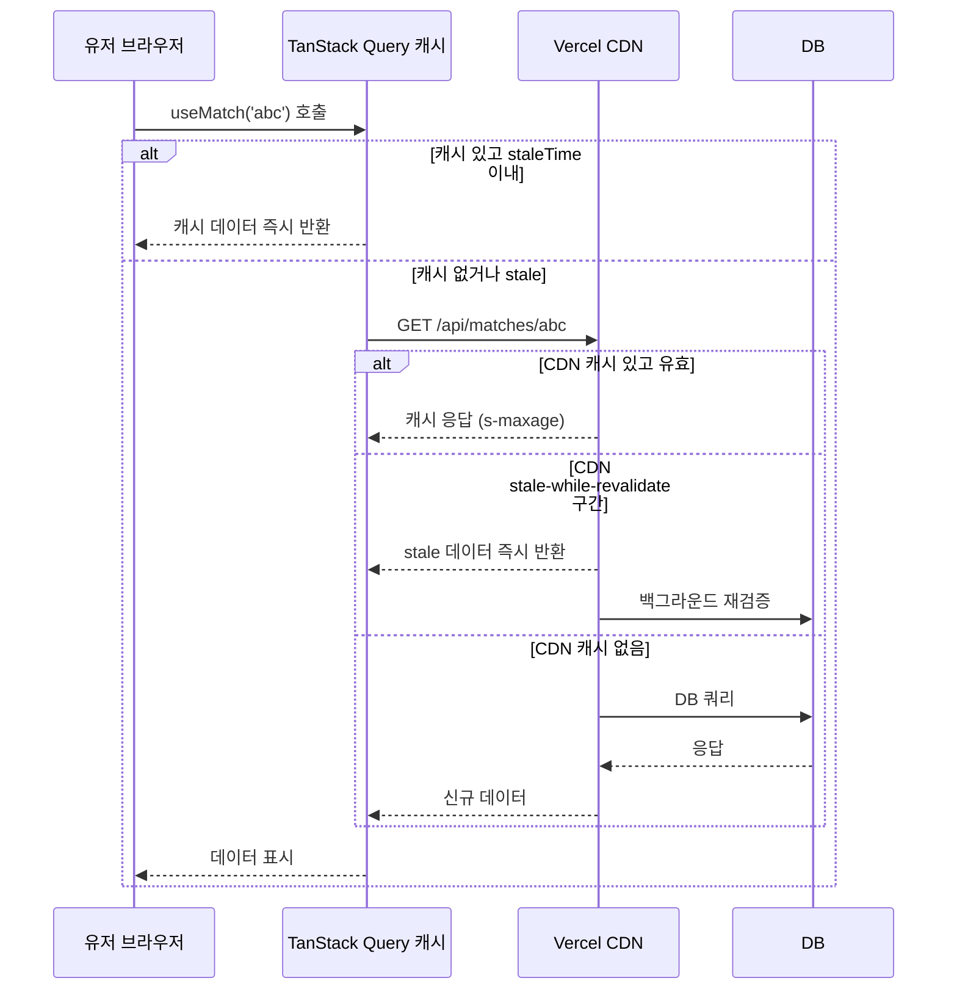

# SWR 패턴 — "캐시된 것 먼저, 갱신은 나중에"

> 작성일: 2026-05-08
> 태그: #개념정리 #tanstack-query #nextjs #성능튜닝
> 출발점: 매치 상세 페이지 초기 로딩이 느린 문제를 논의하다가 SWR 패턴 등장
> 원본 기록: [../backlog.md](../backlog.md)

## 한 줄 요약

SWR은 "캐시된 데이터 즉시 표시 → 백그라운드에서 재요청 → 조용히 교체"하는 패턴. HTTP 헤더 레벨(CDN)과 클라이언트 레벨(TanStack Query)에 각각 존재하며, 두 레이어는 독립적으로 작동한다.

## 배경 지식

### 이름의 유래

SWR은 [RFC 5861](https://datatracker.ietf.org/doc/html/rfc5861) — "HTTP Cache-Control Extensions for Stale Content"에서 나온 용어.

```
Cache-Control: max-age=600, stale-while-revalidate=30
```

- `max-age=600`: 600초간 fresh (이 구간엔 요청 자체를 안 함)
- `stale-while-revalidate=30`: 이후 30초간 stale 데이터 즉시 반환 + 동시에 백그라운드 재검증

→ Vercel/Cloudflare 같은 CDN이 이 헤더를 보고 캐시 정책 결정.

### 왜 생겼나

기존 패턴의 문제:
- **no-cache (항상 서버 확인)**: 빠르지만 서버 부하, 느린 응답 시 유저 대기
- **max-age만 (만료 전까지 캐시)**: 빠르지만 stale 데이터 노출 기간 긺

SWR은 그 중간 — "stale이어도 일단 보여주고, 동시에 갱신"

## 두 레이어 비교

| | HTTP 헤더 (서버/CDN) | TanStack Query (클라이언트) |
|---|---|---|
| 위치 | CDN, Next.js API 응답 헤더 | 브라우저 메모리 |
| 제어 | `Cache-Control: s-maxage, stale-while-revalidate` | `staleTime`, `gcTime` |
| 범위 | 글로벌 (모든 유저) | 로컬 (탭/세션 단위) |
| 키 | URL | queryKey 배열 |

FanClash에서 둘 다 사용 중:

```ts
// HTTP 헤더 (api/matches/[id]/route.ts)
res.headers.set('Cache-Control', 's-maxage=15, stale-while-revalidate=30')

// TanStack Query (queries/index.ts)
staleTime: 20_000  // 20초간 fresh, 이후 백그라운드 refetch
```



## FanClash에서 마주친 상황

"revalidate를 튜닝하면 초기 로딩이 빨라질까?" 라는 질문에서 시작됨.

결론: **revalidate는 두 번째 방문부터 효과**. 첫 방문엔 캐시가 없어서 무조건 서버까지 간다.

```
첫 방문:  브라우저 → (캐시 없음) → Vercel → DB → 응답  ← revalidate 무관
재방문:   브라우저 → (캐시 있음) → 즉시 반환           ← revalidate가 여기서 작동
```

→ 첫 방문 속도를 개선하려면 SWR/revalidate가 아니라 **서버 컴포넌트로 전환**해야 함.

## `staleTime: 0` vs `staleTime: Infinity`

| staleTime 값 | 동작 |
|---|---|
| `0` (기본값) | 마운트할 때마다 항상 stale → 매번 refetch |
| `20_000` (현재) | 20초 이내 재마운트는 캐시 사용, 20초 후 백그라운드 refetch |
| `Infinity` | 절대 stale 처리 안 함 → 수동 invalidate 전까지 재요청 없음 |

## 헷갈렸던 부분

**"revalidate = 60이면 매 60초마다 빠른가?"**
→ 아님. revalidate는 캐시 갱신 주기. 캐시가 없는 첫 요청엔 아무 의미 없음.
→ 혼동 이유: revalidate를 "응답 속도"로 착각. 사실은 "캐시 유효 기간".

**"TanStack Query staleTime이 있으면 첫 방문도 빠른가?"**
→ 아님. staleTime은 이미 캐시에 있는 데이터에만 적용. 처음 마운트엔 무조건 fetch 발생.

## 응용·확장

- `initialDataUpdatedAt: 0` 패턴 → 서버에서 받은 초기 데이터를 "stale"로 마킹해 즉시 백그라운드 refetch 유도 (→ 별도 노트 참고)
- Vercel `stale-while-revalidate` + TanStack Query `staleTime` 조합하면 CDN + 클라이언트 두 단계 캐시 구성 가능
- Vercel KV/Redis로 API 응답을 캐시하면 DB 쿼리 없이 CDN 수준 속도 달성 가능

## 참고 자료

- [RFC 5861](https://datatracker.ietf.org/doc/html/rfc5861) — HTTP Cache-Control Extensions for Stale Content 원문
- [TanStack Query: Important Defaults](https://tanstack.com/query/latest/docs/framework/react/guides/important-defaults) — staleTime 0이 기본인 이유
- [Vercel Cache-Control Headers](https://vercel.com/docs/edge-network/caching) — s-maxage, stale-while-revalidate 동작
