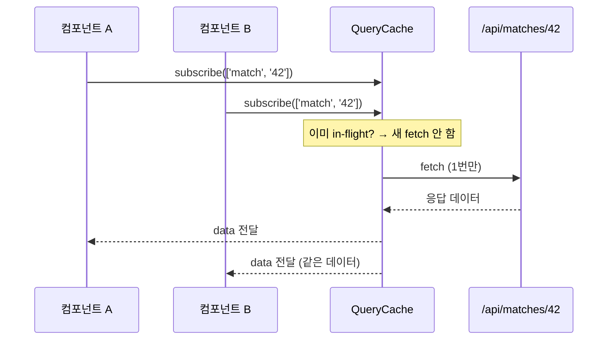

# 학습 노트 — "컴포넌트에서 직접 fetch 금지, 훅 중앙화로 얻는 것"

> 작성일: 2026-05-07  
> 태그: #설계결정 #tanstack-query #typescript #nextjs  
> 출발점: Phase 4 리팩토링 — 여러 라우트에서 중복 정의되던 fetch 로직을 `src/lib/queries/index.ts`로 중앙화  
> 원본 기록: [../06-dev-log.md](../06-dev-log.md) (Phase 4 — 리팩토링 섹션)

---

## 한 줄 요약

`useQuery` 훅을 한 파일에 모아두면 캐시 키 충돌을 막고, 동일 API를 여러 컴포넌트가 호출해도 네트워크 요청은 1번만 나간다.

---

## 배경 지식

### 왜 이 패턴이 필요한가

React에서 데이터를 가져오는 가장 단순한 방법은 `useEffect` + `useState` 조합이다.

```tsx
// 초기 방식 — 컴포넌트 안에 직접 fetch
function MatchCard({ id }: { id: string }) {
  const [match, setMatch] = useState(null)
  useEffect(() => {
    fetch(`/api/matches/${id}`).then(r => r.json()).then(setMatch)
  }, [id])
}
```

이 방식의 문제는 **동일한 엔드포인트를 여러 컴포넌트가 각자 호출**한다는 것이다.

- `MatchCard`가 5개 렌더되면 `/api/matches/42`가 5번 날아감
- 탭 이동 후 돌아오면 다시 요청
- 로딩/에러 상태를 컴포넌트마다 따로 관리
- API URL이 바뀌면 모든 컴포넌트를 찾아서 수정해야 함

TanStack Query는 **QueryCache**라는 전역 저장소를 두고, queryKey를 기준으로 중복 요청을 막는 라이브러리다. 2020년대 초 SWR과 함께 등장했고, v5(2023)에서 API가 정리됐다.

### QueryCache가 뭔가

```
QueryClient
  └─ QueryCache (전역 저장소)
       ├─ Query { key: ['match', '42'], data, status, ... }
       ├─ Query { key: ['teams', 'lck'], data, status, ... }
       └─ Query { key: ['rankings'], data, status, ... }
```

`QueryClient`는 앱 전체에 1개. `QueryCache`는 그 안에 포함되어 모든 쿼리 결과를 들고 있다. 컴포넌트가 `useQuery`를 호출하면 Observer를 통해 해당 Query를 구독한다.

---

## 동작 원리 / 메커니즘

### 1. 요청 중복 제거 (Deduplication)

동일 `queryKey`를 가진 `useQuery`가 여러 컴포넌트에서 동시에 호출되면, TanStack Query는 **Query 레벨에서 in-flight 요청을 1개로 묶는다**.

```
컴포넌트 A → useQuery(['match', '42']) ─┐
컴포넌트 B → useQuery(['match', '42']) ─┼→ 실제 fetch 1번
컴포넌트 C → useQuery(['match', '42']) ─┘
```

각 컴포넌트는 독립된 Observer를 가지지만, 네트워크 요청은 QueryCache 수준에서 합쳐진다. Observer가 여럿이어도 fetch는 1번.



### 2. staleTime — 언제까지 캐시를 믿을 건가

`staleTime`은 캐시 데이터를 **신선**하다고 간주하는 시간이다. 기본값은 `0` — 즉, 마운트할 때마다 무조건 refetch.

```tsx
// src/lib/queries/index.ts에서의 실제 설정값
export function useMatch(id: string) {
  return useQuery({
    queryKey: queryKeys.match(id),
    staleTime: 20_000,   // 20초 동안 캐시 신뢰 → 재요청 없음
  })
}

export function useMatchImpact(matchId: string) {
  return useQuery({
    staleTime: 1000 * 60 * 30,  // 30분 — 영향도 분석은 자주 안 바뀜
  })
}

export function useRecentActivity() {
  return useQuery({
    staleTime: 30_000,
    refetchInterval: 60_000,  // 1분마다 자동 폴링
  })
}
```

| 훅 | staleTime | 이유 |
|---|---|---|
| `useMatch` | 20초 | 경기 상태가 바뀔 수 있음 |
| `useMatchH2H` | 60분 | H2H 기록은 거의 안 변함 |
| `useMatchImpact` | 30분 | 판도 영향도도 고정적 |
| `useStats` | 60초 | 통계는 실시간성 덜 중요 |
| `useRecentActivity` | 30초 + 60초 폴링 | 소셜 활동은 자주 갱신 |

### 3. queryKey — 캐시를 구분하는 기준

```tsx
export const queryKeys = {
  matches: (status?: string) => status ? ['matches', status] : ['matches'],
  match: (id: string) => ['match', id],
  teams: (league?: string) => league ? ['teams', league] : ['teams'],
}
```

`queryKeys.matches('live')` → `['matches', 'live']`  
`queryKeys.matches('all')` → `['matches', 'all']`

이 두 개는 **별도 캐시**다. league, status 같은 파라미터가 키에 포함돼야 "LCK 팀 목록"과 "LPL 팀 목록"이 서로 덮어쓰지 않는다.

키를 함수로 만든 이유: 키를 문자열 리터럴로 흩뿌리면 오타가 생기고 나중에 `invalidateQueries` 할 때 어떤 키를 써야 할지 모른다. 한 곳에서 `queryKeys.match(id)` 형태로 쓰면 오타 걱정 없이 타입 체크까지 된다.

### 4. invalidateQueries — 캐시 무효화

예측 제출 성공 후, 해당 경기와 내 유저 정보를 다시 불러와야 한다.

```tsx
export function usePrediction() {
  const queryClient = useQueryClient()
  return useMutation({
    mutationFn: (body) => fetch('/api/predictions', { method: 'POST', ... }),
    onSuccess: (_, variables) => {
      // 이 두 줄이 각 훅 사용처를 찾아서 refetch 트리거
      queryClient.invalidateQueries({ queryKey: queryKeys.match(variables.matchId) })
      queryClient.invalidateQueries({ queryKey: queryKeys.me() })
    },
  })
}
```

`invalidateQueries`를 호출하면 해당 키를 구독 중인 모든 컴포넌트가 자동으로 새 데이터를 받는다. 컴포넌트가 몇 개든, 직접 찾아서 setState 안 해도 됨.

---

## 어떤 상황에서 마주쳤나

Phase 4 리팩토링 커밋:

```
refactor: High priority 리팩토링 — teamSelect 중앙화, useCountdown 훅 통합,
          NextAuth 타입 확장, 예측 통계 계산 통일
```

`teamSelect` 객체(Prisma select 필드 목록)와 함께, API fetch 로직도 분산돼 있던 상태였다. 같은 `/api/matches` 엔드포인트를 여러 컴포넌트가 각자 `fetch().then()`으로 호출하면서 staleTime 설정도 따로따로였다. → `src/lib/queries/index.ts`로 모두 이관.

---

## 해당 상황을 반복하지 않으려면 어떤 조치를 취해야 하나?

**컴포넌트에서 `fetch`를 직접 쓰는 코드를 작성하지 않는다.** CLAUDE.md에도 명시돼 있다:

> 클라이언트는 반드시 `src/lib/queries/index.ts`의 훅을 사용한다. 컴포넌트에서 직접 `fetch`하지 않는다.

새 API 엔드포인트를 추가할 때 흐름:
1. `src/app/api/...` 라우트 작성
2. `src/lib/queries/index.ts`에 `useXxx` 훅 추가 (queryKey도 `queryKeys` 객체에 등록)
3. 컴포넌트는 `useXxx()`만 호출

---

## 헷갈렸던 부분 / 함정

**"staleTime이 0이면 매번 fetch 하는 거 아닌가?"** → 맞다. 기본값 `staleTime: 0`은 컴포넌트가 마운트될 때마다 항상 refetch를 트리거한다. 하지만 **동시에 여러 컴포넌트가 같은 키로 마운트되면 그 순간 in-flight 중복은 제거**된다.

즉, `staleTime: 0`이어도:
- 마운트 동시 발생 → fetch 1번 (중복 제거)
- 탭 이동 후 재마운트 → fetch 다시 발생 (stale이라서)

`staleTime: 20_000`이면:
- 20초 안에 재마운트 → fetch 없음 (캐시 신선)
- 20초 후 재마운트 → fetch 발생

**"gcTime이랑 staleTime 차이"** — staleTime은 "이 데이터를 신선하다고 믿는 시간", gcTime(구 cacheTime)은 "아무도 안 쓰는 캐시를 메모리에서 지우기까지 기다리는 시간". stale이어도 gcTime이 남아있으면 캐시에 데이터는 있다. 그냥 refetch 트리거 여부만 다름.

| | staleTime | gcTime |
|---|---|---|
| 역할 | 언제 refetch 트리거할지 | 언제 메모리에서 지울지 |
| 기본값 | 0ms | 5분 (300,000ms) |
| 캐시 데이터 있음? | stale해도 있음 | gcTime 지나면 사라짐 |

---

## 응용·확장

- **prefetchQuery**: SSR에서 서버사이드로 캐시를 미리 채우고, 클라이언트가 hydrate 시 재요청 없이 쓰게 할 수 있다. Next.js App Router의 `dehydrate/HydrationBoundary` 패턴.
- **선택적 구독**: `select` 옵션으로 캐시 전체가 아닌 일부만 구독 가능. 불필요한 리렌더링 감소.
- **optimistic update**: mutation 성공 전에 캐시를 미리 업데이트해서 UI가 즉시 반응하게 하는 패턴.

---

## 참고 자료

- [TanStack Query v5 Caching](https://tanstack.com/query/v5/docs/react/guides/caching) — 캐시 생명주기 공식 문서
- [Query Keys](https://tanstack.com/query/v5/docs/framework/react/guides/query-keys) — queryKey 설계 가이드
- [QueryObserver](https://tanstack.com/query/v4/docs/reference/QueryObserver) — Observer 패턴 내부 구조
