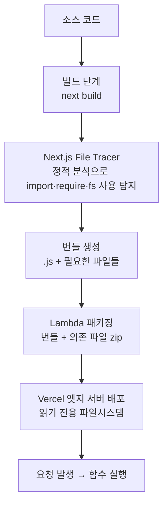
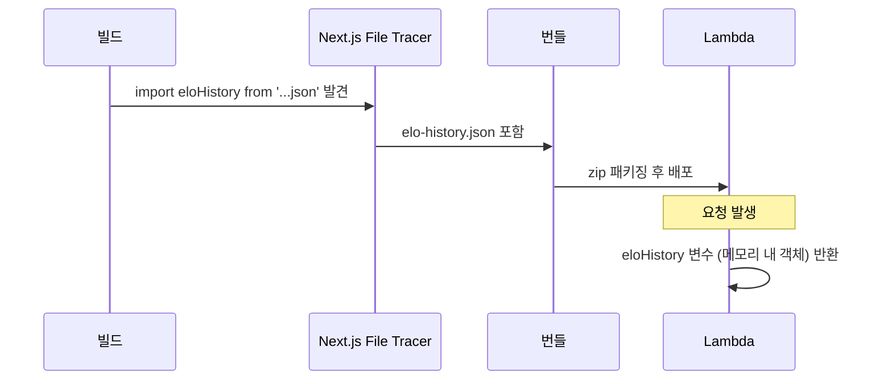
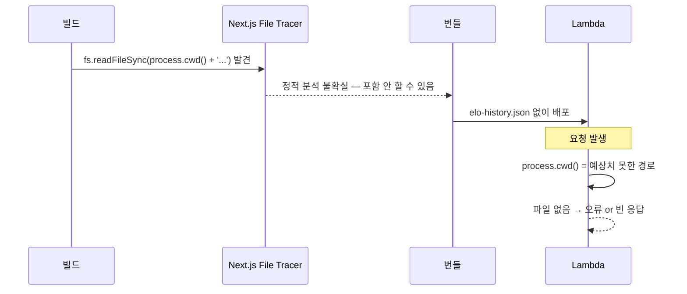

# 제목 — "fs.readFileSync vs import — 빌드 타임 번들링과 런타임 파일 접근의 차이"

> 작성일: 2026-05-07
> 태그: #원인분석 #nextjs #vercel #typescript
> 출발점: Vercel 배포 후 `/api/elo` 가 빈 응답을 반환 — 로컬에서는 정상 동작
> 원본 기록: [../06-dev-log.md](../06-dev-log.md) — Phase 3 "Vercel 배포 이슈" 섹션

## 한 줄 요약

Vercel serverless 환경에서 `fs.readFileSync`는 `process.cwd()`가 달라 파일을 못 찾고, `import`는 빌드 타임에 번들에 포함되기 때문에 항상 동작한다.

## 배경 지식

### Node.js에서 파일을 읽는 두 가지 방법

```ts
// 방법 1 — 런타임 파일 접근
import fs from 'fs'
const data = fs.readFileSync(process.cwd() + '/data/elo-history.json', 'utf-8')

// 방법 2 — 빌드 타임 번들링
import eloHistory from '../../../../data/elo-history.json'
```

겉보기엔 둘 다 "JSON 파일을 읽는다"지만, **언제** 읽히는지가 완전히 다르다.

| | `fs.readFileSync` | `import` |
|---|---|---|
| 실행 시점 | 런타임 (요청이 들어올 때) | 빌드 타임 (번들 생성 시) |
| 파일 위치 의존 | `process.cwd()` 기준 경로 필요 | 번들에 포함 → 경로 불필요 |
| Vercel 동작 | ❌ 실패 가능 | ✅ 항상 성공 |
| 파일 변경 반영 | 즉시 반영 | 재빌드 필요 |

### Vercel serverless 함수가 만들어지는 과정

Vercel에 `git push`하면 이런 일이 일어난다:



핵심은 **정적 분석 단계**다. Next.js File Tracer(=nft, Node File Trace)가 코드를 분석해서 "이 파일이 런타임에 뭘 읽을 것 같은지"를 예측해서 번들에 포함시킨다.

- `import eloHistory from './data/elo-history.json'` → 정적 분석에서 바로 탐지됨 → 번들에 포함
- `fs.readFileSync(process.cwd() + '/data/elo-history.json')` → 런타임 경로 조합 → 탐지 **안 될 수 있음**

### `process.cwd()`가 환경마다 다른 이유

| 환경 | `process.cwd()` 값 |
|---|---|
| 로컬 개발 (`next dev`) | `/Users/seong-in/Desktop/Git/loltoto` (프로젝트 루트) |
| Vercel 빌드 중 | `/vercel/path0` (임시 빌드 경로) |
| Vercel **런타임** | `.next/server/` 내부 (함수 실행 컨텍스트) |

로컬에서 `process.cwd() + '/data/elo-history.json'`이 맞아 떨어지더라도, Vercel 런타임에서 같은 경로는 존재하지 않는다. 파일 자체가 번들에 포함 안 됐으니까.

## 동작 원리 / 메커니즘

### `import`가 번들에 포함되는 흐름

```ts
// src/app/api/elo/route.ts
import eloHistory from '../../../../data/elo-history.json'

export async function GET() {
  return NextResponse.json(eloHistory)
}
```

1. `next build` 실행
2. nft(Node File Trace)가 `import ... from '../../../../data/elo-history.json'` 감지
3. `elo-history.json`을 번들에 포함
4. Vercel Lambda: `eloHistory`는 이미 메모리에 올라간 JS 객체 — 파일 접근 없음
5. 요청 → `NextResponse.json(eloHistory)` → 200



### `fs.readFileSync`가 실패하는 흐름

```ts
// 문제가 됐던 코드 (이미 수정됨)
import fs from 'fs'

export async function GET() {
  const raw = fs.readFileSync(process.cwd() + '/data/elo-history.json', 'utf-8')
  return NextResponse.json(JSON.parse(raw))
}
```

1. `next build` 실행
2. nft가 `fs.readFileSync(process.cwd() + '...')` 감지 — 경로가 런타임에 결정되므로 정적 분석 불확실
3. `elo-history.json`이 번들에 **포함되지 않을 수 있음**
4. Vercel Lambda 런타임: `process.cwd()`가 예상 경로가 아님
5. 파일 없음 → 예외 or 빈 응답



## 어떤 상황에서 마주쳤나

ELO 히스토리를 정적 JSON 파일(`data/elo-history.json`)로 저장하고 `/api/elo` 라우트에서 `fs.readFileSync`로 읽었음. 로컬 `next dev`에서는 정상. Vercel 배포 후 `/api/elo`가 빈 응답 반환.

수정: `fs.readFileSync` → `import eloHistory from '...json'` 한 줄로 교체.

→ [현재 코드: src/app/api/elo/route.ts](../../src/app/api/elo/route.ts)

## 해당 상황을 반복하지 않으려면

- **읽기 전용 정적 파일**은 무조건 `import`로 가져온다 (`fs` 사용 금지)
- 특히 `data/`, `public/` 이외 경로의 JSON은 `import`가 유일한 안전한 방법
- 동적으로 생성/수정되는 파일(런타임에 쓰는 파일)이 필요하면 `/tmp`(임시) 또는 DB/외부 스토리지 사용
- `vercel.json`의 `outputFileTracingIncludes`로 명시적 포함도 가능하지만, `import`가 훨씬 단순

## 헷갈렸던 부분 / 함정

**"로컬에서 됐으니까 배포도 될 것 같다"**
→ 로컬은 `process.cwd()`가 프로젝트 루트라서 경로가 맞음. Vercel은 함수 실행 컨텍스트가 달라서 다름. 이 차이가 로컬에서 전혀 증상이 안 나온다는 게 함정.

**"`process.cwd()`를 쓰면 된다고 했는데?"**
→ 공식 문서에 "process.cwd() 쓰라"는 말이 있는데, 이건 nft의 정적 분석이 `__dirname`보다 `process.cwd()`를 더 잘 탐지한다는 뜻. 탐지가 "더 잘 된다"는 거지 "항상 된다"는 게 아님. JSON처럼 확실히 필요한 파일은 `import`가 유일하게 100% 보장되는 방법.

**"fs 모듈 자체를 못 쓰는 건 아니다"**
→ Vercel Lambda 런타임도 Node.js 기반이라 `fs`는 동작함. 다만 읽으려는 파일이 번들에 포함돼 있어야 하고, 런타임 `process.cwd()` 경로가 맞아야 함. 파일시스템은 읽기 전용(read-only). 쓰기 시도 → `EROFS: read-only file system` 에러.

## 응용·확장

이 패턴이 적용되는 다른 곳:
- **i18n 번역 파일**: `locales/ko.json` 같은 정적 번역 파일 → `import` 사용
- **설정 파일**: 빌드 타임에 확정되는 config JSON → `import`
- **팀 메타데이터**: DB 없이 JSON으로 관리하는 정적 데이터 → `import`

`import`의 단점: 파일을 바꾸면 재빌드 필요. 실시간으로 바뀌는 데이터는 DB나 외부 API를 써야 함.

CLAUDE.md의 "ELO 히스토리 저장" 결정 이유가 여기서 온다: "읽기 전용 + 빌드 타임 번들링으로 Vercel 캐시 최적화"

## 참고 자료

- [How can I use files in Vercel Functions?](https://vercel.com/kb/guide/how-can-i-use-files-in-serverless-functions) — Vercel 공식 KB, process.cwd() vs __dirname 설명
- [Vercel Runtimes](https://vercel.com/docs/functions/runtimes) — serverless 함수 실행 환경 스펙
- [Next.js Discussion #32236](https://github.com/vercel/next.js/discussions/32236) — API routes에서 파일 읽기 커뮤니티 정리
- [Reading files on Vercel during Next.js ISR](https://francoisbest.com/posts/2023/reading-files-on-vercel-during-nextjs-isr) — ISR에서 파일 읽기 심층 분석
