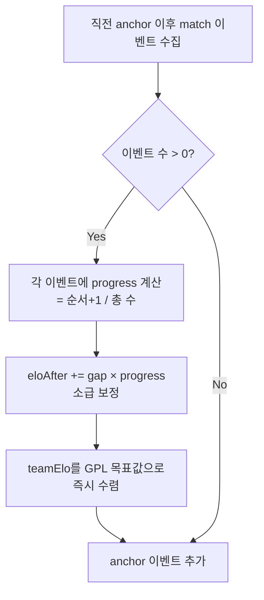
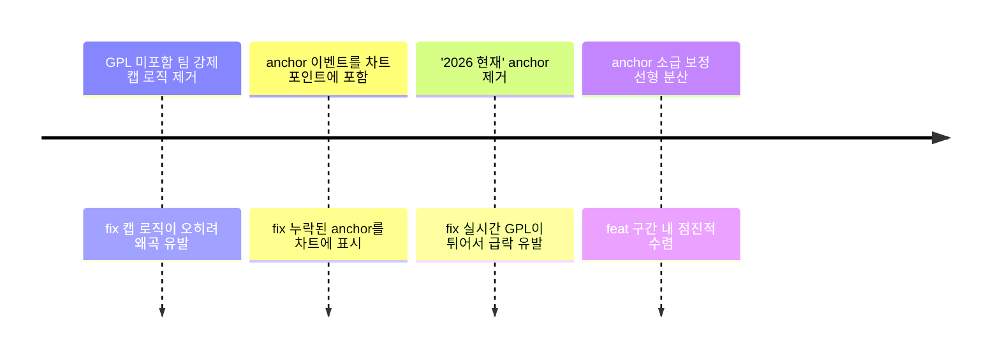

# anchor 소급 보정과 선형 분산

> 작성일: 2026-05-07
> 태그: #원인분석 #elo #typescript #lck
> 출발점: GPL 앵커 도입 후 ELO 차트에서 특정 날짜에 T1 -83, GEN -183pt 급락 현상 발생
> 원본 기록: [../06-dev-log.md](../06-dev-log.md) — Phase 3 "ELO 앵커 도입과 고통" 섹션

---

## 한 줄 요약

anchor 시점에 GPL 목표값으로 **즉시 100% 수렴**하면 그 날짜에 점프가 생긴다. 직전 구간 이벤트들에 **선형 보간으로 소급 분산**하면 점프가 ±8pt 이하로 줄어든다.

---

## 배경 지식

### GPL이란?

GPL(Global Power Rankings)은 Leaguepedia가 산출하는 팀 종합 점수. 국제전 성적, 국내 리그 성적, 상대 전적 등을 종합한 외부 데이터.

FanClash는 GPL 스냅샷을 **anchor 포인트**로 쓴다. 특정 시즌 종료 시점에 "우리 ELO가 이 값이 되어야 한다"는 기준점으로 활용하는 것.

### anchor 방식 도입 전 문제

초기엔 모든 팀을 1500으로 시작해서 순수 경기 결과만 ELO를 쌓았다. 문제는 LCK 팀이 국제전에서 어떻게 성적을 냈는지를 반영하지 못한다는 것. T1이 2024 Worlds를 우승했는데 이걸 적절히 반영하는 초기값이 없으면 ELO가 처음부터 설득력이 없다.

그래서 GPL 스냅샷을 역산해서 초기값을 세팅하는 방식으로 전환. 스플릿마다 GPL 값을 anchor로 찍어서 ELO를 보정한다.

### anchor 이벤트의 역할

경기 이벤트(type: `'match'`)와 달리 anchor 이벤트(type: `'anchor'`)는 경기 없이 `eloAfter`만 찍는 특수 포인트. ELO 차트가 이 이벤트를 기준으로 팀 ELO를 리셋한다.

---

## 동작 원리 / 메커니즘

### 문제 1: '2026 현재' GPL 스냅샷이 anchor로 쓰이면 폭락

GPL 사이트의 '현재' 스냅샷은 실시간으로 업데이트되는 값. Split 1 종료 이후 경기가 쌓이면서 팀들의 GPL 값이 떨어져 있었는데, 이걸 그대로 anchor에 넣으면:

```
Split 1 종료 ELO:  T1=1513, GEN=1586
2026 현재 GPL:     T1=1463, GEN=1519
→ anchor 시점에 즉시: T1 -52, GEN -67 급락
```

**해결**: `'현재'` 레이블이 포함된 스냅샷은 anchor에서 제외. Split 1 이후는 순수 ELO 누적으로 처리.

```typescript
// scripts/recalc-elo-history.ts:110-113
const snapshots: GplSnapshot[] = gplRaw.snapshots
  .filter((s: GplSnapshot) => !s.label.includes('현재'))  // ← 여기
  .sort((a, b) => a.date.localeCompare(b.date))
```

### 문제 2: anchor 즉시 수렴 → 차트에서 점프

anchor가 GPL 목표값으로 즉시 100% 수렴하면 이전 경기와 anchor 이벤트 사이에 수십~수백 pt 점프가 생긴다. 차트를 보는 팬 입장에서 "이 날 경기도 없는데 왜 ELO가 -183이야?" 라는 상황.

```
구간 내 경기 누적 ELO: DK=1380
GPL 목표: DK=1563
→ anchor 날짜에 +183 점프
```

### 해결: 선형 보간 소급 적용

직전 anchor 이후의 모든 match 이벤트들에 gap을 **progress 비율**로 나눠서 소급 적용한다.

```
progress = (이벤트 순서 + 1) / 구간 내 총 이벤트 수
소급 보정값 = gap × progress
```

즉, 구간 시작에 가까울수록 0%에 가깝게, anchor 직전 이벤트일수록 100%에 가깝게 보정한다.

```typescript
// scripts/recalc-elo-history.ts:229-240
const segStart = historyEvents.findLastIndex(e => e.type === 'anchor')
const segEvents = historyEvents.slice(segStart + 1)
const total = segEvents.length

if (total > 0) {
  for (let i = 0; i < total; i++) {
    const progress = (i + 1) / total  // 0 < progress ≤ 1
    const ev = segEvents[i]
    for (const [slug, gap] of Object.entries(gaps)) {
      if (ev.eloAfter[slug] == null) continue
      ev.eloAfter[slug] = Math.round(ev.eloAfter[slug] + gap * progress)
    }
  }
}
```

이 보정은 `eloAfter`(표시 ELO)에만 적용. `teamElo`(내부 계산용)는 anchor 시점에 한 번에 목표값으로 수렴시켜서 이후 경기의 기준점이 된다.



### 전후 비교

| 구간 | 기존 최대 점프 | 소급 보정 후 |
|---|---|---|
| 2026 FST anchor | ±183pt | ±8pt |
| 2025 Split1/MSI | 없음 | 없음 |
| 2025 Split2/3 | 없음 | 없음 |
| 전체 최대 | ±183pt | ±19pt |

DK vs T1 2026-02-22 경기 검증: DK +13, T1 -13 유지 (개인 ELO 변동 정상)

---

## 어떤 상황에서 마주쳤나

`feat: GPL 앵커 기반 전체 팀 ELO 재계산` 커밋으로 anchor 방식을 도입하자마자 ELO 차트에서 특정 날짜에 뾰족하게 치솟거나 급락하는 현상이 생겼다. 팬들이 보기에 "이날 경기도 없는데 왜 ELO가 이렇게 변하냐"는 UX 문제.

총 4단계 수정을 거쳤다:



---

## 해당 상황을 반복하지 않으려면

1. **GPL '현재' 스냅샷은 anchor로 쓰지 말 것.** 실시간 값은 경기 결과와 무관하게 튈 수 있다. anchor는 시즌 종료 확정 스냅샷만 쓴다.

2. **새 anchor 추가 시 `--dry-run`으로 점프 분석을 먼저 확인.**
   ```bash
   npx tsx scripts/recalc-elo-history.ts --dry-run
   # "앵커 점프 분석" 섹션에서 ±5pt 초과 팀 수 확인
   ```

3. **anchor가 생기는 날짜에 경기가 없으면 소급 분산이 작동 안 함.** `total === 0`이면 보정 건너뜀. 이 경우는 점프가 그대로 남는다 (현재 허용 중).

---

## 헷갈렸던 부분 / 함정

### "표시 ELO"와 "내부 teamElo"를 구분 못 하면 보정이 꼬인다

처음엔 소급 보정도 `teamElo`에 적용해야 하는 줄 알았음. 근데 `teamElo`는 다음 경기 계산의 기준값이라서 여기에 소급 보정을 넣으면 이후 모든 경기 ELO 계산이 틀어진다.

- `eloAfter` → **표시 ELO** (차트에 보이는 값). 여기에만 소급 보정.
- `teamElo` → **계산용 내부 ELO** (다음 경기 기대 승률 계산에 씀). anchor 시점에 GPL 목표값으로 즉시 수렴.

### findLastIndex는 ES2023

`historyEvents.findLastIndex(e => e.type === 'anchor')` — 이걸 `findIndex` + 반전으로 구현하려다가 `findLastIndex`가 있다는 걸 뒤늦게 알았음. Node.js 18+이면 쓸 수 있음. Vercel은 Node 20 기본이라 문제없음.

### progress가 0부터 시작하지 않는 이유

`progress = (i + 1) / total`이라 첫 이벤트가 `1/total`, 마지막이 `1.0`. `i / total`로 하면 첫 이벤트가 0%라 보정이 전혀 안 들어가고, 마지막 이벤트가 `(total-1)/total`이라 anchor 직전에도 gap을 다 못 채운다. `(i+1)/total`이어야 마지막 이벤트가 정확히 100% 반영됨.

---

## 응용·확장

- 이 패턴은 **"외부 기준값이 존재하는 ELO 시스템"** 전반에 적용 가능. 체스 FIDE 레이팅과 내부 서버 레이팅 싱크를 맞출 때도 동일한 문제가 생김.
- 소급 보정의 대안으로 **평균 회귀(mean reversion)** 방식도 있음. 매 경기마다 1500 방향으로 20% 당기는 방식(`crawler/calc-elo.ts`의 `REVERSION_RATE = 0.20`). 이쪽은 외부 기준 없이도 작동하지만 실제 GPL 값에 수렴시키기 어려움.

---

## 참고 자료

- [recalc-elo-history.ts](../../scripts/recalc-elo-history.ts) — 소급 보정 구현체 (229-240 라인)
- [06-dev-log.md Phase 3](../06-dev-log.md) — ELO 앵커 도입 타임라인
- [commit 2b6e813](https://github.com) — `feat: anchor 소급 보정으로 ELO 수렴을 구간 내 선형 분산` (±183pt → ±8pt)
- [commit 97e9390](https://github.com) — `fix: '2026 현재' anchor 제거로 Split1 이후 ELO 폭락 방지`
