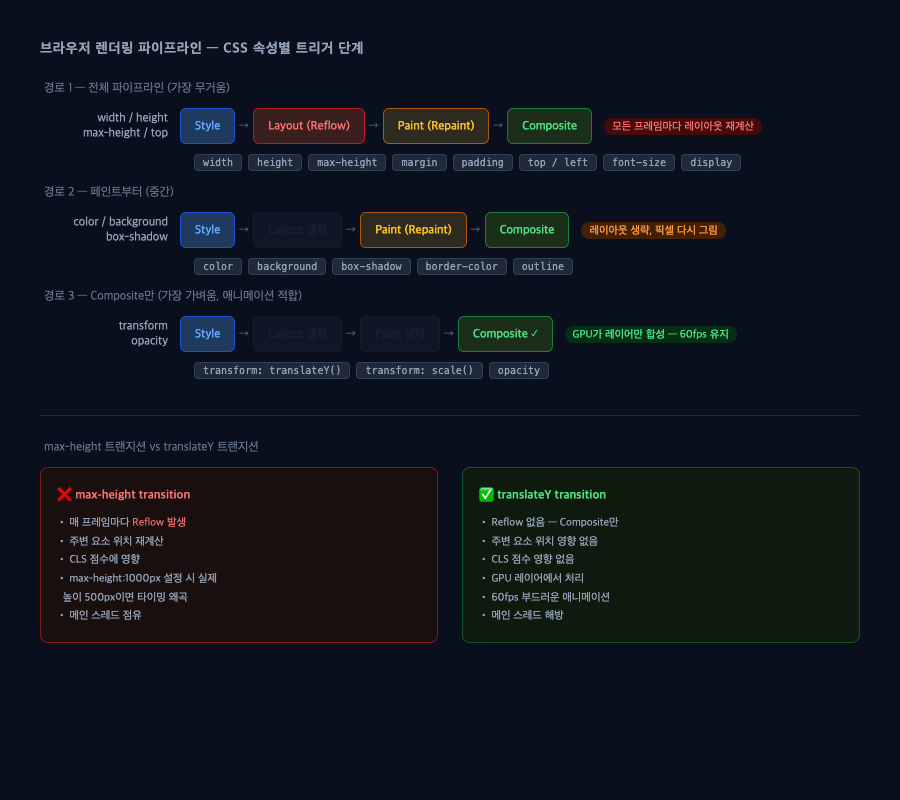

# CSS 렌더링 파이프라인 — Reflow, Repaint, Composite & CLS

> 작성일: 2026-05-09
> 태그: #개념정리 #css #성능튜닝 #web-vitals
> 출발점: max-height transition이 왜 layout shift를 유발하는지, translateY가 왜 부드러운지 원리 탐구
> 원본 기록: 학습 목적 — 공식 문서(web.dev, MDN) 기반 정리

## 한 줄 요약

`max-height` 트랜지션은 매 프레임 Reflow → Repaint → Composite 전체를 탄다. `translateY`는 Composite 단계만 타서 GPU가 처리하고 주변 요소에 영향을 주지 않는다.


> 위: CSS 속성별 트리거 단계. max-height는 경로 1(전체), translateY는 경로 3(Composite만).

---

## 배경 지식

### 브라우저 렌더링 파이프라인 5단계

브라우저가 화면을 그리는 과정은 고정된 파이프라인을 거친다. 이걸 "픽셀 파이프라인(Pixel Pipeline)"이라고 부름.

```
JavaScript → Style → Layout → Paint → Composite
```

각 단계는 독립적으로 스킵 가능하다. 어떤 CSS 속성을 바꾸느냐에 따라 어느 단계부터 시작할지가 결정됨.

| 단계 | 하는 일 | 비용 |
|---|---|---|
| Style | CSS 규칙을 요소에 적용 | 낮음 |
| Layout (Reflow) | 각 요소의 위치·크기 계산 | **높음** — 페이지 전체 순회 |
| Paint (Repaint) | 레이어별 픽셀 그리기 | 중간 |
| Composite | 레이어를 순서대로 합성 | **낮음** — GPU가 처리 |

Layout 단계가 비싼 이유는 "한 요소의 크기 변화가 부모, 형제, 자식 전체에 영향을 줄 수 있기 때문". 트리 전체를 순회해서 재계산한다.

### CSS 속성별 트리거 경로

```
경로 1 (Layout → Paint → Composite)   : width, height, max-height, margin, padding, top, left, display
경로 2 (Paint → Composite)            : color, background, box-shadow, border-color
경로 3 (Composite만)                  : transform, opacity
```

- 전체 목록 참고: [CSS 트리거 목록 (Paul Irish)](https://gist.github.com/paulirish/5d52fb081b3570c81e3a)
- 아니면 크롬 DevTools Performance 탭에서 실측

### GPU 합성 레이어 (Compositing Layer)

`transform`과 `opacity`는 브라우저가 해당 요소를 **별도 레이어**로 승격시켜서 GPU가 처리한다. 레이어는 독립적이라 다른 요소와 관계없이 GPU에서 위치·투명도만 바꿔서 화면에 합성함.

→ 메인 스레드를 건드리지 않으므로 JavaScript가 돌아가는 동안에도 애니메이션이 끊기지 않는다.

단, 레이어가 너무 많으면 GPU VRAM을 과하게 잡아먹어서 역효과남. 필요한 곳에만 쓰는 게 원칙.

---

## 동작 원리 / 메커니즘

### max-height transition이 Reflow를 유발하는 이유

```css
/* 이렇게 쓰면 매 애니메이션 프레임마다 Reflow */
.panel {
  max-height: 0;
  transition: max-height 0.3s ease;
  overflow: hidden;
}
.panel.open {
  max-height: 500px; /* 실제 콘텐츠 높이가 200px이면 타이밍이 망가짐 */
}
```

1. 매 프레임마다 `max-height` 값이 바뀜
2. 브라우저는 레이아웃 재계산 — `.panel` 높이 변화가 형제 요소 위치에 영향
3. 재계산된 레이아웃으로 픽셀 다시 그림 (Repaint)
4. 화면에 합성 (Composite)

→ **60fps = 1초에 60회 Reflow 발생**. 메인 스레드가 꽉 참.

추가 문제: `max-height: 500px`인데 콘텐츠가 200px이면, 실제 보이는 애니메이션은 0→200px 구간에서만 일어나는데 CSS는 0→500px 기준으로 타이밍을 계산함 → ease가 깨짐.

### translateY가 Composite만 타는 이유

```css
/* Reflow 없음 — GPU 레이어에서 처리 */
.panel {
  transform: translateY(-100%);
  transition: transform 0.3s ease;
}
.panel.open {
  transform: translateY(0);
}
```

- `transform`은 렌더링된 레이어를 GPU에서 **이동**시킬 뿐 — 문서 흐름(flow)에 영향 없음
- 다른 요소는 처음부터 `.panel`이 있던 자리가 비어있는 것으로 계산되어 있음 (DOM 공간은 그대로)
- GPU가 합성 단계에서만 처리 → 메인 스레드 해방

단, `translateY`는 **공간을 차지하면서 이동**하는 것. 요소가 DOM에서 차지하는 공간은 유지된 채 시각적으로만 옮겨짐. 이 점이 max-height와 다른 동작을 이해하는 핵심.

```
max-height: 0 → 200px   실제로 공간이 생김 → 형제 요소 밀려남 → Reflow
translateY(-200px)       공간은 그대로, 시각적으로만 올라감 → Reflow 없음
```

---

## CLS (Cumulative Layout Shift) 공식 정의

**CLS = 페이지 생애주기 동안 발생한 예상치 못한 레이아웃 이동의 최대 세션 윈도우 점수**

### 계산 공식 (web.dev 공식)

```
레이아웃 이동 점수 = 영향 분율(impact fraction) × 이동 거리 분율(distance fraction)
```

- **영향 분율(impact fraction)**: 이전/현재 프레임에서 불안정 요소가 차지하는 뷰포트 비율
- **이동 거리 분율(distance fraction)**: 불안정 요소가 뷰포트의 가장 큰 차원 대비 얼마나 이동했는가

예: 요소가 뷰포트 75%를 차지하고, 뷰포트 높이의 25%를 이동 → 0.75 × 0.25 = 0.1875

### 세션 윈도우

개별 이동들을 묶어서 최대값을 CLS로 씀:
- 각 이동 간격 < 1초
- 총 세션 길이 ≤ 5초

### 점수 기준

| 점수 | 등급 |
|---|---|
| ≤ 0.1 | Good |
| 0.1 ~ 0.25 | Needs Improvement |
| > 0.25 | Poor |

측정 기준: 기기별로 나눈 페이지 로드의 **75th percentile**.

### CLS에 포함되는 것 / 안 되는 것

| 포함 | 미포함 |
|---|---|
| 기존 요소가 위치 변경 | DOM에 새 요소 추가 (주변 밀림이 없는 경우) |
| 이미지 로드 후 크기 확정으로 밀림 | 유저 입력 후 500ms 이내 이동 |
| 폰트 로드 후 텍스트 리플로우 | 개발자가 의도한 스크롤 위치 복원 |

→ `max-height` 트랜지션이 CLS에 영향을 줄 수 있는 이유: 요소 높이가 바뀌면서 하단 콘텐츠가 밀려나면 layout shift로 집계됨.

---

## 어떤 상황에서 마주쳤나

- 아코디언, 드롭다운, 펼치기/접기 UI 구현 시 `max-height` 트랜지션 쓰는 패턴이 일반적
- CLS 점수 개선 작업하면서 레이아웃 이동 트리거 속성 목록 정리 필요

---

## 해당 상황을 반복하지 않으려면

**펼치기/접기 애니메이션 구현 시 우선순위:**

1. **translateY + overflow:hidden** → 콘텐츠가 이미 DOM에 있고 시각적으로만 숨기는 경우
2. **JS로 실제 높이 측정 후 height px 지정** → 진짜 높이 변화가 필요한 경우
   ```js
   const height = element.scrollHeight; // 실제 콘텐츠 높이
   element.style.height = `${height}px`; // 정확한 값 → 타이밍 왜곡 없음
   ```
3. **Web Animations API + KeyframeEffect** → 복잡한 경우
4. **max-height 트랜지션** → 피할 수 있으면 피함. 쓴다면 실제 최대 높이에 가까운 값으로 설정

**CLS 방지 체크리스트:**
- 이미지에 `width`/`height` 명시 (또는 `aspect-ratio`)
- 폰트 로딩 전략: `font-display: optional` 또는 preload
- 동적 콘텐츠 삽입 시 공간 미리 확보

---

## 헷갈렸던 부분 / 함정

**처음에 "translateY는 실제로 요소를 이동시키니까 Reflow가 날 것"이라고 생각했는데** — 아님. `transform`은 이미 레이아웃 계산이 끝난 후 GPU에서 시각적 변환만 적용. 문서 흐름(flow)에는 전혀 영향 없음.

**`translate3d(0, 0, 0)` 꼼수** — 과거엔 GPU 레이어 강제 승격 트릭으로 썼음. 지금은 `will-change: transform`이 표준 방법.

```css
/* 구식 방법 */
transform: translate3d(0, 0, 0);

/* 현대 방법 */
will-change: transform; /* 브라우저에게 "곧 transform 바뀔 거야" 힌트 */
```

단, `will-change`도 남발하면 GPU 메모리 낭비. 실제 애니메이션 직전에만 적용하고 끝나면 제거하는 게 맞음.

**max-height 타이밍 왜곡** — `max-height: 1000px`으로 설정했는데 실제 콘텐츠가 300px이면, CSS는 0→1000px 기준으로 0.3s를 분배함. 실제로는 첫 0.09초(=300/1000)에 애니메이션이 끝나버리고 나머지 0.21초는 아무것도 안 함. ease도 0~300px 구간만 잘라낸 것처럼 동작 → easing이 망가짐.

---

## 응용·확장

- **React Transition Group / Framer Motion**: 내부적으로 height 측정 후 pixel 값으로 transition — max-height 함정 피함
- **View Transitions API**: 페이지 전환 애니메이션. `::view-transition-old`/`new`로 GPU 레이어 활용
- **Layout Animation (Framer)**: FLIP 기법으로 Reflow 없이 레이아웃 변경 애니메이션 구현
  - FLIP = First, Last, Invert, Play — 시작/끝 위치 기록 후 translateY로 역방향 재생

---

## 참고 자료

- [Rendering Performance — web.dev](https://web.dev/articles/rendering-performance) — 파이프라인 3경로 설명, 가장 깔끔한 원본
- [Cumulative Layout Shift (CLS) — web.dev](https://web.dev/articles/cls) — CLS 공식 정의, 공식, 점수 기준
- [CLS - MDN Glossary](https://developer.mozilla.org/en-US/docs/Glossary/CLS) — 간단한 정의
- [Reflow - MDN Glossary](https://developer.mozilla.org/en-US/docs/Glossary/Reflow) — Reflow 정의
- [What forces layout/reflow — Paul Irish (GitHub Gist)](https://gist.github.com/paulirish/5d52fb081b3570c81e3a) — Reflow 유발 DOM/CSS 속성 전체 목록
- [GPU Animation: Doing It Right — Smashing Magazine](https://www.smashingmagazine.com/2016/12/gpu-animation-doing-it-right/) — GPU 레이어 원리 심층
- [Layout Shift caused by CSS transitions — corewebvitals.io](https://www.corewebvitals.io/pagespeed/layout-shift-caused-by-css-transitions) — transition:all 함정
