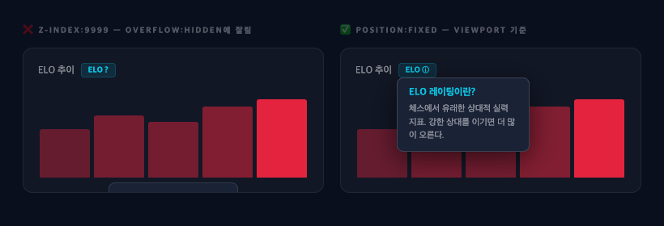
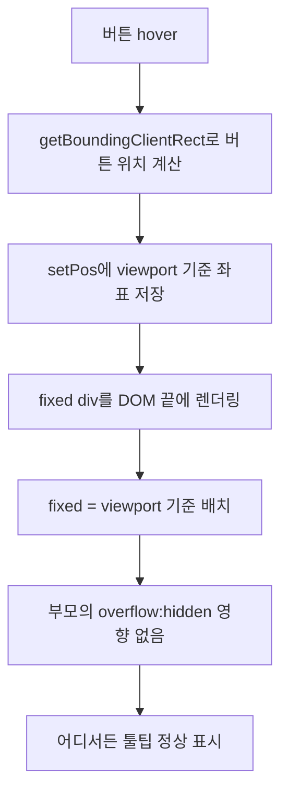

# 제목 — "fixed position 툴팁: scrollY 함정과 overflow-hidden 탈출"

> 작성일: 2026-05-07  
> 태그: #원인분석 #css #nextjs  
> 출발점: EloTooltip이 스크롤하면 위치가 틀어지고, overflow-hidden 부모에 잘리는 두 가지 버그  
> 원본 기록: [../06-dev-log.md](../06-dev-log.md) — Phase 2, 4월 29일 ELO 첫 도입 섹션

---

## 한 줄 요약

`getBoundingClientRect()`는 viewport 기준이라 `fixed`에 바로 쓰면 되고


> 왼쪽: z-index:9999여도 부모 overflow:hidden에 잘림. 오른쪽: position:fixed로 viewport 기준 렌더링 — overflow clip 탈출, scrollY 없이 getBoundingClientRect().top 그대로 사용., `scrollY`를 더하면 오히려 틀어진다. 그리고 `z-index`가 아무리 높아도 부모의 `overflow: hidden`은 뚫지 못한다 — `fixed`로 DOM 계층 자체를 탈출해야 한다.

---

## 배경 지식

### `getBoundingClientRect()`가 반환하는 좌표계

MDN 스펙 기준으로, `getBoundingClientRect()`는 **viewport(브라우저 창)의 좌상단을 (0, 0)으로 하는 좌표**를 반환한다.

```
┌──────────────────────────────────┐  ← viewport top = 0
│                                  │
│   ┌─────────┐                    │
│   │ 버튼    │← r.top = 200px     │
│   └─────────┘                    │
│                                  │
└──────────────────────────────────┘
```

핵심: **스크롤해도 이 값은 변하지 않는다.** 페이지를 500px 스크롤해서 버튼이 화면 위 200px에 보이면, `r.top = 200`이다. 스크롤 양과 무관하게 항상 "지금 화면에서의 위치"를 말한다.

### `position: fixed`의 기준

`position: fixed` 요소는 **viewport를 기준**으로 배치된다. `top: 200px`이면 화면 위에서 200px, 스크롤해도 그 자리에 고정.

→ 따라서 `getBoundingClientRect().top`을 `fixed` 요소의 `top`으로 쓰면 정확히 일치한다.

### scrollY를 더하면 왜 틀어지는가

`scrollY`를 더하면 "document(문서 전체) 기준 좌표"가 된다. 이건 `position: absolute`나 문서 좌표가 필요한 경우에 쓰는 값이다.

```
document 기준 top = r.top + window.scrollY
```

`fixed` 요소에 이 값을 주면, 스크롤 500px일 때 `top: 700px`이 돼버린다. 화면상 200px에 있어야 할 게 700px로 내려간다.

```
스크롤 0일 때:  top = 200 + 0   = 200  ← 맞음
스크롤 500일 때: top = 200 + 500 = 700  ← 화면 밖으로 사라짐
```

**오류 방향**: `scrollY`를 더하면 스크롤할수록 툴팁이 아래로 도망간다.

### `z-index`와 `overflow: hidden` 충돌

`z-index`는 **stacking context(쌓임 맥락)** 안에서만 의미 있다. 그런데 `overflow: hidden`은 z-index와 전혀 다른 차원에서 작동한다.

`overflow: hidden`은 **자식 요소가 부모 박스를 벗어나면 잘라낸다.** 이건 stacking order와 무관하다. z-index가 9999여도 부모 박스 밖으로 나간 픽셀은 렌더링 자체를 안 한다.

```
┌──────────────────────┐
│ overflow: hidden 부모 │
│   ┌──────────┐       │
│   │ 버튼     │       │
│   └──────────┘       │
│   ▲ 툴팁가 여기서    │
│   │ 잘린다           │
└──────────────────────┘
  ← 이 바깥은 렌더링 안 됨 (z-index 상관없이)
```

**유일한 해결책**: 툴팁을 `overflow: hidden` 부모의 DOM 자식에서 꺼내거나, `position: fixed`로 viewport 기준으로 렌더링해서 부모의 clipping 영역 자체를 벗어나는 것.

---

## 동작 원리 / 메커니즘

### 올바른 fixed 툴팁 위치 계산

```tsx
function show() {
  if (!btnRef.current) return
  const r = btnRef.current.getBoundingClientRect()
  setPos({
    top: r.top - 10,           // viewport 기준, scrollY 더하지 않음
    left: r.left + r.width / 2,
  })
  setVisible(true)
}
```

```tsx
<div
  className="fixed ..."   // fixed = viewport 기준 배치
  style={{
    top: pos.top,          // getBoundingClientRect().top 그대로
    left: pos.left,
  }}
/>
```

### 잘못된 버전 (버그 재현)

```tsx
setPos({
  top: r.top + window.scrollY - 10,   // ❌ scrollY 더하면 스크롤할수록 아래로 도망감
  left: r.left + r.width / 2,
})
```

### 좌표계 선택 기준 정리

| 포지셔닝 방식 | 기준 | getBoundingClientRect 변환 |
|---|---|---|
| `position: fixed` | viewport | `r.top` 그대로 사용 |
| `position: absolute` (body 기준) | document | `r.top + window.scrollY` |
| `position: absolute` (부모 기준) | 부모 요소 | `r.top - parentRect.top` |

### overflow: hidden 탈출 흐름



`position: fixed` 요소는 closest positioned ancestor가 아닌 **viewport**가 containing block이 된다. 그래서 DOM 계층상 `overflow: hidden` 부모 안에 있어도, 실제 렌더링은 viewport 기준으로 하기 때문에 clipping을 받지 않는다.

---

## 어떤 상황에서 마주쳤나

ELO 차트 옆에 "ELO 레이팅이란?" 설명 툴팁([EloTooltip.tsx](../../src/components/EloTooltip.tsx)) 구현. ELO 차트는 스크롤되는 페이지 중간에 위치하고, 차트 컨테이너에 `overflow: hidden`이 걸려 있었다.

두 가지 버그가 연달아 발생:

1. **scrollY 버그**: 초기 구현에서 `r.top + window.scrollY`를 `fixed` 요소의 `top`으로 사용. 스크롤 전엔 맞는데 스크롤하면 툴팁이 화면 아래로 사라짐.

2. **overflow 버그**: scrollY 버그 수정 후, 툴팁이 차트 컨테이너의 `overflow: hidden`에 잘려서 절반만 보이는 현상. `z-index: 9999`를 줬는데도 해결 안 됨. `position: fixed`로 변경해서 clipping 탈출.

---

## 해당 상황을 반복하지 않으려면 어떤 조치를 취해야 하나?

**fixed 툴팁/드롭다운 구현 시 체크리스트:**

1. `getBoundingClientRect()`의 좌표는 **viewport 기준** → `fixed` 요소에 그대로 쓴다. `scrollY`를 더하지 않는다.
2. 툴팁이 잘린다면 `z-index`를 올리기 전에 **부모에 `overflow: hidden`이 있는지** 먼저 확인한다.
3. `overflow: hidden` 부모 안에서 넘쳐야 하는 요소는 `position: fixed` 또는 Portal(DOM 이동)을 써야 한다.
4. 두 가지 포지셔닝 방식을 섞을 때는 **기준 좌표계가 맞는지** 항상 확인한다.

---

## 헷갈렸던 부분 / 함정

**함정 1: "fixed니까 scrollY 더해야 절대 위치가 된다"는 오해**

처음엔 `fixed`가 스크롤과 무관하게 고정되려면, 스크롤 양만큼 보정이 필요하다고 생각했음. 반대다. `getBoundingClientRect()`가 이미 "현재 화면에서의 위치"를 반환하고, `fixed` 배치도 화면 기준이라 그냥 그대로 쓰면 된다.

| 생각 | 실제 |
|---|---|
| scrollY 더해야 fixed 위치 맞음 | scrollY 더하면 오히려 틀어짐 |
| getBoundingClientRect는 문서 기준 | getBoundingClientRect는 viewport 기준 |

**함정 2: "z-index 9999면 뭐든 위에 뜬다"는 오해**

`z-index`는 같은 stacking context 안에서의 순서만 결정한다. `overflow: hidden`은 stacking order와 아예 다른 레이어에서 작동하는 clipping이다. 아무리 z-index를 올려도 부모의 overflow clip은 뚫지 못한다.

**함정 3: position: fixed면 overflow: hidden도 탈출한다**

이건 맞는 사실이긴 한데, "왜?" 를 몰랐음. `position: fixed`의 containing block이 viewport이기 때문에, DOM 부모와의 관계에서 벗어나 viewport를 기준으로 독립적으로 렌더링된다. 결과적으로 부모의 clipping 영향을 받지 않는다.

---

## 응용·확장

- **드롭다운 메뉴**: 같은 패턴. 테이블 행 안의 드롭다운이 `overflow: hidden` 테이블 컨테이너에 잘리는 경우 동일하게 `fixed` 또는 Portal로 해결.
- **React Portal**: `createPortal(content, document.body)`로 DOM을 body 직하에 렌더링하는 방법도 있음. `fixed` 대신 `absolute`를 쓰고 싶을 때 유용. 단, scroll 이벤트 핸들링이 추가로 필요함.
- **CSS Anchor Positioning**: CSS 신규 스펙(`anchor-name`, `position-anchor`). 아직 브라우저 지원이 완전하지 않지만, JS 없이 이 문제를 선언적으로 해결하려는 시도. TODO: 브라우저 지원 현황 확인.
- **IntersectionObserver**: 툴팁이 viewport 경계에 걸릴 때 방향 자동 전환 구현 시 활용 가능.

---

## 참고 자료

- [Element.getBoundingClientRect() — MDN](https://developer.mozilla.org/en-US/docs/Web/API/Element/getBoundingClientRect) — viewport 기준 좌표 반환 스펙 공식 문서
- [z-index and stacking contexts — web.dev](https://web.dev/learn/css/z-index) — stacking context 개념 설명
- [4 reasons your z-index isn't working — Coder Coder](https://coder-coder.com/z-index-isnt-working/) — overflow:hidden과 z-index 충돌 케이스 포함
- [CSS Anchor Positioning — MDN](https://developer.mozilla.org/en-US/docs/Web/CSS/Guides/Anchor_positioning/Using) — scrollY 없이 툴팁 붙이는 CSS 신규 스펙
