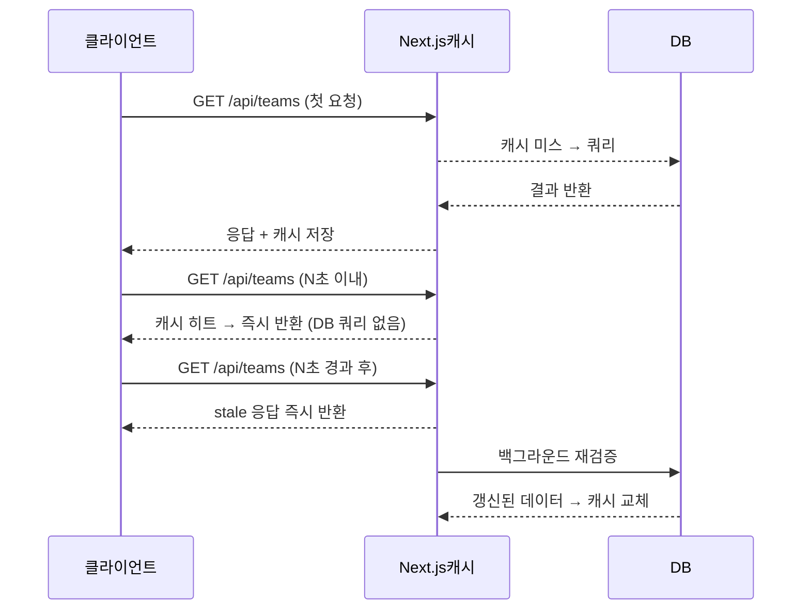
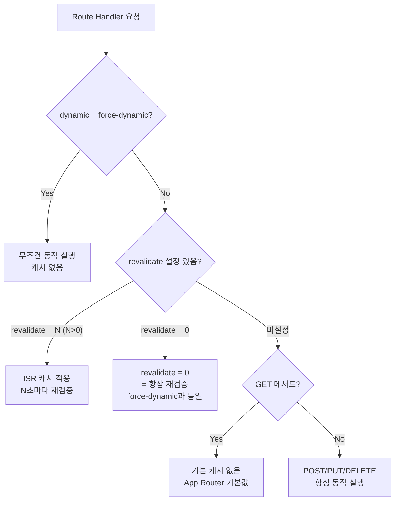

# 학습 노트 — "Next.js 캐시 전략 선택 기준: force-dynamic vs revalidate"

> 작성일: 2026-05-07  
> 태그: #설계결정 #nextjs  
> 출발점: API 라우트 파일마다 `force-dynamic` vs `revalidate = N`이 섞여 있어서 선택 기준이 뭔지 정리  
> 원본 기록: [../06-dev-log.md](../06-dev-log.md) — Phase 1 "feat: force-dynamic 셋팅" 커밋

---

## 한 줄 요약

`force-dynamic`은 "요청마다 항상 새로 실행" (DB 쓰기·인증·실시간), `revalidate = N`은 "N초 동안은 캐시, 그 후 재검증" (읽기 전용·집계 데이터). 선택 기준은 **응답이 요청 컨텍스트(세션, Body)에 의존하는가, 아니면 시간 기준 신선도로 충분한가**.

---

## 배경 지식

### Next.js App Router의 Route Handler 캐싱 기본 동작

Next.js 14 이후 App Router에서 Route Handler(`route.ts`)는 **기본적으로 캐시되지 않는다** (GET 메서드 포함). 단, 명시적으로 opt-in하면 캐시된다.

캐시 동작을 제어하는 방법은 크게 두 가지:

```
export const dynamic = 'force-dynamic'   // 항상 동적 실행
export const revalidate = N              // N초 ISR (N=0이면 force-dynamic과 동일)
```

### ISR이란 (Incremental Static Regeneration)

원래 Pages Router의 `getStaticProps`에 `revalidate`를 붙이면, 빌드 타임에 생성된 정적 페이지를 백그라운드에서 주기적으로 갱신하는 방식이다. App Router에서는 이 개념이 Route Handler에도 적용됐다.

핵심 동작:

```
첫 요청 → 캐시 미스 → DB 쿼리 실행 → 응답 캐시에 저장
이후 N초 이내 요청 → 캐시 히트 → 저장된 응답 즉시 반환
N초 경과 후 첫 요청 → 캐시 stale 판정 → (a) 캐시된 응답 즉시 반환, (b) 백그라운드에서 재검증 시작
재검증 완료 → 캐시 갱신
```

→ stale-while-revalidate 패턴. 사용자는 항상 즉각 응답을 받고, 갱신은 뒤에서 일어난다.



### force-dynamic은 무엇인가

`export const dynamic = 'force-dynamic'`은 **요청마다 Route Handler를 처음부터 실행**한다. 캐시 없음. Next.js 공식 문서에서는 Pages Router의 `getServerSideProps()`와 동등하다고 설명한다.

내부적으로는 모든 `fetch()` 호출에 `{ cache: 'no-store', next: { revalidate: 0 } }`을 적용한 것과 동일하다.

### revalidate = 0은 force-dynamic과 같은가?

거의 같다. 둘 다 Full Route Cache와 Data Cache를 건너뛰어 매 요청마다 서버에서 실행된다. 실질적 차이:

| 항목 | `dynamic = 'force-dynamic'` | `revalidate = 0` |
|---|---|---|
| 동작 | 항상 동적, 캐시 불가 | 재검증 주기 0초 = 항상 stale |
| fetch 기본값 변경 | `no-store`로 강제 | `no-store`로 변경 |
| 의미론적 명확성 | "나는 동적이다"를 선언 | "캐시 주기를 0으로 설정"한 부산물 |
| 공식 권장 | 동적 라우트에서 더 명확 | ISR 맥락에서 자연스러움 |

→ 이 프로젝트에서 `revalidate = 0`을 쓰는 두 파일(`activity`, `highlights/[slug]`)은 사실 `force-dynamic`으로 써도 동일하다.

---

## 동작 원리 / 메커니즘

Next.js는 Route Handler를 실행할 때 다음 단계로 캐시 여부를 결정한다:



### 이 프로젝트의 실제 분포

50개 route.ts 파일 기준:

| 전략 | 파일 수 | 비율 |
|---|---|---|
| `force-dynamic` | 34개 | 68% |
| `revalidate = N` (N > 0) | 8개 | 16% |
| `revalidate = 0` | 2개 | 4% |
| 설정 없음 | 5개 | 10% |

**`revalidate = N` 파일들의 N값 분포:**

| 라우트 | revalidate | 이유 |
|---|---|---|
| `/api/predictions/lck` | 3600 (1시간) | 몬테카를로 50,000회 시뮬레이션, 계산 비용 높음 |
| `/api/matches/[id]/h2h` | 3600 (1시간) | H2H 통계 — 경기 결과 반영되면 cron이 별도 갱신 |
| `/api/matches/[id]/impact` | 1800 (30분) | 판도 영향도 계산 — 반정적 데이터 |
| `/api/admin/matches/[id]/report-card` | 1800 (30분) | 리포트 카드 — 경기 직후 한 번 생성 후 재사용 |
| `/api/rankings` | 60 (1분) | 실시간성 필요하지만 초단위는 과함 |
| `/api/teams/[slug]` | 300 (5분) | 팀 상세 — ELO 변동 빈도 낮음 |
| `/api/teams` | 300 (5분) | 팀 목록 — 팀 추가/삭제 빈도 낮음 |
| `/api/users/[id]` | 60 (1분) | 타인 프로필 — 포인트 변동 있지만 실시간 불필요 |

---

## 어떤 상황에서 마주쳤나

Phase 1 첫 주에 "feat: force-dynamic 셋팅" 커밋으로 모든 API 라우트에 `force-dynamic`을 박았다. 이후 Phase 3~4에서 무거운 연산(시뮬레이션, H2H)을 캐싱할 필요가 생기면서 일부 라우트를 `revalidate = N`으로 전환했다.

`/api/predictions/lck` (LCK 진출 확률)는 몬테카를로 50,000회를 매 요청마다 돌리다가 응답 시간이 수백ms를 넘어서 `revalidate = 3600`으로 전환한 케이스다.

---

## 해당 상황을 반복하지 않으려면

**새 API 라우트 작성 시 체크리스트:**

1. **요청 Body나 세션을 읽는가?** → `force-dynamic` (POST/PUT/DELETE는 자동으로 동적이지만 명시 권장)
2. **응답이 인증된 사용자마다 다른가?** → `force-dynamic`
3. **응답이 "최신 DB 상태"를 반영해야 하는가 (정산, 예측 제출)?** → `force-dynamic`
4. **읽기 전용이고, 수초~수분 지연이 허용되는가?** → `revalidate = N`
5. **연산 비용이 높은가 (시뮬레이션, 집계)?** → `revalidate = N` (N은 연산 비용에 비례)

```
쓰기 작업 (POST/PUT/DELETE)         → force-dynamic (기본)
인증 라우트 (세션 의존)              → force-dynamic
실시간 데이터 (예측 현황, 활동)      → force-dynamic 또는 revalidate = 0
집계 데이터 (랭킹, 팀 목록)          → revalidate = 60~300
무거운 연산 (시뮬레이션, H2H)        → revalidate = 1800~3600
거의 안 변하는 데이터 (팀 상세)      → revalidate = 300~3600
```

---

## 헷갈렸던 부분 / 함정

**처음엔 "revalidate = 0 ≠ force-dynamic"인 줄 알았는데, 실질적으로는 동일하다.**

공식 문서를 보면 `revalidate = 0`은 "모든 fetch를 `no-store`로 만들어서 매번 재검증"하는 것이고, `force-dynamic`도 "모든 fetch를 `{ cache: 'no-store', next: { revalidate: 0 } }`로 만든다"고 설명한다. 둘 다 Full Route Cache와 Data Cache를 건너뛴다. 이 프로젝트 `/api/activity/route.ts`에서 `revalidate = 0`을 쓰는 건 사실 `force-dynamic`으로 써도 동일하다.

**"설정 안 하면 자동으로 캐시된다"는 착각.**

App Router에서 Route Handler는 **설정 없으면 캐시 안 됨**이 기본이다 (Pages Router의 API Routes와 동일). 오히려 캐시를 켜려면 `export const dynamic = 'force-static'` 또는 `revalidate = N`으로 **명시적 opt-in**이 필요하다.

→ Phase 1에서 모든 라우트에 `force-dynamic`을 박은 건 사실 불필요한 중복이었다. 설정 안 해도 동적으로 동작한다. 하지만 **의도를 명시한다는 점에서 나쁜 선택은 아니다**.

**`revalidate`는 GET만 적용된다.**

POST/PUT/DELETE 메서드를 포함하는 라우트에 `revalidate = 60`을 붙여도 쓰기 메서드에는 적용되지 않는다. GET 응답 캐싱에만 영향을 준다.

---

## 응용·확장

- **Page.tsx에서도 동일한 규칙 적용**: API Route가 아닌 Server Component 페이지에서도 `export const dynamic = 'force-dynamic'`으로 SSR 강제, `export const revalidate = N`으로 ISR 적용 가능.
- **on-demand revalidation**: `revalidateTag()` / `revalidatePath()`로 정산 완료 시 관련 캐시만 즉시 무효화 가능. 정기 재검증과 조합하면 "경기 결과가 나오면 즉시 랭킹 캐시 갱신"하는 패턴 구현 가능.
- **Vercel Edge Cache와의 관계**: `force-dynamic`이어도 Vercel Edge에서 추가 캐싱이 걸릴 수 있다. `Cache-Control: no-store` 헤더를 명시적으로 붙여야 완전히 막을 수 있다.

---

## 참고 자료

- [Route Segment Config | Next.js 공식 문서](https://nextjs.org/docs/app/api-reference/file-conventions/route-segment-config) — `dynamic`, `revalidate` 옵션 전체 스펙
- [Getting Started: Caching and Revalidating | Next.js](https://nextjs.org/docs/app/getting-started/caching-and-revalidating) — ISR 동작 원리
- [Guides: Caching | Next.js](https://nextjs.org/docs/app/building-your-application/caching) — Full Route Cache, Data Cache 전체 맵
