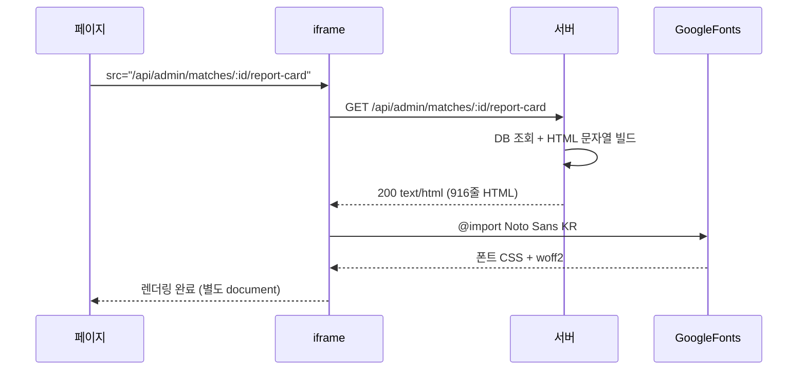
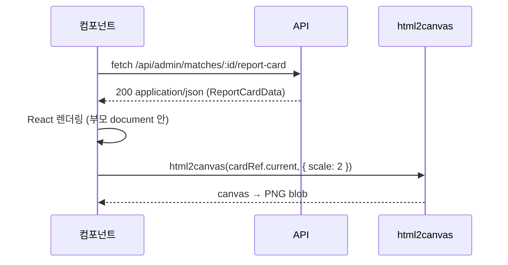

# iframe vs React 컴포넌트 — "리포트 카드 렌더링 방식 선택"

> 작성일: 2026-05-07  
> 태그: #설계결정 #nextjs #react #tailwind  
> 출발점: LCK 경기 분석 리포트 카드를 처음 iframe으로 만들었다가 React 컴포넌트로 전환한 경험  
> 원본 기록: [../06-dev-log.md — Phase 4](../06-dev-log.md#phase-4----2026-05-07)

---

## 한 줄 요약

API 라우트가 HTML을 통째로 반환하고 iframe으로 띄우는 방식은 "빠른 구현"은 되지만, 스타일 격리·반응형·PNG 저장 세 문제가 동시에 발목을 잡는다. JSON 반환 + React 컴포넌트로 바꾸는 게 처음에 더 많이 만들지만 결국 코드가 더 적어진다.

---

## 배경 지식

### iframe이란?

`<iframe>`(inline frame)은 현재 HTML 문서 안에 **완전히 별도의 브라우징 컨텍스트(browsing context)** 를 내장하는 HTML 요소다. 별도 컨텍스트란 독립적인 `window`, `document`, DOM 트리를 의미한다.

```
부모 페이지 (fan-clash.lol/matches/abc)
└── window (부모)
    └── document
        └── <iframe src="/api/admin/matches/abc/report-card">
            └── window (자식) ← 완전히 별도
                └── document ← 별도 DOM
```

이 격리가 iframe의 최대 장점("내부에서 무슨 짓을 해도 부모에 영향 없다")이자 최대 단점("부모와 소통하려면 항상 우회가 필요하다")이다.

### HTML 반환 라우트란?

Next.js API 라우트는 JSON뿐 아니라 `Content-Type: text/html`로 HTML 문자열을 통째로 반환할 수 있다.

```ts
// 기존 방식 — route.ts가 HTML을 직접 생성
return new NextResponse(html, {
  headers: { 'Content-Type': 'text/html; charset=utf-8' },
})
```

이 방식은 서버가 "완성된 화면"을 만들어서 내보내기 때문에 클라이언트 쪽에서 데이터를 다시 가져오거나 컴포넌트를 렌더링할 필요가 없다. puppeteer나 다른 headless 브라우저가 캡처하기에도 편하다 — 페이지 URL만 넘기면 되니까.

### html2canvas란?

DOM을 `<canvas>`로 복사해서 PNG로 내보내는 라이브러리. **iframe 내부 DOM은 보안 정책상 읽지 못한다**. Same-origin이어도 iframe 내부 요소는 html2canvas 렌더링 결과에서 빈 영역으로 나온다 — 이건 장기 미해결 이슈([#275](https://github.com/niklasvh/html2canvas/issues/275), [#2912](https://github.com/niklasvh/html2canvas/issues/2912)).

---

## 동작 원리 / 메커니즘

### 기존 방식 (iframe)

```
[브라우저]
매치 상세 페이지 로드
  └─→ showCard = true
        └─→ <iframe src="/api/admin/matches/:id/report-card">
              └─→ [서버] DB 조회 + HTML 템플릿 문자열 생성 (916줄)
                    └─→ Content-Type: text/html 반환
                          └─→ iframe 내부 독립 document로 파싱
                                └─→ Google Fonts CDN 요청 (@import url)
                                      └─→ 폰트 로드 완료 후 렌더링
```



문제 1 — **높이**: iframe은 `height: 80vh` 고정. 카드 내용이 긴 경우 내부 스크롤이 생기고, 반대로 내용이 짧으면 아래가 텅 비어 보인다. 자동 높이를 만들려면 `postMessage` + `ResizeObserver` 조합이 필요한데, 이건 same-origin이라도 별도 JS를 iframe 내부 document에 심어야 한다.

문제 2 — **스타일 격리**: iframe 내부는 부모 페이지의 Tailwind reset, CSS 변수, `font-family` 등을 **전혀 상속하지 않는다**. 그래서 HTML 템플릿 안에 폰트 `@import`부터 모든 CSS를 직접 작성해야 했고, 결과적으로 route.ts 하나가 916줄짜리 HTML 생성기가 됐다.

문제 3 — **PNG 저장**: html2canvas는 iframe 내부를 읽지 못한다. 때문에 PNG 저장을 위해 별도로 `puppeteer`를 띄워 headless 브라우저로 해당 URL을 열고 스크린샷을 찍는 `/report-card-image` 라우트를 따로 만들어야 했다. puppeteer는 Vercel serverless에서 사용하기가 어렵다(바이너리 크기, cold start).

### 전환 후 방식 (React 컴포넌트)

```
[브라우저]
매치 상세 페이지 로드
  └─→ <MatchReportCard matchId="abc">
        └─→ fetch("/api/admin/matches/abc/report-card") — JSON 반환
              └─→ data 수신 → React로 렌더링
                    └─→ html2canvas(cardRef.current) — 같은 DOM이니 직접 읽기 가능
```



route.ts는 DB 조회 + 계산 결과를 JSON으로 내보내는 역할만 한다(776줄 → 리팩토링 후 훨씬 감소). 시각화 코드는 React 컴포넌트(`MatchReportCard.tsx`) 안에서 TSX로 관리되므로, 팀 컬러 같은 동적 값은 `style={{ color: team.color }}`로 그냥 쓰면 된다.

---

## 어떤 상황에서 마주쳤나

2026-05-07 Phase 4에서 리포트 카드를 처음 만들 때(커밋 `cbc5d5b`), "서버가 HTML을 통째로 만들어주면 빠르다"는 생각으로 iframe 방식을 선택했다. 그러나 같은 날 18분 후(커밋 `3f6a6af`) React로 전환했다.

```
18:08 feat: LCK 경기 분석 리포트 카드 기능 추가  (iframe 방식)
18:26 refactor: 리포트 카드를 iframe → React 컴포넌트로 전환  (18분 만에 포기)
```

18분 만에 포기한 직접적 원인:
1. 카드가 모달 안에서 `height: 80vh` 고정 → 카드 길이에 따라 스크롤 또는 여백
2. PNG 저장을 html2canvas로 못 하니 puppeteer 라우트를 별도로 만들었는데, 이게 Vercel에서 쓰기 까다로움
3. Google Fonts CDN 로딩이 끝나야 렌더링이 완성되어 iframe 열리는 속도가 느림

---

## 해당 상황을 반복하지 않으려면 어떤 조치를 취해야 하나?

**"화면에 보여주는 것"과 "이미지로 저장하는 것"을 동시에 요구하는 UI라면 처음부터 React 컴포넌트로 만든다.**

결정 체크리스트:

| 조건 | iframe | React 컴포넌트 |
|---|---|---|
| 서버가 완전히 독립된 HTML 페이지를 생성해야 할 때 | ✅ | — |
| 부모 페이지 스타일과 공유해야 할 때 | ❌ | ✅ |
| html2canvas 등으로 직접 캡처해야 할 때 | ❌ (지원 안 함) | ✅ |
| 높이를 콘텐츠에 맞게 자동 조절해야 할 때 | ❌ (postMessage 우회 필요) | ✅ |
| 빠른 프로토타이핑, 외부 embed 등 | ✅ | — |

---

## 헷갈렸던 부분 / 함정

**iframe = 스타일 격리 ≠ 문제 없음**

처음에 "iframe이 스타일을 격리해주니까 부모의 Tailwind와 충돌 걱정이 없어서 좋다"고 생각했다. 실제로는 반대였다. 격리된다는 건 **부모의 CSS 변수, reset, 폰트를 하나도 못 가져다 쓴다**는 뜻이다. 결국 iframe 내부 HTML에 CSS를 처음부터 다 다시 쓰게 된다. 916줄이 나온 이유가 여기 있다.

**"서버가 HTML을 주면 데이터 패칭이 줄어든다"는 착각**

서버가 HTML 템플릿을 만든다고 해서 데이터 처리가 줄지 않는다. 오히려 HTML 생성 코드와 데이터 조회 코드가 같은 파일에 섞이면서 유지보수가 훨씬 어려워진다. JSON API는 데이터만 책임지고, 렌더링은 React가 책임지는 역할 분리가 훨씬 낫다.

**"반응형은 CSS로 해결 가능하다"는 착각**

`<iframe style={{ width: 820 }}>` 을 `max-width: 100%`로 바꿔도 내부 document는 여전히 800px 기준으로 렌더링된다. iframe 내부 레이아웃이 반응형이 되려면 내부 HTML 자체에 media query가 있어야 하고, 뷰포트는 iframe 크기 기준이다. 반응형 대응이 이중으로 필요해진다.

---

## 응용·확장

- **OG 이미지**: `src/app/api/og/` 라우트는 `@vercel/og` + `ImageResponse`를 쓴다. 이건 "서버가 이미지를 직접 반환"하는 경우로, iframe 방식과 다름 — 렌더링 결과가 브라우저 DOM이 아니라 PNG 파일 자체이기 때문에 html2canvas 문제가 없다. 리포트 카드를 소셜 공유용 이미지로 만들고 싶다면 이 방향이 맞다.
- **Shadow DOM**: iframe보다 가벼운 스타일 격리가 필요하다면 Web Components의 Shadow DOM을 쓸 수 있다. 단, React와 함께 쓰기가 까다롭고, html2canvas는 Shadow DOM도 지원이 제한적이다.
- **Puppeteer on Vercel**: 필요하다면 `@sparticuz/chromium` + `puppeteer-core` 조합으로 Vercel에서 headless 브라우저를 쓸 수 있다. 다만 cold start가 5~10초 수준이라 사용자 응답 API에는 부적합하고, 어드민 전용 비동기 처리에만 적합하다.

---

## 참고 자료

- [html2canvas: iframe not supported #275](https://github.com/niklasvh/html2canvas/issues/275) — 2014년 이슈, 아직 미해결
- [html2canvas: iframe support #2912](https://github.com/niklasvh/html2canvas/issues/2912) — 보안 정책상 iframe 내부 읽기 불가 확인
- [MDN: The Inline Frame element](https://developer.mozilla.org/en-US/docs/Web/HTML/Reference/Elements/iframe) — iframe browsing context 스펙
- [iframe height auto resize: ResizeObserver 방식](https://markaicode.com/how-to-automatically-resize-iframes-to-fit-content/) — postMessage + ResizeObserver 우회법
