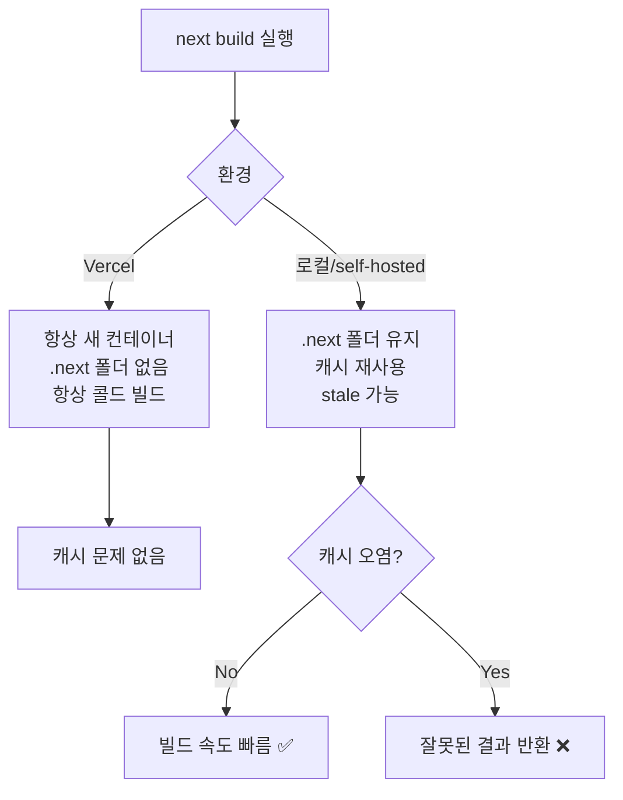
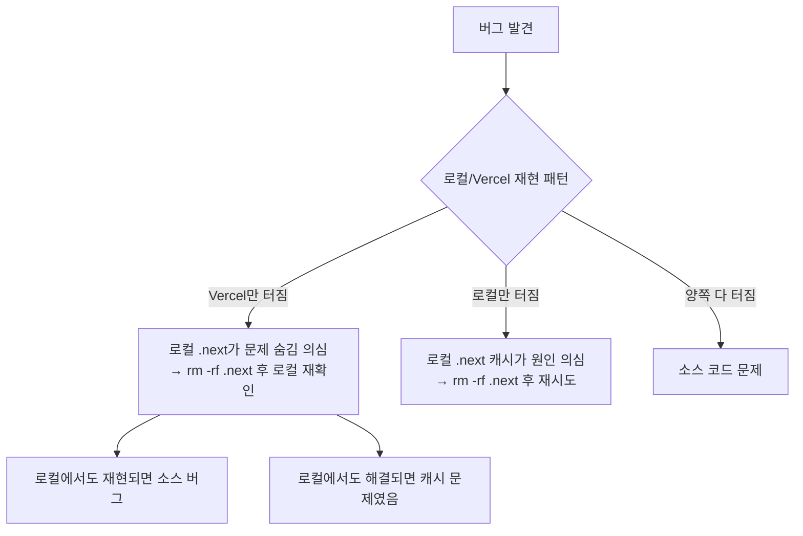

# .next 폴더 오래된 캐시 문제와 해결 패턴

> 작성일: 2026-05-07  
> 태그: #원인분석 #nextjs #캐시  
> 출발점: Vercel 배포 후 fs.readFileSync 문제, ELO API 빈 응답, 로컬에서만 재현 안 되는 버그들  
> 원본 기록: [../06-dev-log.md](../06-dev-log.md)

## 한 줄 요약

`.next` 폴더는 소스 코드와 무관하게 오래된 빌드·캐시 결과물을 들고 있을 수 있고, 특정 상황에서는 이게 정상 동작을 방해한다. 언제 지워야 하는지 알면 디버깅 시간이 30분 이상 줄어든다.

---

## 배경 지식

### .next 폴더는 무엇인가

`next build` 또는 `next dev`가 실행되면 생성되는 **빌드 결과물 전체** 디렉토리다. 크게 두 층으로 나뉜다.

```
.next/
├── cache/                  ← 빌드 캐시 (webpack/turbopack 컴파일 결과물)
│   ├── webpack/            ← 모듈 그래프, 청크 해시, 컴파일 캐시
│   └── fetch-cache/        ← fetch() 응답 캐시 (ISR용)
├── server/                 ← SSR/RSC 서버 번들
│   ├── app/                ← App Router 페이지별 번들
│   └── pages/              ← Pages Router 페이지별 번들
├── static/                 ← 클라이언트 청크, 이미지, CSS
│   └── chunks/
└── BUILD_ID                ← 빌드 고유 ID (배포 버전 식별자)
```

### cache 하위 폴더의 역할

- **`cache/webpack/`**: webpack(또는 Turbopack)이 모듈을 컴파일한 중간 결과물. 다음 빌드에서 변경된 파일만 재컴파일하도록 delta 참조로 쓰인다. 빌드 속도를 크게 높여주는 대신, 오염되면 잘못된 결과를 재사용한다.
- **`cache/fetch-cache/`**: `fetch()`에 `revalidate` 옵션이 붙은 응답을 파일로 저장. ISR의 "서버 사이드 캐시 파일"이 여기 쌓인다. 이 파일이 stale이면 `revalidate = 60`으로 설정해도 재검증이 일어나지 않는 것처럼 보인다.

### Next.js가 캐시를 자동으로 지우는 경우

Next.js는 **소스 파일 변경을 감지**해서 관련 모듈 캐시만 무효화한다(webpack의 content-hash 기반). 하지만 이 무효화 로직이 잡지 못하는 케이스가 있다.

---

## 동작 원리 / 메커니즘

### 빌드 캐시가 stale 해지는 과정

```
1. 첫 번째 빌드
   src/lib/elo.ts ──컴파일──▶ .next/cache/webpack/client-production/.../elo.HASH1.js

2. elo.ts 수정 후 재빌드
   content-hash 변경 감지 → elo.HASH2.js 생성 ✅ (정상)

3. 프로젝트 외부 파일 변경 (node_modules 업그레이드, .env 변경)
   content-hash 감지 범위 밖 → HASH1 캐시 그대로 재사용 ❌ (stale)
```

### fetch-cache stale 시나리오

```
배포 A: fetch('/api/elo', { next: { revalidate: 60 } })
  → .next/cache/fetch-cache/abc123 파일 생성 (응답 저장)

소스 변경 없이 Vercel 재배포
  → BUILD_ID 바뀜
  → 그러나 self-hosted 환경에서 .next 폴더를 유지하면
    fetch-cache 파일이 이전 배포 응답을 그대로 반환 ⚠️
```

### Vercel vs 로컬의 차이



---

## 어떤 상황에서 마주쳤나

이 프로젝트에서는 두 번 부딪혔다.

**케이스 1 — Vercel 배포 후 ELO API 빈 응답**

```
fix: /api/elo fs.readFileSync → JSON import로 변경 (Vercel 파일 접근 문제)
```

Vercel serverless function에서 `process.cwd()`가 달라서 `fs.readFileSync`로 `data/elo-history.json`을 못 읽는 문제였다. 로컬에서는 `.next` 캐시가 이전 빌드 결과를 들고 있어서 재현이 안 됐다. Vercel은 항상 콜드 빌드라 바로 터졌다.

→ 이건 캐시 문제라기보다 캐시가 "로컬 재현을 막는" 역할을 한 케이스.

**케이스 2 — ELO 차트 수정 후 로컬에서 변경이 반영 안 되는 현상**

Phase 3에서 ELO anchor 로직을 여러 번 수정하면서, `next dev` 재시작 후에도 옛날 차트 동작이 남아있는 것처럼 보였다. `.next/cache/webpack` 삭제 후 해결됐다.

---

## 해당 상황을 반복하지 않으려면 어떤 조치를 취해야하나?

### 판단 기준 — 삭제할 때 vs 아닐 때

| 상황 | 삭제 필요? | 이유 |
|---|---|---|
| 소스 파일만 수정했는데 변경이 반영 안 됨 | **YES** | webpack 캐시 오염 의심 |
| node_modules 버전 업그레이드 후 빌드 실패 | **YES** | 외부 패키지 변경은 content-hash 감지 범위 밖 |
| `.env` 값 변경 후 빌드 동작 이상 | **YES** | 환경변수는 캐시 무효화 트리거 아님 |
| 로컬에서는 정상인데 Vercel에서만 에러 | **캐시 의심하되 먼저 빌드 로그 확인** | Vercel은 콜드 빌드라 .next 없음. 로컬 캐시가 문제 숨김 |
| ISR 페이지가 `revalidate` 지나도 안 갱신 | **fetch-cache 삭제** | `.next/cache/fetch-cache/` 만 삭제해도 됨 |
| 그냥 느린 빌드 | **NO** | 캐시가 정상 작동 중 |
| 새로운 컴포넌트 추가 | **NO** | 새 파일은 캐시 충돌 없음 |

### 삭제 범위

```bash
# 전부 날리기 (가장 확실)
rm -rf .next

# 빌드 캐시만 (소스 변경 반영 문제)
rm -rf .next/cache/webpack

# fetch 캐시만 (ISR/revalidate 문제)
rm -rf .next/cache/fetch-cache
```

`package.json`에 스크립트 등록해두면 편하다:

```json
{
  "scripts": {
    "clean": "rm -rf .next",
    "dev:clean": "rm -rf .next && next dev"
  }
}
```

### "로컬에서 재현 안 되면 .next부터 지워라" 규칙

Vercel과 로컬의 가장 큰 차이는 `.next` 폴더 유무다. Vercel은 매 배포마다 콜드 빌드라 `.next`가 없다. 로컬에서는 `.next`가 누적된다. **"Vercel에서 터지는데 로컬에서 안 터진다"면, 로컬의 캐시가 문제를 숨기고 있을 확률이 높다.** 반대로 "로컬에서 터지는데 Vercel에서 안 터진다"면 로컬 캐시가 문제 원인일 수 있다.



---

## 헷갈렸던 부분 / 함정

**함정 1 — `.next` 삭제하면 소스 코드도 사라지는 줄 알았음**

`.next`는 컴파일 결과물만 들어있다. `src/`, `public/`, `prisma/` 등 소스는 전혀 건드리지 않는다. 겁 없이 지워도 된다.

**함정 2 — `next dev` 재시작하면 캐시 초기화되는 줄 알았음**

`next dev` 재시작은 프로세스 종료 후 재실행이지, `.next/cache` 폴더를 건드리지 않는다. 재시작 후에도 webpack 캐시는 그대로 남는다. 캐시 초기화가 목적이라면 반드시 폴더 삭제가 필요하다.

**함정 3 — `revalidate = 0` 설정하면 캐시가 무조건 무효화되는 줄 알았음**

`revalidate = 0`은 "매 요청마다 재검증"이지만, 이는 `fetch-cache` 레이어가 대상이다. webpack 빌드 캐시와는 별개다. 두 캐시 레이어가 독립적으로 존재한다.

| 캐시 레이어 | 위치 | 초기화 방법 | 관련 설정 |
|---|---|---|---|
| webpack 빌드 캐시 | `.next/cache/webpack/` | `rm -rf .next/cache/webpack` | 없음 (자동) |
| fetch 데이터 캐시 | `.next/cache/fetch-cache/` | `rm -rf .next/cache/fetch-cache` | `revalidate`, `cache: 'no-store'` |
| 클라이언트 라우터 캐시 | 브라우저 메모리 | 페이지 새로고침 / hard refresh | `router.refresh()` |

---

## 응용·확장

- **CI 환경**: GitHub Actions 등에서 `.next/cache/webpack`을 actions/cache로 캐싱하면 빌드 속도 단축 가능. 단, cache key에 `package-lock.json` 해시를 포함시켜야 node_modules 변경 시 무효화된다.
- **Turbopack**: Next.js 15+에서 `experimental.turbopackFileSystemCacheForDev` 활성화 시 `.next/cache/turbopack/` 폴더가 추가된다. 동일한 stale 이슈가 생길 수 있고, 삭제 방법도 동일하다.
- **monorepo 환경**: 프로젝트 외부 패키지(`packages/ui` 등) 변경이 `.next` 캐시 무효화를 트리거하지 않아 stale 빌드가 더 자주 발생한다.

---

## 참고 자료

- [Next.js Caching 공식 문서](https://nextjs.org/docs/app/building-your-application/caching) — 캐시 레이어 전체 구조 설명
- [Next.js ISR 가이드](https://nextjs.org/docs/app/guides/incremental-static-regeneration) — fetch-cache와 revalidate 동작 원리
- [GitHub Discussion: .next 캐시 빌드 무효화 문제 #35555](https://github.com/vercel/next.js/issues/35555) — "프로젝트 외부 변경 시 캐시 미갱신" 이슈
