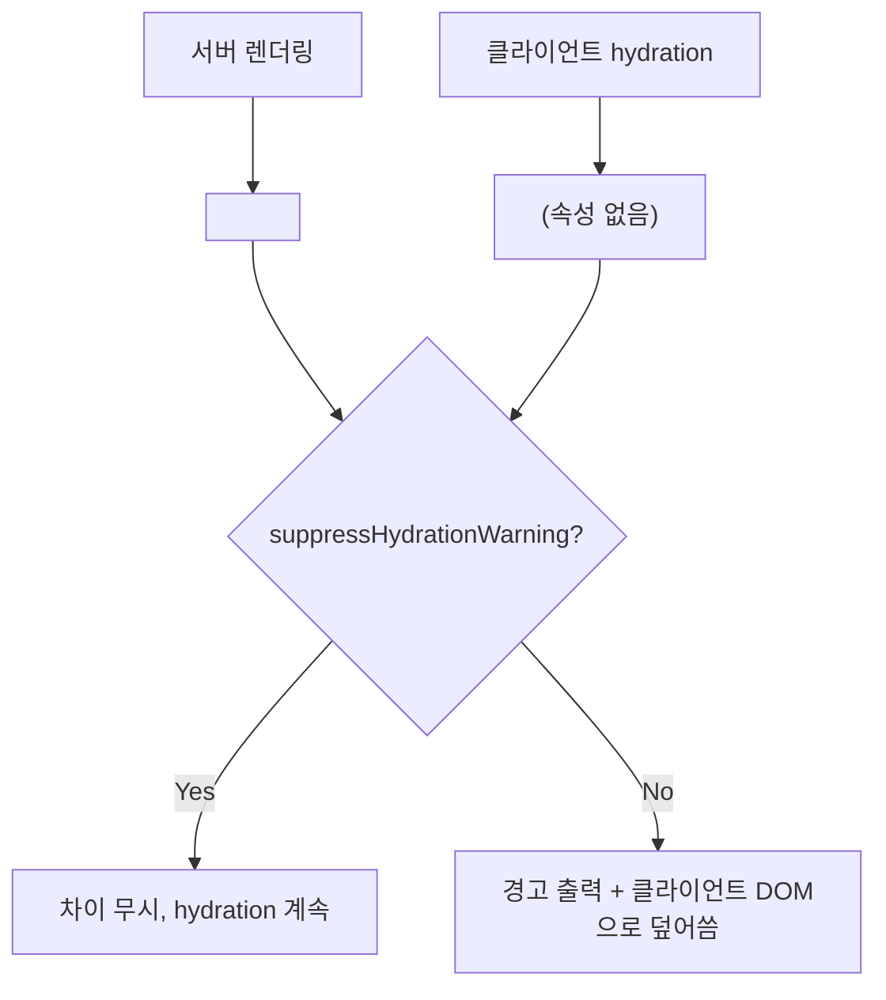

# 제목 — "Next.js Hydration Mismatch와 suppressHydrationWarning"

> 작성일: 2026-05-12
> 태그: #원인분석 #nextjs #react
> 출발점: 우문현답 `layout.tsx`의 `<head>` 태그에서 hydration mismatch 경고 발생
> 원본 기록: 우문현답 프로젝트 Claude Code 대화

## 한 줄 요약

브라우저 확장 프로그램(또는 Next.js dev 도구)이 서버 HTML의 `<head>`에 `data-*` 속성을 주입 → 클라이언트 hydration 시 불일치 → `suppressHydrationWarning`을 해당 태그에 추가해서 무시.

## 배경 지식

### Hydration이란?

서버가 완성된 HTML을 브라우저로 보낸다. 그 HTML은 정적 문자열이라 클릭·입력 같은 이벤트 처리가 불가능.
React는 이 HTML 위에 이벤트 핸들러와 상태를 "붙이는" 작업을 한다 — 이게 hydration.

```
서버 → HTML 문자열 전송
브라우저 → HTML 파싱 + DOM 생성 (빠른 첫 화면)
React → 동일한 Virtual DOM 생성 + 실제 DOM에 attach (hydration)
```

### 왜 Mismatch가 문제인가?

React는 hydration 시 "내가 생성할 Virtual DOM"과 "서버가 보낸 실제 DOM"을 비교한다.
이때 두 DOM이 다르면 React는 보통 클라이언트 버전으로 DOM을 덮어쓴다.

→ 문제는 그 "덮어쓰기"가 사용자에게 **Layout Shift**로 보이거나, React 19 이전에는 아예 렌더링을 포기하는 케이스도 있었음.

### React 19에서 개선된 점

React 19부터 `<head>`와 `<body>` 안에 예상치 못한 태그나 속성이 있으면 **스킵**한다.
서드파티 스크립트나 브라우저 확장이 주입한 내용을 그대로 놔두고 나머지만 hydrate.
→ 이전 버전보다 훨씬 관대해졌지만 경고는 여전히 출력될 수 있음.

## 동작 원리 / 메커니즘

### 이번 에러의 구체적인 흐름

```
1. Next.js dev 서버가 HTML 렌더링
   → <head data-locator-hook-status-message="loading: No valid renderers found."> 주입
   → 이건 Next.js 개발 도구 자체가 서버 사이드에서 추가하는 속성

2. 브라우저가 HTML을 받음
   → React 클라이언트 bundle 실행

3. React hydration 시작
   → Virtual DOM의 <head>에는 data-locator-hook-status-message 없음
   → 실제 DOM의 <head>에는 있음 → MISMATCH

4. React가 경고를 출력하고 클라이언트 DOM으로 덮어씀
   → dev 도구 속성이 사라짐 → React DevTools 등에서 "No valid renderers found" 상태
```

에러 메시지의 `-` 기호가 핵심 단서:
```
<head
-  data-locator-hook-status-message="loading: No valid renderers found."
>
```
`-`는 서버 HTML에만 있고 클라이언트에는 없다는 뜻 → 서버가 주입한 속성.

### suppressHydrationWarning 동작 원리

```tsx
// 이 prop을 추가하면:
<head suppressHydrationWarning>

// React는 이 element에 한해 속성 불일치 검사를 건너뜀
// "이 element의 서버/클라이언트 차이는 의도된 것" 으로 신뢰
```

중요한 제약:
- **1 depth만** 작동함. 자식 element에는 전파되지 않음
- `suppressHydrationWarning`은 경고를 끄는 것이지 DOM을 fix하는 게 아님
- production에서도 적용됨 (경고만 없어지는 게 아니라 검사 자체를 skip)



### 브라우저 확장이 원인인 경우와 dev 도구가 원인인 경우 구분법

| 구분 | 브라우저 확장 | Next.js dev 도구 |
|---|---|---|
| 시크릿 모드에서 재현 | ❌ 안 됨 | ✅ 재현됨 |
| 다른 브라우저에서 재현 | 경우에 따라 다름 | ✅ 재현됨 |
| production 빌드에서 재현 | ❌ 안 됨 | ❌ 안 됨 |
| 속성 이름 패턴 | `cz-shortcut-listen`, 확장 고유명 | `data-locator-*` |

이번 케이스는 시크릿 모드에서도 재현될 가능성이 높음 → **Next.js dev 도구** 원인으로 판단.

## 어떤 상황에서 마주쳤나

우문현답 `app/layout.tsx`에서 `<html>`에만 `suppressHydrationWarning`을 추가한 상태.
Next.js dev 서버가 `<head>`에 `data-locator-hook-status-message` 속성을 주입하면서 hydration mismatch 경고 발생.

`<html>`에 이미 있던 `suppressHydrationWarning`이 `<head>`에는 **전파되지 않음** (1 depth 제약) → `<head>`에도 별도로 추가해서 해결.

## 해당 상황을 반복하지 않으려면 어떤 조치를 취해야하나?

`layout.tsx` 작성 시 `<html>`과 `<head>` 양쪽에 모두 `suppressHydrationWarning`을 추가하는 걸 기본 템플릿으로 삼을 것:

```tsx
<html lang="ko" suppressHydrationWarning>
  <head suppressHydrationWarning>
    {/* 폰트 링크 등 */}
  </head>
  <body>
    {children}
  </body>
</html>
```

`<html>`만 추가하는 게 "당연히 하위에도 적용되겠지"라는 착각을 차단.

## 헷갈렸던 부분 / 함정

- `suppressHydrationWarning`이 **하위 element에도 전파**되는 줄 알았음 → 아님. 딱 해당 element 1개에만 적용
- 처음에 `<html>`에만 추가하면 충분할 거라 생각했지만, `<head>`는 별개 element라 따로 붙여야 함
- "브라우저 확장 문제"로만 생각했는데 사실 Next.js dev 도구 자체가 server-side에서 head에 속성을 주입하는 케이스도 있음
- production 배포 후에는 이 속성 자체가 주입되지 않아 hydration mismatch도 발생하지 않음 → **dev 전용 노이즈**

## 응용·확장

- `<body>`에도 동일 패턴 적용 가능 (브라우저 확장이 `<body>`에 속성 추가하는 경우 대비)
- 브라우저 확장이 주입하는 속성 목록 예시: `cz-shortcut-listen` (Colorzilla), `data-new-gr-c-s-check-loaded` (Grammarly), `data-locator-hook-*` (React DevTools 계열)
- Next.js `next/font` 사용 시 CDN 폰트 링크를 `<head>`에 직접 넣는 패턴 자체가 권장되지 않음 → `next/font`로 마이그레이션 고려 (TODO)

## 참고 자료

- [hydrateRoot — React 공식 문서](https://react.dev/reference/react-dom/client/hydrateRoot) — suppressHydrationWarning 동작 원리 공식 설명
- [Next.js Hydration Error 문서](https://nextjs.org/docs/messages/react-hydration-error) — 원인 분류 및 해결 방법
- [Hydration Error caused by Chrome extension (Next.js Discussion)](https://github.com/vercel/next.js/discussions/71577) — 브라우저 확장 케이스 실제 사례
- [Colorzilla 확장 hydration mismatch 이슈](https://github.com/vercel/next.js/discussions/72035) — `cz-shortcut-listen` 주입 패턴 참고