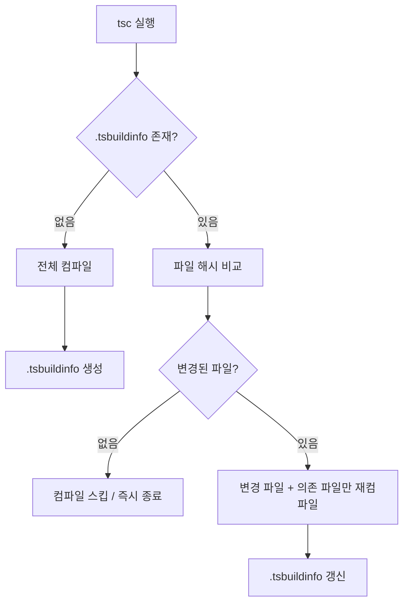

# 제목 — "tsconfig.tsbuildinfo: TypeScript 증분 빌드 캐시 파일"

> 작성일: 2026-05-07  
> 태그: #개념정리 #typescript #nextjs  
> 출발점: `tsconfig.tsbuildinfo`가 git에 잔존하는 이유 확인 + `.gitignore` 처리  
> 원본 기록: [../backlog.md](../backlog.md)

## 한 줄 요약

`tsconfig.tsbuildinfo`는 TypeScript 증분 컴파일 캐시 파일로, `tsconfig.json`의 `"incremental": true`가 켜져 있으면 자동 생성된다. git에 올리면 안 되고, `.gitignore`에 `*.tsbuildinfo`로 막으면 끝.

---

## 배경 지식

### TypeScript 컴파일은 왜 느린가?

TypeScript 컴파일러(`tsc`)는 파일을 실행할 때 모든 소스 파일을 처음부터 읽고, 의존성 그래프를 추적하고, 타입을 추론하고, 에러를 검사한다.

프로젝트 규모가 커질수록 이 비용이 선형이 아닌 **비선형으로** 증가하는 경향이 있다.  
→ VS Code 수준 프로젝트에서 `tsc --noEmit` 한 번 = 수십 초.

### 이걸 해결하려고 두 가지 방식이 있었음

| 방식                | 설명                                            | 한계                                             |
| ------------------- | ----------------------------------------------- | ------------------------------------------------ |
| `tsc --watch`       | 파일 변경을 실시간 감지해서 부분 재컴파일       | 프로세스 살아있어야 함. 재시작하면 처음부터 다시 |
| `tsc --incremental` | 빌드 결과를 파일로 저장해서 다음 실행 때 재사용 | 파일에 의존하므로 파일 관리 필요                 |

TypeScript 3.4 (2019년 3월) 에서 `--incremental` 플래그가 도입됐다.  
동기: "overnight watch 프로세스를 유지하지 않아도 빠른 빌드를 할 수 있게 하자."

### 성능 효과 (실측 기준)

- VS Code 프로젝트 기준: incremental 적용 후 빌드 시간 **약 1/5로 감소**
- 일반 중대형 프로젝트: `tsc` → `tsc --incremental` **보통 2~10x 빠름**

---

## 동작 원리 / 메커니즘

### 1단계 — 최초 빌드

`"incremental": true` 상태로 첫 `tsc` 실행 → 정상 컴파일 완료 후 `.tsbuildinfo` 파일 생성.

이 파일 안에는:

- 각 소스 파일의 **내용 해시(content hash)** — 파일이 변경됐는지 감지용
- 파일 간 **의존성 그래프** — A.ts가 B.ts를 import하면 B가 바뀌면 A도 재컴파일 대상
- 타입 추론 결과 일부 (**BuilderState 시리얼라이즈**) — 재분석 불필요한 부분 스킵용

```json
// .tsbuildinfo 내부 (개념적 구조)
{
	"program": {
		"fileInfos": {
			"src/lib/elo.ts": { "version": "abc123...", "signature": "def456..." },
			"src/components/EloChart.tsx": { "version": "789xyz..." }
		},
		"referencedMap": {
			"src/components/EloChart.tsx": ["src/lib/elo.ts"]
		}
	}
}
```

### 2단계 — 다음 빌드

`tsc` 재실행 시 `.tsbuildinfo` 읽기 → 현재 파일 해시와 비교 → **변경된 파일 + 그 파일에 의존하는 파일만 재컴파일**.



### 파일 위치 결정 규칙

| 설정 조합              | .tsbuildinfo 위치                      |
| ---------------------- | -------------------------------------- |
| 아무것도 없음          | 프로젝트 루트 (`tsconfig.tsbuildinfo`) |
| `outDir` 설정          | `<outDir>/tsconfig.tsbuildinfo`        |
| `outFile` 설정         | `<outFile>.tsbuildinfo`                |
| `tsBuildInfoFile` 명시 | 명시한 경로                            |

이 프로젝트는 `outDir` 미설정 + `noEmit: true` → **루트에 생성됨**.

---

## 어떤 상황에서 마주쳤나

`git status`에서 `tsconfig.tsbuildinfo`가 modified 상태로 계속 잔존.  
`.gitignore`에 없어서 git이 추적하고 있었음 → `*.tsbuildinfo` 추가로 해결.

Next.js가 프로젝트 생성 시 `tsconfig.json`에 `"incremental": true`를 기본값으로 설정하기 때문에 Next.js 프로젝트에서는 항상 이 파일이 생긴다.

---

## 해당 상황을 반복하지 않으려면 어떤 조치를 취해야 하나?

`.gitignore`에 `*.tsbuildinfo` 추가. (이미 완료)

새 프로젝트 시작할 때 `.gitignore` 템플릿에 포함시켜 두는 게 제일 확실.  
GitHub의 공식 TypeScript `.gitignore` 템플릿에는 포함돼 있으나, Next.js `create-next-app` 기본 `.gitignore`에는 빠져 있는 경우가 있음.

---

## 헷갈렸던 부분 / 함정

**"노출되면 안 되는 파일인가?"** 라고 처음에 생각했는데 — 아님.  
보안 문제는 없다. 단지 **머지 충돌 유발 + git 히스토리 오염** 때문에 gitignore에 넣는 것.

**"삭제하면 문제 생기나?"** — 없음.  
`.tsbuildinfo`는 런타임에 전혀 관여하지 않는다. 삭제하면 다음 빌드에서 전체 컴파일 후 재생성될 뿐.

| 잘못된 생각               | 실제                                      |
| ------------------------- | ----------------------------------------- |
| 이 파일 없으면 빌드 안 됨 | 없으면 처음부터 컴파일, 느릴 뿐 정상 작동 |
| 보안 정보가 들어있음      | 파일 해시, 타입 정보만 있음. 키/토큰 없음 |
| git에 올려야 CI가 빠름    | CI는 클린 빌드가 기본, 캐시 전략은 별도   |

---

## 응용·확장

### `tsBuildInfoFile` 옵션으로 위치 지정

```json
{
	"compilerOptions": {
		"incremental": true,
		"tsBuildInfoFile": ".cache/tsconfig.tsbuildinfo"
	}
}
```

`.cache/` 디렉토리에 몰아두면 `.gitignore`도 `/.cache` 한 줄로 처리 가능.

### Project References와의 관계

`tsconfig.json`의 `references` 필드로 모노레포를 구성할 때, 각 sub-project마다 `.tsbuildinfo`가 생성된다.  
`tsc --build`(`tsc -b`)는 이 파일들을 조합해서 변경된 패키지만 재빌드한다.

### CI에서 캐시 전략

CI에서 `.tsbuildinfo`를 캐싱하면 빌드 속도를 높일 수 있다.  
Vercel은 `.next/` 캐시를 자체 관리하므로 별도 설정 불필요.  
GitHub Actions라면:

```yaml
- uses: actions/cache@v3
  with:
    path: tsconfig.tsbuildinfo
    key: tsbuildinfo-${{ hashFiles('src/**/*.ts') }}
```

---

## 참고 자료

- [TypeScript 3.4 릴리즈 노트](https://www.typescriptlang.org/docs/handbook/release-notes/typescript-3-4.html) — incremental 첫 도입 배경과 예제
- [TSConfig: incremental](https://www.typescriptlang.org/tsconfig/incremental.html) — 공식 옵션 레퍼런스
- [TSConfig: tsBuildInfoFile](https://www.typescriptlang.org/tsconfig/tsBuildInfoFile.html) — 파일 위치 커스텀 옵션
- [Next.js GitHub PR #30357](https://github.com/vercel/next.js/pull/30357) — Next.js가 incremental을 기본값으로 추가한 PR
