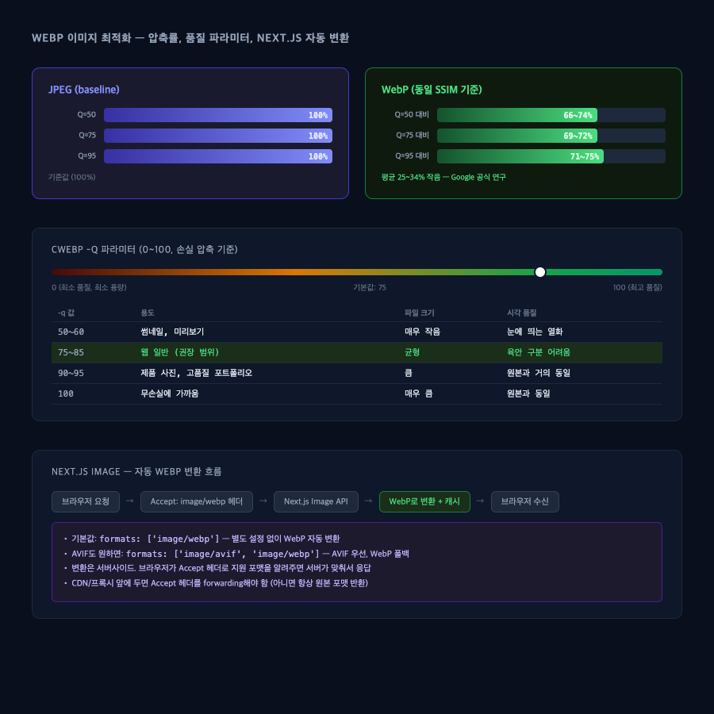

# WebP 이미지 최적화 — 압축률, cwebp -q, Next.js 자동 변환

> 작성일: 2026-05-09
> 태그: #개념정리 #성능튜닝 #nextjs #web-vitals
> 출발점: 이미지 최적화 시 WebP가 실제로 얼마나 줄어드는지, -q 80이 무엇을 의미하는지, Next.js가 자동으로 해주는지 탐구
> 원본 기록: 학습 목적 — Google 공식 연구, cwebp docs, Next.js docs 기반 정리

## 한 줄 요약

WebP는 JPEG 대비 동일 화질 기준 **25~34% 작다** (Google 공식 연구). `cwebp -q 80`은 0~100 품질 척도에서 80점 — 웹 권장 범위(75~85)의 중상단. Next.js Image는 별도 설정 없이 WebP를 자동 변환해준다.


> JPEG vs WebP 용량 비교, cwebp 품질 파라미터 범위, Next.js 자동 변환 흐름

---

## 배경 지식

### WebP가 등장한 이유

JPEG는 1992년 표준. 웹이 이미지를 대규모로 서빙하게 되면서 "같은 화질인데 더 작은 파일"이 필요해졌음. Google이 2010년 발표한 WebP는 VP8 비디오 코덱에서 파생된 인트라프레임 압축을 사용.

JPEG와 비교한 핵심 차이:
- **손실 압축**: VP8 기반 예측 부호화 → JPEG의 DCT 방식보다 효율적
- **무손실 압축**: 별도의 무손실 모드 지원 (PNG 대체 가능)
- **알파 채널**: 무손실 WebP는 투명도 지원 (JPEG는 불가)
- **애니메이션**: GIF 대체 가능 (대신 파일이 커짐)

### 품질 지표: PSNR vs SSIM

Google의 연구에서 기존 PSNR(최대 신호 대 잡음비) 대신 SSIM(Structural Similarity Index)을 품질 기준으로 씀.

PSNR은 픽셀 오차를 수학적으로 계산하는데, 사람 눈의 인지 패턴을 반영하지 못함. SSIM은 **밝기·대비·구조** 세 요소를 따로 비교해서 인간의 시각 인지에 더 가까움.

→ 같은 SSIM 값 = 같은 "체감 품질"

---

## 동작 원리 / 메커니즘

### WebP vs JPEG 압축률 — 공식 수치

**출처: [Google WebP Compression Study](https://developers.google.com/speed/webp/docs/webp_study)**

| JPEG 품질 | WebP 파일 크기 (동일 SSIM) | 절감 |
|---|---|---|
| Q=50 | JPEG 대비 66~74% | 26~34% 작음 |
| Q=75 | JPEG 대비 69~72% | 28~31% 작음 |
| Q=95 | JPEG 대비 71~75% | 25~29% 작음 |

→ 한 줄로: **WebP는 JPEG 대비 동일 품질에서 약 25~34% 작다**

추가 대규모 연구 (900,000장 JPEG 분석): WebP 평균 압축률 41.30% (= JPEG 대비 파일 크기가 41% 더 작음). 이 수치는 SSIM 제약 없이 "압축 이득이 양수인 경우"만 포함.

### cwebp -q 파라미터

```bash
cwebp -q 80 input.jpg -o output.webp
```

- 범위: **0 ~ 100** (정수)
- 기본값: **75**
- 0: 최소 품질, 최소 파일 크기
- 100: 최고 품질, 최대 파일 크기

**손실 압축 모드 (기본)**에서 -q는 압축 강도를 조절:
- 낮을수록 → 더 많이 버려서 → 더 작은 파일 → 더 많은 열화
- 높을수록 → 더 보존해서 → 더 큰 파일 → 더 좋은 화질

**무손실 압축 모드(-lossless 플래그)**에서는 의미가 바뀜:
- 낮을수록 → 더 빠른 인코딩 → 더 큰 파일
- 높을수록 → 더 느린 인코딩 → 더 작은 파일
- (품질이 아니라 인코딩 노력의 정도)

```bash
# 손실: 품질 80
cwebp -q 80 photo.jpg -o photo.webp

# 무손실: 최대 압축 노력 (느리지만 가장 작음)
cwebp -lossless -q 100 graphic.png -o graphic.webp
```

### 실용 권장값 요약

| -q 범위 | 용도 |
|---|---|
| 50~65 | 썸네일, 백그라운드, 덜 중요한 장식 이미지 |
| 75~85 | **웹 일반 — 대부분의 경우 이 범위** |
| 85~92 | 제품 사진, 포트폴리오, 디테일이 중요한 경우 |
| 95~100 | 아카이브, 인쇄용 원본에 가까운 품질이 필요한 경우 |

→ `-q 80`은 "웹 권장 범위" 안에 있음. 기본값 75보다 약간 더 보수적(품질 우선).

### Next.js Image — 자동 WebP 변환

**별도 설정 없어도 기본으로 WebP 자동 변환된다.**

동작 방식:
1. 브라우저가 이미지 요청 시 `Accept: image/webp` 헤더를 포함해서 보냄
2. Next.js Image Optimization API가 이 헤더를 보고 WebP로 변환해서 응답
3. 변환된 이미지는 캐시됨 (다음 요청부터는 캐시 히트)

```jsx
// 이것만 해도 WebP 자동 서빙
import Image from 'next/image'

<Image src="/hero.jpg" width={1200} height={600} alt="hero" />
```

기본 formats 설정 (next.config.js):

```js
// 기본값 — 명시적으로 쓰면 이렇게
module.exports = {
  images: {
    formats: ['image/webp'], // WebP 지원 브라우저면 WebP, 아니면 원본 포맷
  },
}

// AVIF도 원하면
module.exports = {
  images: {
    formats: ['image/avif', 'image/webp'],
    // AVIF 지원 브라우저 → AVIF
    // WebP 지원 브라우저 → WebP
    // 그 외 → 원본 포맷
  },
}
```

**AVIF vs WebP** (참고):
- AVIF는 WebP 대비 20% 더 작음
- AVIF는 인코딩 시간이 WebP 대비 약 50% 더 걸림 (첫 요청이 느림)
- Next.js 공식: "대부분의 경우 WebP를 권장"

**중요 주의사항 — CDN/프록시 앞에 두는 경우:**

```
브라우저 → CDN → Next.js 서버
```

CDN이 Accept 헤더를 Next.js에 포워딩하지 않으면, Next.js는 WebP 지원 여부를 알 수 없어서 항상 원본 포맷을 반환함. CDN 설정에서 `Accept` 헤더 forwarding 필수.

Vercel에 배포하는 경우엔 이 처리가 자동으로 됨.

---

## 어떤 상황에서 마주쳤나

- 이미지가 많은 페이지 성능 최적화 시 WebP 변환 여부 확인
- `next/image` 컴포넌트가 WebP를 자동으로 처리하는지 확인하고 싶었음
- `cwebp -q 80`으로 수동 변환 스크립트 작성 시 파라미터 의미 파악

---

## 해당 상황을 반복하지 않으려면

**next/image 쓰는 경우**: 별도 WebP 변환 작업 불필요. 자동으로 됨.

**수동 변환이 필요한 경우** (static export, CDN 직접 업로드 등):

```bash
# 단일 파일
cwebp -q 80 image.jpg -o image.webp

# 폴더 일괄 변환
for f in *.jpg; do cwebp -q 80 "$f" -o "${f%.jpg}.webp"; done

# 품질 결과 확인
cwebp -q 80 -v image.jpg -o image.webp 2>&1 | grep "output size"
```

**최적 -q 값 찾는 법**: 두 방법 중 하나
1. 육안 비교: 85, 80, 75, 70 각각 변환 후 원본 나란히 놓고 비교
2. SSIM 측정: `dssim original.png converted.webp` (0에 가까울수록 유사)

---

## 헷갈렸던 부분 / 함정

**"Next.js가 자동으로 WebP로 변환해주니까 원본 파일 품질은 상관없다"** — 아님. Next.js는 변환 시 원본의 화질 정보를 기반으로 재압축함. 원본이 이미 저품질 JPEG이면 WebP 변환해도 화질이 개선되지 않음. 원본은 최대한 높은 품질로 유지하는 게 맞음.

**-q와 파일 크기의 비선형 관계** — -q 75→80(+5)이 줄이는 파일 크기와 -q 95→100(+5)이 늘리는 크기가 전혀 다름. 하이 퀄리티 구간(90+)에서는 품질 증가 대비 파일 크기가 급격히 커짐.

대략 참고용 수치 (1MB JPEG 기준, 내용에 따라 크게 다름):
- -q 60: ~120KB
- -q 75: ~200KB
- -q 80: ~280KB
- -q 90: ~500KB
- -q 95: ~800KB

**무손실(-lossless)에서 -q의 의미가 반대** — 손실 모드: q 낮을수록 작음. 무손실 모드: q 높을수록 작음 (대신 느림). 같은 파라미터인데 모드에 따라 반대 방향으로 작동하니까 헷갈림.

---

## 응용·확장

- **AVIF**: WebP 다음 세대. 20% 더 작지만 브라우저 지원율이 WebP보다 낮음 (2026 기준 대부분 지원). 인코딩 느림.
- **Sharp**: Node.js 이미지 처리 라이브러리. Next.js Image Optimization 내부에서도 Sharp 사용. 직접 쓸 때 유용.
- **next-image-export-optimizer**: static export 환경에서 next/image처럼 WebP 변환해주는 패키지
- **srcset + picture 태그**: next/image 없이 수동으로 포맷 폴백 구현할 때
  ```html
  <picture>
    <source type="image/avif" srcset="image.avif">
    <source type="image/webp" srcset="image.webp">
    
  </picture>
  ```
- **LCP 최적화**: 히어로 이미지에 `priority` 속성 + WebP + `sizes` 올바르게 설정하면 LCP 크게 개선 가능

---

## 참고 자료

- [WebP Compression Study — Google Developers](https://developers.google.com/speed/webp/docs/webp_study) — 공식 압축률 연구, SSIM 기준 25~34% 절감 수치
- [WebP Comparative Study — Google Developers](https://developers.google.com/speed/webp/docs/c_study) — 대규모 900K장 연구
- [cwebp 공식 문서 — Google Developers](https://developers.google.com/speed/webp/docs/cwebp) — -q 파라미터 정의
- [Image formats: WebP — web.dev](https://web.dev/learn/images/webp/) — WebP 기술 원리
- [Next.js Image Component — 공식 문서](https://nextjs.org/docs/app/api-reference/components/image) — formats 설정, 자동 변환 동작
