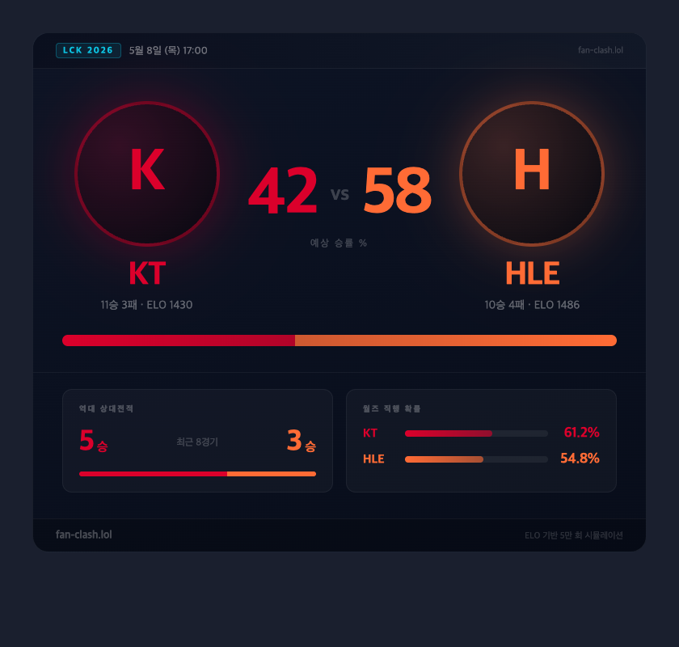
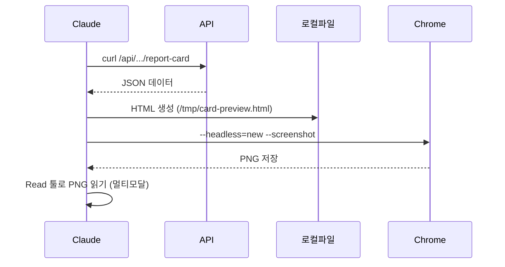

# 공유카드 컴팩트 디자인 & Claude가 UI를 확인하는 방법

> 작성일: 2026-05-08
> 태그: #도구습득 #nextjs #react #claude-code
> 출발점: 커뮤니티 공유용 경기 리포트 카드 디자인 개선 작업
> 원본 기록: [../backlog.md](../backlog.md)

## 한 줄 요약

Claude Code는 Chrome 헤드리스로 정적 HTML을 렌더링해서 PNG를 찍고, 멀티모달로 직접 확인한다. 인증 보호된 Next.js 앱은 직접 못 뚫으니 API 데이터로 동등한 HTML을 별도 생성하는 방식을 쓴다.

---

## 배경 — 공유카드 컴팩트 디자인

기존 `MatchReportCard`는 섹션이 8개짜리 데이터 대시보드에 가까웠음. 커뮤니티에 캡처해서 올리려면 **한 장에 임팩트**가 있어야 함.

개선 방향:
- 팀 로고: 72px → **180px** + 팀 컬러 글로우
- 팀명: 24px → **40px**
- 승률 숫자: 48px → **80px**, 카드 중앙 주인공으로
- 승률 바: 10px → **14px** 두께
- 섹션 8개 → 3개로 압축 (VS + H2H + 월즈)
- 카드 너비: 640px → **760px**

결과물은 `MatchReportCardCompact` 컴포넌트로 분리. 기존 상세 카드는 건드리지 않고 admin에 "공유 카드" / "상세 카드" 버튼으로 분기.



---

## Claude가 UI를 확인하는 방법

### 흐름

```
1. API 데이터 curl로 수집
        ↓
2. 동등한 정적 HTML 생성 (/tmp/card-preview.html)
        ↓
3. Chrome 헤드리스로 PNG 캡처 (/tmp/card-preview.png)
        ↓
4. Claude가 Read 툴로 이미지 읽어 멀티모달 확인
```



### 핵심 명령어

```bash
"/Applications/Google Chrome.app/Contents/MacOS/Google Chrome" \
  --headless=new \
  --screenshot=/tmp/card-preview.png \
  --window-size=840,800 \
  --hide-scrollbars \
  --no-sandbox \
  "file:///tmp/card-preview.html"
```

- `--headless=new`: 구버전 `--headless` 대비 렌더링 품질이 더 좋음 (Chrome 112+)
- `--screenshot`: 파일 경로 지정, PNG로 저장
- `--window-size`: 캡처 해상도, 카드 너비 + 여백 고려해서 지정
- `file://`: 로컬 HTML 파일을 직접 열 수 있음

### 왜 Next.js 앱을 직접 캡처 안 하나

인증 미들웨어(`src/middleware.ts`)가 `/admin/*` 경로를 보호하고 있어서 curl이나 헤드리스 브라우저로 접근하면 로그인 페이지로 리다이렉트됨. 쿠키 없이는 진입 불가.

→ 대신 API 응답 JSON을 가져와서 **동일한 스타일의 HTML을 직접 생성**해 렌더링.

---

## 이미지 저장 경로

| 경로 | 특성 |
|---|---|
| `/tmp/` | macOS 임시 폴더. 재부팅 시 초기화, 3일 이상 방치 시 자동 삭제 |
| `docs/notes-assets/` | 프로젝트 내 영구 경로. git에 포함 가능 |

노트에 이미지를 영구 보존하려면 `docs/notes-assets/`에 복사해야 함:

```bash
cp /tmp/card-preview.png \
   /path/to/project/do./2026-05-08-compact-card-preview.png
```

마크다운에서 참조:
```markdown

```

---

## 헷갈렸던 부분 / 함정

**`/tmp`가 영구라고 착각하기 쉬움**
→ `/tmp`는 macOS가 주기적으로 정리하는 임시 디렉토리. 재부팅하면 사라짐. Claude가 "이미지 저장됐어요"라고 해도 프로젝트 안 경로에 복사해두지 않으면 나중에 없어짐.

**헤드리스 캡처 결과 ≠ 실제 앱 결과**
→ 정적 HTML이라 Next.js Image 최적화, Noto Sans KR 웹폰트, Tailwind 클래스 등이 빠짐. 근사치 프리뷰. 정확한 확인은 브라우저에서 직접 봐야 함.

**`--headless` vs `--headless=new`**
→ 구버전 `--headless`는 렌더링 엔진이 달라서 Shadow DOM 처리 등에서 차이 날 수 있음. Chrome 112+ 환경이면 `--headless=new` 쓰는 게 안전.

---

## 응용·확장

- OG 이미지 생성도 같은 패턴 사용 가능 (`/api/og` 라우트)
- Playwright 설치하면 쿠키 주입 → 인증된 상태로 실제 앱 캡처 가능
- CI에서 시각적 회귀 테스트(Visual Regression Test) 자동화할 때도 동일 방식

---

## 참고

- [Chrome 헤드리스 공식 문서](https://developer.chrome.com/docs/chromium/new-headless) — `--headless=new` 변경점 설명
