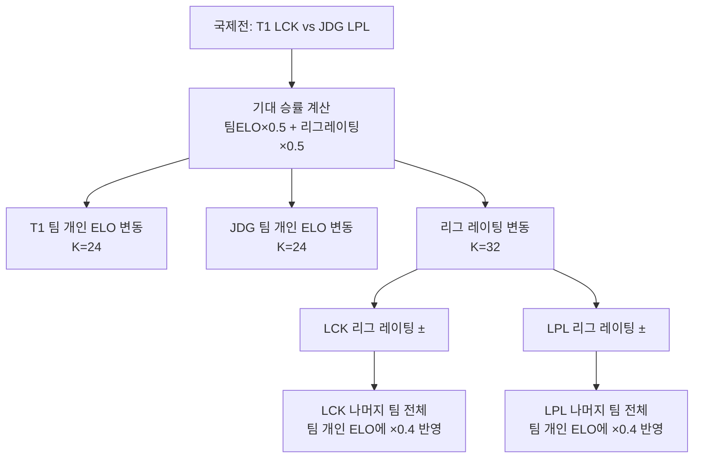
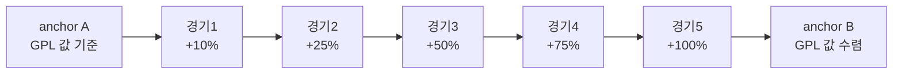

# 팀 개인 ELO와 리그 레이팅 분리 설계

> 작성일: 2026-05-07  
> 태그: #설계결정 #elo #lck #typescript  
> 출발점: ELO v5 개편 — 팀/리그 분리 + 국제전 전파 로직 도입 (Phase 4)  
> 원본 기록: [../06-dev-log.md](../06-dev-log.md#phase-4--분석--랭킹-고도화-2026-05-07)

---

## 한 줄 요약

팀 개인 ELO는 "내가 이겼나 졌나"만 반영하고, 리그 레이팅은 "내 리그가 국제전에서 얼마나 강한가"를 별도로 쌓는다. 표시 ELO = 팀 개인 ELO + (리그 레이팅 변동 × 0.4).

---

## 배경 지식

### ELO란

체스에서 시작된 레이팅 시스템. 기대 승률 대비 실제 결과로 점수를 올리고 내린다.

```
기대 승률 E = 1 / (1 + 10^((상대-나) / 400))
점수 변동 Δ = K × (실제결과 - 기대 승률)   // 실제결과: 승=1, 패=0
```

K-factor가 클수록 한 경기의 영향이 크다. K=16이면 이변이 나도 최대 ±16pt, K=72면 최대 ±72pt.

### 문제: 리그 간 ELO가 연결이 없다

LCK에서 T1이 100전 100승을 하면 ELO가 올라간다. 그런데 LCK 전체가 MSI에서 계속 지면 LCK 팀들의 "진짜 강도"는 과대평가된 상태다. 국내 경기만으로는 리그 간 실력 차이를 반영할 수 없음.

반대로: 국제전 결과를 경기한 두 팀에만 반영하면 나머지 팀은 영향을 전혀 안 받는다.

→ **그래서 리그 레이팅(League Rating)을 별도로 둔다.**

---

## 동작 원리 / 메커니즘

### 두 개의 레이어

```
표시 ELO = 팀 개인 ELO + (리그 레이팅 변동 × LEAGUE_WEIGHT)
                                                    ↑ 0.4 (감쇠 계수)
```

| 레이어 | 갱신 시점 | 대상 |
|---|---|---|
| 팀 개인 ELO | 모든 경기 (국내 + 국제) | 경기에 직접 참여한 두 팀 |
| 리그 레이팅 | 국제전 (MSI, Worlds, FIRST) | 서로 다른 리그끼리 맞붙은 경기 |

### 국내 경기 흐름

```typescript
// K_DOMESTIC = 16
const eA = expectedScore(eloA, eloB)
const sA = winner === 'team_a' ? 1 : 0
deltaA = Math.round(K_DOMESTIC * (sA - eA))
deltaB = Math.round(K_DOMESTIC * ((1 - sA) - (1 - eA)))

teamElo[tA.slug] += deltaA
teamElo[tB.slug] += deltaB
// 리그 레이팅은 변동 없음
```

### 국제전 흐름

```typescript
// K_INTL_TEAM = 24, K_LEAGUE = 32

// 기대 승률: 팀 점수 50% + 리그 레이팅 50%
const adjA = eloA * 0.5 + lrA * 0.5
const adjB = eloB * 0.5 + lrB * 0.5
const eA = expectedScore(adjA, adjB)

// 1. 팀 개인 ELO 변동 (직접 참여 2팀만)
deltaA = Math.round(K_INTL_TEAM * (sA - eA))
deltaB = Math.round(K_INTL_TEAM * ((1 - sA) - (1 - eA)))
teamElo[tA.slug] += deltaA
teamElo[tB.slug] += deltaB

// 2. 리그 레이팅 변동 (서로 다른 리그일 때만)
if (regionA !== regionB) {
  const leagueDeltaA = Math.round(K_LEAGUE * (sA - expectedScore(lrA, lrB)))
  leagueRating[regionA] += leagueDeltaA
  leagueRating[regionB] -= leagueDeltaA

  // 3. 리그 레이팅 변동을 해당 리그 전체 팀에 즉시 전파
  //    (직접 참여한 두 팀 제외 — 그 팀은 팀 개인 ELO로 이미 처리됨)
  for (const team of allTeams) {
    if (team.slug === tA.slug || team.slug === tB.slug) continue
    if (region === regionA) teamElo[team.slug] += leagueDeltaA * LEAGUE_WEIGHT
    if (region === regionB) teamElo[team.slug] -= leagueDeltaA * LEAGUE_WEIGHT
  }
}
```

### 전파 흐름 시각화



### GPL 앵커와 소급 보정

리그 레이팅의 초기값은 어떻게 세팅하나? → **GPL(Global Power Rankings) 스냅샷**에서 역산.

GPL은 Riot이 각 시즌 종료 후 공식 발표하는 리그 간 실력 순위다. 스냅샷 날짜에 팀 ELO가 GPL 값과 정확히 수렴하도록 소급 보정을 한다.

```
소급 보정 원리:
- 직전 anchor 이후 발생한 경기 이벤트 목록을 구간으로 잡음
- 구간 끝(anchor 직전)이 목표값이 되도록
- 각 이벤트에 progress = (i+1)/total 비율로 gap을 선형 분산

progress=0.1 → gap의 10%만 보정
progress=0.5 → gap의 50%만 보정
progress=1.0 → gap의 100% 보정 (마지막 이벤트 = anchor 직전)
```



이렇게 하면 anchor 시점에서 그래프가 **툭 튀지 않는다**. 자연스럽게 수렴하는 효과.

---

## 어떤 상황에서 마주쳤나

Phase 3에서 LPL/LEC/LCS 팀을 추가했더니 리그 간 ELO 기준이 달라서 비교가 무의미해졌다. LCK 팀은 LCK 내전 결과만 쌓았고, LPL 팀은 LPL 내전 결과만 쌓은 상태.

MSI 같은 국제전에서 LCK 팀이 LPL에 지면 그 경기 참여팀 2개만 변동이 생기고, LCK에서 국내전 잘 하던 나머지 팀들은 ELO가 그대로였다. 실제론 "LCK 전반의 경쟁력이 낮다"는 정보가 담겨있는데.

---

## 해당 상황을 반복하지 않으려면

- 국제전 경기 처리 시 `isInternational` 플래그를 반드시 확인할 것.
- 리그 레이팅 전파 대상에서 **직접 참여 2팀을 명시적으로 exclude**해야 이중 반영이 안 된다.
- `LEAGUE_WEIGHT = 0.4`는 조율 가능한 파라미터. 1.0이면 리그 부침이 너무 강하게 반영돼서 개인 퍼포먼스가 묻힘.

---

## 헷갈렸던 부분 / 함정

**함정 1: 직접 참여 팀도 전파 대상에 포함시키면 이중 반영**

처음에 생각했던 코드:
```typescript
// 틀린 코드: tA, tB도 포함해버리면
for (const team of allTeams) {
  if (region === regionA) teamElo[team.slug] += leagueDeltaA * LEAGUE_WEIGHT
}
// → T1은 이미 deltaA를 받았는데, 리그 전파분도 또 받음
```

올바른 코드: 직접 참여한 두 팀은 `continue`로 스킵.

**함정 2: anchor 소급 보정 없이 anchor 시점에 값을 강제 수렴시키면 그래프가 툭 튀는 현상**

GPL 스냅샷 날짜에 팀 ELO를 GPL 값으로 강제 세팅하면, 직전 경기까지는 내 계산값이었다가 anchor 당일 순간 수백 포인트 점프가 일어난다. 이걸 "anchor 점프"라고 부르는데, 소급 선형 보간으로 해결.

**함정 3: '현재' 스냅샷을 anchor로 쓰면 안 된다**

GPL에는 "현재 시즌 진행 중" 스냅샷도 있는데, 이걸 anchor로 넣으면 시즌 중에 ELO가 폭락하는 현상이 생겼다. 원인: 아직 경기가 끝나지 않아서 GPL 값이 확정되지 않은 상태인데 강제 수렴을 시켜버리기 때문.

```typescript
// "현재" 포함된 스냅샷은 제외
const snapshots = gplRaw.snapshots.filter(s => !s.label.includes('현재'))
```

**함정 4: 플레이인처럼 같은 리그끼리 국제전 경기 → 리그 레이팅 변동 안 함**

MSI 플레이인에서 LCK-1 vs LCK-2 경기가 생길 수 있음. `regionA !== regionB` 조건이 없으면 같은 리그끼리 리그 레이팅이 서로 상쇄되는 이상한 상황 발생.

---

## 수치로 보는 K-factor 설계

| 상황 | K-factor | 한 경기 최대 변동 | 이유 |
|---|---|---|---|
| 국내 경기 (팀 ELO) | 16 | ±16 | 국내 리그는 수십 경기 → 안정적으로 |
| 국제전 (팀 ELO) | 24 | ±24 | 국제전은 경기 수 적음 → 가중치 더 높게 |
| 국제전 (리그 레이팅) | 32 | ±32 | 리그 레이팅은 전 팀에 전파되므로 팀 ELO보다 크게 |
| 리그 전파 감쇠 | ×0.4 | ±12.8 | 직접 참여 안 한 팀이라서 절반 이하로 |

예시: T1(LCK)이 JDG(LPL)에 3-0으로 이겼을 때
- T1 팀 ELO: +24 근방
- JDG 팀 ELO: -24 근방
- LCK 리그 레이팅: +32 근방
- LPL 리그 레이팅: -32 근방
- LCK 나머지 팀(Gen.G, DK 등): +32 × 0.4 = +12.8 → +13
- LPL 나머지 팀: -32 × 0.4 = -12.8 → -13

---

## 응용·확장

- **LEAGUE_WEIGHT 파라미터 튜닝**: 0.4는 경험값. 국제전 결과가 국내 랭킹에 너무 많이/적게 반영되면 조정.
- **K_LEAGUE 조정**: 대회 규모(Worlds vs MSI vs First Stand)에 따라 다르게 줄 수 있음. 현재는 동일.
- **다른 게임 적용**: "리그 레이팅" 개념은 분리된 리그가 있는 어떤 게임에도 적용 가능. 리그 A와 B가 교차 경기를 가끔 하는 구조라면 동일한 패턴.
- TODO: 국제전 대회별로 K_LEAGUE 다르게 적용 (Worlds > MSI > First Stand)

---

## 참고 자료

- [scripts/recalc-elo-history.ts](../../scripts/recalc-elo-history.ts) — 실제 재계산 스크립트 전체
- [src/lib/elo.ts](../../src/lib/elo.ts) — 기본 ELO 함수 (expectedScore, kFactor, formMultiplier 등)
- [Wikipedia: Elo rating system](https://en.wikipedia.org/wiki/Elo_rating_system) — ELO 기본 공식
