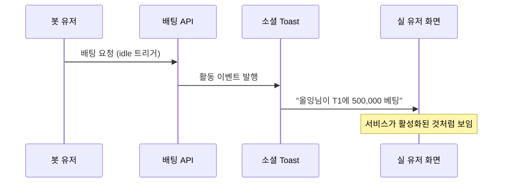

# 봇 유저를 처음부터 넣은 이유 — "배팅 풀이 비어있으면 배당률이 의미없다"

> 작성일: 2026-05-07  
> 태그: #설계결정 #게임설계 #배당률 #소셜기능  
> 출발점: Phase 1 뼈대 단계에서 봇 유저를 동시 투입한 배경이 궁금해서  
> 원본 기록: [../06-dev-log.md](../06-dev-log.md) Phase 1 섹션, [../../src/lib/bot.ts](../../src/lib/bot.ts)

---

## 한 줄 요약

파리뮤추얼 배당 시스템에서 배팅 풀이 비어있으면 배당률이 수학적으로 의미없어지고, 봇은 그 풀을 채우는 동시에 소셜 토스트의 소재도 된다.

---

## 배경 지식

### 파리뮤추얼(Pari-mutuel) 배당 방식

FanClash는 고정 배당이 아니라 **파리뮤추얼 방식**을 쓴다. 이게 핵심이다.

| 방식 | 배당 결정 시점 | 배당률 결정 주체 |
|---|---|---|
| 고정 배당 | 경기 전 고정 | 운영자 (or 오즈메이커) |
| 파리뮤추얼 | 경기 마감 시 확정 | 전체 배팅 풀 분포 |

파리뮤추얼에서 A팀의 배당률은 대략:

```
배당률(A) = 전체 배팅 풀 합계 / A팀에 몰린 배팅 합계
```

예: 전체 1,000,000 포인트 중 A팀에 800,000이 몰렸다면 → A팀 배당 ≈ 1.25배, B팀 ≈ 5배.

### 배팅 풀이 비어있을 때의 문제

배팅 풀에 아무도 없으면:

- 분모가 0 → 배당률 계산 불가
- 분모가 매우 작으면 → 배당률이 터무니없이 커짐 (1명이 100만 포인트 걸면 배당 ∞)
- **"나 혼자 배팅" 상태**: 맞춰도 아무도 잃지 않으니 배당 재원이 없음

고정 배당 시스템이었다면 이 문제가 없다. 운영자가 배당을 미리 정해놓으니까. 하지만 파리뮤추얼은 **유저들의 집단 판단이 배당률을 만드는 구조**라, 유저가 없으면 그 구조 자체가 성립하지 않는다.

### 닭이 먼저냐 달걀이 먼저냐

신규 서비스의 고전적 콜드 스타트 문제다:

- 유저가 없으니 배당률이 이상함
- 배당률이 이상하니 유저가 안 옴

봇이 이 루프를 끊는다.

---

## 동작 원리 / 메커니즘

### 봇의 두 가지 역할

```
봇 유저
├── 역할 1: 배팅 풀 최소 확보
│   └── 모든 경기에 자동 배팅 → 배당률이 항상 의미있는 범위 유지
└── 역할 2: 소셜 토스트 소재
    └── 봇 활동이 실시간 toast로 노출 → 서비스가 살아있는 것처럼 보임
```

### 봇 배팅 로직 (`src/lib/bot.ts`)

봇은 멍청하게 랜덤으로 배팅하지 않는다. **ELO 기반 승률**을 실제로 반영한다:

```typescript
// ELO 기반 승률 우선, 없으면 하드코딩 fallback
const eloA = match.eloA ?? match.teamA.eloRating
const eloB = match.eloB ?? match.teamB.eloRating
const probA = (eloA && eloB)
  ? winProbability(eloA, eloB)
  : (TEAM_WIN_PROB[teamASlug] ?? 0.5)
```

그리고 봇도 자기 응원팀이 경기에 나오면 **+25% 편향**이 붙는다:

```typescript
// 팬덤 보정: 본인 응원팀이 경기에 있으면 해당 팀 예측 확률 +25%
if (bot.mainTeamId === match.teamAId) adjProbA = Math.min(0.92, probA + 0.25)
else if (bot.mainTeamId === match.teamBId) adjProbA = Math.max(0.08, probA - 0.25)
```

이게 중요한 이유: 실제 팬도 응원팀에 더 많이 거는 경향이 있다. 봇이 현실적인 배팅 분포를 만들어줘서, 실 유저가 봤을 때 배당률이 "납득 가능한 범위"가 된다.

### 봇 유저 다양성 설계

봇은 지역 분포까지 현실적으로 설계됐다:

```typescript
const REGION_WEIGHTS = {
  KR: 0.90,   // 한국 90%
  CN: 0.04,   // 중국 4%
  NA: 0.03,   // 북미 3%
  EU: 0.01,   // 유럽 1%
  SEA: 0.01,  // 동남아 1%
  BR: 0.005,  // 브라질
  OTHER: 0.005,
}
```

한국 유저 90%, 글로벌 10%는 LCK 시청자 비율을 실제로 반영한 수치다. 그리고 지역마다 닉네임 사전이 다르다 — KR은 "올잉", "존버", "떡상" 같은 단어, CN은 "xiaoming", "dragon88", NA/EU는 영어 단어.

이유: **toast에 노출될 때 국적 다양성이 느껴져야 글로벌 서비스처럼 보인다.**

### 배팅 금액 설계

봇의 배팅 금액도 무작위가 아니다:

```typescript
// 현재 포인트의 5~30%, 최소 10,000 최대 500,000
const wager = Math.min(500_000, Math.max(10_000, Math.round(currentPoints * (0.05 + rand() * 0.25))))
```

포인트 비례 배팅을 쓰는 이유:
- 실 유저처럼 자산 규모에 따라 배팅 크기가 다름
- 극단적인 배팅(전재산 올인, 1포인트 찔끔)이 안 나와서 배팅 풀이 왜곡되지 않음

### 배팅 풀 유지 효과

봇 수 N명, 평균 배팅액 W라고 하면 경기당 최소 배팅 풀은:

```
최소 풀 = N × participation_rate × W
```

팀 팬 비율(T1 32%, 젠지 18%, ...)이 봇에도 적용되어, 실제 팬 분포와 비슷한 배당률 분포가 자연스럽게 형성된다.

---

## 소셜 토스트에서의 봇 활용



dev-log를 보면 toast는 처음엔 단순한 알림 용도였다가, `idle 봇 트리거`가 붙으면서 봇 활동도 소재가 됐다:

```
feat: idle 봇 트리거 + toast 위로 쌓임 + 수동 닫기
feat: 유저 활동 기반 봇 자동 배팅 트리거 추가
```

실 유저가 활동하면 → 봇도 따라서 배팅 → 봇 배팅이 toast로 노출 → 다른 실 유저가 봄 → 서비스가 북적이는 것처럼 느껴짐. 이게 의도된 설계다.

---

## 어떤 상황에서 마주쳤나

Phase 1 뼈대 단계(2026-04-27)에서, "배팅 기능"이 만들어지자마자 바로 봇도 투입됐다. dev-log 기록:

> "배팅 풀이 비어있으면 배당률이 의미 없다. 초기부터 봇을 넣었다"

이게 Phase 1에서 나온 결정이라는 게 중요하다. UI도 없던 시기에, 배당률 시스템의 수학적 한계를 먼저 인지하고 봇을 설계했다.

---

## 반복하지 않으려면 어떤 조치가 필요한가?

이건 버그가 아니라 설계 원칙이다. 반복하지 않을 실수라기보다, **파리뮤추얼 배당을 새로 도입하는 시스템에서 항상 기억해야 할 원칙**:

1. **파리뮤추얼 = 풀 크기가 임계값 이상이어야 배당률이 의미를 가진다**
2. **신규 서비스라면 콜드 스타트 풀을 반드시 설계해야 한다** (봇이든, 운영자 시드 배팅이든)
3. **봇이 소셜 기능의 소재가 될 수 있다면, 봇 유저 다양성을 현실적으로 설계하는 게 가치 있다**

---

## 헷갈렸던 부분 / 함정

**"봇이 배팅하면 배당률이 왜곡되지 않나?"**

처음엔 이게 불공평하다고 느껴질 수 있다. 하지만:

- 봇도 ELO 기반 승률을 따르므로, 실 유저의 직관과 비슷한 패턴으로 배팅한다
- 봇 배팅이 한쪽으로 극단적으로 쏠리지 않도록 팬덤 편향을 ±25%로 제한했다 (최대 92%, 최소 8%)
- 팀 팬 비율(T1 32%, 젠지 18%)이 현실 팬 분포를 반영하기 때문에, 봇이 많아도 배당률이 "이상한 방향"으로 가지 않는다

**고정 배당이었으면 이런 고민 자체가 없었다.**

파리뮤추얼을 선택한 이유(dev-log 결정 표):
> "유저들의 예측 분포가 배당률에 반영됨"

이 장점을 살리려면 풀 크기가 충분해야 한다. 봇은 그 조건을 충족시키는 가장 단순한 해결책이었다.

---

## 응용·확장

- 이 패턴은 **스포츠 베팅 플랫폼**, **예측 마켓**, **크라우드소싱 확률 게임** 어디서나 같은 문제가 생긴다
- 봇 없이 운영자가 직접 "시드 배팅"을 하는 방식도 있음 (전통 파리뮤추얼 경마에서 실제로 사용)
- `botRatio` 파라미터로 배팅 참여 비율을 조절할 수 있어서, 서비스 성장에 따라 봇 의존도를 낮출 수 있는 구조가 이미 있음:

```typescript
export async function runBotPredictions(opts: BotPredictOptions = {}): Promise<...> {
  const { matchId, botRatio = 1.0 } = opts
  // botRatio < 1.0이면 전체 봇 중 일부만 랜덤 샘플링
```

실 유저가 충분히 쌓이면 botRatio를 0.5 → 0.2 → 0.0으로 줄여가면 된다.

---

## 참고 자료

- [Pari-mutuel betting — Wikipedia](https://en.wikipedia.org/wiki/Pari-mutuel_betting) — 파리뮤추얼 기본 개념, 경마에서 기원
- [docs/06-dev-log.md](../06-dev-log.md) — Phase 1 "봇 유저" 결정, 주요 결정 & 트레이드오프 표
- [src/lib/bot.ts](../../src/lib/bot.ts) — 봇 생성, 지역 분포, 배팅 로직 전체
