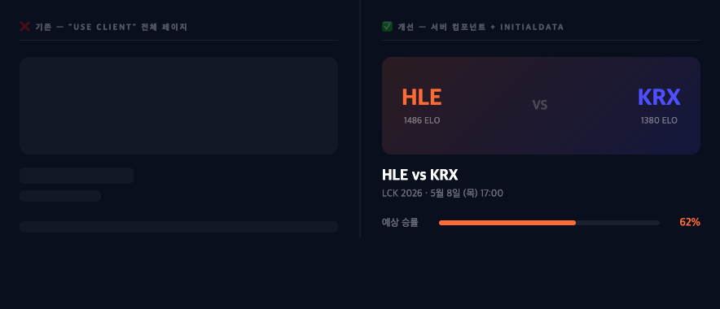
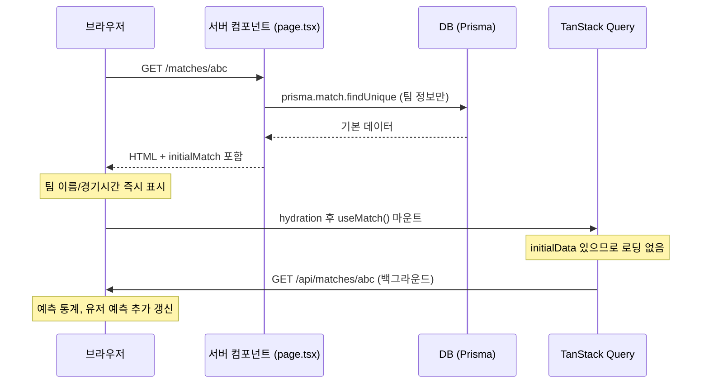

# 서버 컴포넌트 + initialData — 첫 화면 로딩 없이 즉시 렌더링

> 작성일: 2026-05-08
> 태그: #패턴발견 #nextjs #tanstack-query #성능튜닝
> 출발점: 매치 상세 페이지 첫 방문 시 스켈레톤만 보이다가 데이터가 뒤늦게 채워지는 문제
> 원본 기록: [../backlog.md](../backlog.md)

## 한 줄 요약

`page.tsx`를 서버 컴포넌트로 바꾸고 Prisma로 직접 조회한 데이터를 `initialData`로 클라이언트에 넘기면


> 왼쪽: `"use client"` 전체 페이지 — 스켈레톤만 보이다 600ms+ 후 렌더링. 오른쪽: 서버 컴포넌트 + initialData — 팀명·경기시간 즉시 표시, 예측 통계는 백그라운드에서 채워짐., 브라우저는 API 요청 없이 즉시 렌더링하고 백그라운드에서 전체 데이터(예측 통계, 유저 예측)를 갱신한다.

## 배경 지식

### 기존 흐름의 문제

```
브라우저 도착
  → JS 번들 다운로드 (~수백ms)
  → React hydration
  → useMatch() 마운트 → /api/matches/[id] 요청
  → Vercel → DB 쿼리 (~수백ms)
  → 응답 도착 → 화면 렌더링
```

총 2번의 네트워크 왕복. 두 번째가 끝나기 전까지 스켈레톤만 보임.

### 서버 컴포넌트 전환 후

```
브라우저 요청
  → Vercel 서버 컴포넌트 실행 → Prisma 직접 조회 (1번만)
  → HTML에 데이터 포함해서 전송
  → 브라우저는 JS 없이 즉시 렌더링
  → hydration 후 TanStack Query가 백그라운드에서 전체 데이터 갱신
```

네트워크 왕복 1번. 팀 이름/경기 시간은 HTML 파싱 즉시 표시.

## 구현 구조

```
app/matches/[id]/
  page.tsx                  ← 서버 컴포넌트 (Prisma 직접 조회)
  _components/
    MatchDetailClient.tsx   ← 클라이언트 컴포넌트 (기존 로직 그대로)
```



### 서버 컴포넌트 (page.tsx)

```tsx
// app/matches/[id]/page.tsx — 서버 컴포넌트 (async)
export default async function MatchDetailPage({ params }) {
  const raw = await prisma.match.findUnique({
    where: { id: params.id },
    include: {
      teamA: { select: teamSelectWithElo },
      teamB: { select: teamSelectWithElo },
    },
  })

  const initialMatch: MatchData = {
    ...raw,
    startTime: raw.startTime.toISOString(),
    userPrediction: null,      // 인증 필요 → 클라이언트에서 채움
    predictionStats: undefined, // 집계 쿼리 → 클라이언트에서 채움
  }

  return <MatchDetailClient id={params.id} initialMatch={initialMatch} />
}
```

### 클라이언트 컴포넌트에서 initialData 사용

```tsx
// _components/MatchDetailClient.tsx
export function MatchDetailClient({ id, initialMatch }: Props) {
  const { data: match } = useMatch(id, { initialData: initialMatch })
  // initialData 있으면 로딩 상태 없음 — 즉시 match 데이터 사용 가능
}
```

### useMatch 훅 수정

```ts
// lib/queries/index.ts
export function useMatch(id: string, options?: { initialData?: MatchData }) {
  return useQuery({
    queryKey: queryKeys.match(id),
    queryFn: () => fetchJson<{ match: MatchData }>(`/api/matches/${id}`),
    select: (data) => data.match,
    enabled: !!id,
    staleTime: 20_000,
    ...(options?.initialData
      ? { initialData: { match: options.initialData }, initialDataUpdatedAt: 0 }
      : {}),
  })
}
```

## `initialDataUpdatedAt: 0` 이 핵심

`initialData`만 넘기면 TanStack Query는 이 데이터를 "fresh"로 취급해서 `staleTime`이 지날 때까지 재요청하지 않음.

`initialDataUpdatedAt: 0`을 설정하면 "이 데이터는 epoch(1970년) 시점에 받은 것"으로 처리 → 항상 stale → **마운트 즉시 백그라운드 refetch 실행**.

```
initialDataUpdatedAt: 0
  → TanStack Query: "데이터가 있지만 stale"
  → 화면: 즉시 렌더링 (initialData 사용)
  → 백그라운드: /api/matches/[id] 재요청
  → 응답 오면: predictionStats, userPrediction 포함된 최신 데이터로 교체
```

이게 "일단 보여주고 나중에 갱신"의 핵심 트릭.

## 서버에서 뭘 조회하고 뭘 클라이언트에 남겼나

| 데이터 | 위치 | 이유 |
|---|---|---|
| 팀 정보 (이름, 색상, ELO) | 서버 | 공개 데이터, 즉시 표시 가능 |
| 경기 시간, 상태, 스코어 | 서버 | 공개 데이터 |
| `userPrediction` | 클라이언트 | 세션 기반, 서버 컴포넌트에서 auth 연동 복잡 |
| `predictionStats` | 클라이언트 | 집계 쿼리 느림, 잠깐 없어도 UX 무관 |

## 어떤 상황에서 마주쳤나

매치 상세 페이지 전체가 `"use client"`라서 서버에서 아무것도 안 하고 브라우저가 전부 처리하던 구조. 첫 방문마다 스켈레톤이 보이다가 수백ms 후 데이터가 채워지는 UX.

`staleTime` 튜닝이나 `revalidate` 조정으로는 첫 방문 속도를 개선할 수 없다는 걸 확인한 뒤 서버 컴포넌트 전환으로 방향을 잡음.

## 해당 상황을 반복하지 않으려면

새 페이지를 만들 때 처음부터 서버 컴포넌트로 시작. `"use client"` 전체 페이지는 첫 방문 성능이 항상 나쁨.

분리 기준:
- 인증/인터랙션/상태 필요한 부분만 클라이언트 컴포넌트
- 초기 렌더링에 필요한 데이터는 서버에서 직접 조회 후 prop으로 전달

## 헷갈렸던 부분

**"select + initialData를 같이 쓰면 타입이 꼬이지 않나?"**
→ `select`는 `initialData`와 queryFn 결과 **둘 다**에 적용된다.
→ 그래서 `initialData: { match: options.initialData }` 형태로 넘겨야 함 — queryFn이 반환하는 타입과 맞춰야 하기 때문.
→ 처음에 `initialData: options.initialData` (MatchData 직접)로 넘겼다가 타입 에러 남.

**"서버 컴포넌트에서 `predictionStats`도 같이 가져오면 더 빠르지 않나?"**
→ 맞지만, `predictionStats` 집계 쿼리가 느려서 서버 응답 자체가 늦어짐.
→ 빠르게 가져올 수 있는 것만 서버에서, 느린 건 클라이언트에서 비동기로 채우는 게 체감상 유리.
→ 팀 이름/경기 시간이 즉시 보이는 것만으로도 "뭔가 로딩됐다"는 체감 크게 달라짐.

## 응용·확장

- 팀 상세 페이지(`/teams/[slug]`), 랭킹 페이지도 같은 패턴 적용 가능
- 더 고급: `HydrationBoundary` + `prefetchQuery` 패턴 — queryClient에 prefetch해서 hydration 시 클라이언트 캐시에 직접 주입 (Suspense 스트리밍과 조합 가능)
- `predictionStats`를 Suspense로 감싸면 서버에서도 스트리밍으로 늦게 전송 가능 → API 호출 불필요

## 참고 자료

- [TanStack Query: Initial Query Data](https://tanstack.com/query/latest/docs/framework/react/guides/initial-query-data) — initialData, initialDataUpdatedAt 공식 설명
- [TanStack Query: Advanced SSR](https://tanstack.com/query/latest/docs/framework/react/guides/advanced-ssr) — HydrationBoundary 고급 패턴
- [Next.js: Server Components](https://nextjs.org/docs/app/building-your-application/rendering/server-components) — 서버 컴포넌트 공식 가이드
