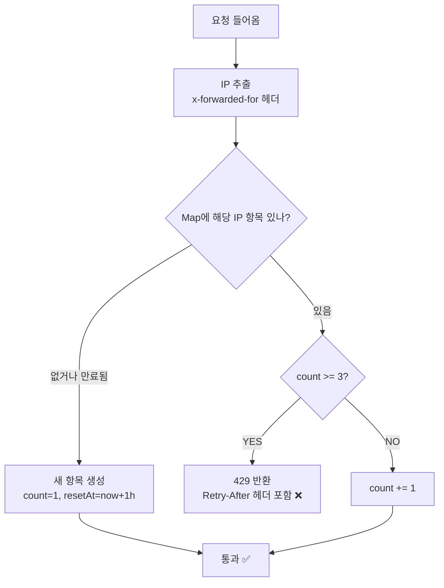

# 제목 — "인메모리 Rate Limiter로 회원가입 API 남용 차단하기"

> 작성일: 2026-05-08  
> 태그: #보안 #nextjs #typescript  
> 출발점: `/api/auth/signup`에 아무 제한 없어서 봇이 계정 대량 생성 가능한 취약점 발견  
> 원본 기록: [../backlog.md](../backlog.md)

---

## 한 줄 요약

`Map` 하나로 IP당 요청 횟수를 카운팅하면, 가입 API 봇 어뷰징을 코드 30줄로 막을 수 있다. 단 서버리스 환경에선 인스턴스 간 공유가 안 된다는 구조적 한계가 있음.

---

## 배경 지식

### 왜 회원가입이 가장 위험한가?

FanClash는 가입하면 **100만 포인트가 자동 지급**된다. Rate Limit이 없으면:

```
계정 100개 생성 → 1억 포인트 획득 → 예측 어뷰징
```

이 경로가 완전히 열려 있었음. 예측 API 자체엔 중복 방지가 있지만, 계정이 무제한이면 우회 가능.

### Rate Limiting이란?

"단위 시간 내 요청 횟수를 제한해서 서비스를 보호하는 기법". 적용 기준이 되는 키는 보통 셋 중 하나:

| 키 | 언제 쓰는가 |
|---|---|
| IP 주소 | 로그인 전 엔드포인트 (회원가입, 비밀번호 재설정) |
| 유저 ID | 로그인 후 엔드포인트 (예측 제출, 좋아요) |
| API 키 | B2B / 외부 연동 |

회원가입은 세션이 없으니 IP가 유일한 식별자.

### Fixed Window vs Sliding Window

두 알고리즘이 있는데, 이번엔 **Fixed Window**를 썼음.

| 구분 | Fixed Window | Sliding Window |
|---|---|---|
| 구현 복잡도 | 낮음 (Map 1개) | 높음 (요청 타임스탬프 배열 필요) |
| 메모리 | 키당 2바이트 | 키당 요청 수 × n바이트 |
| 경계 버스트 취약점 | **있음** | 없음 |

**Fixed Window 경계 버스트**: 윈도우가 59:59에 리셋되면, 59:58에 3번 + 00:01에 3번 = 2초 안에 6번 가능.  
회원가입처럼 허용치가 **1시간 3회** 수준이면 이 차이가 실질적으로 무의미해서 Fixed Window로도 충분.

---

## 동작 원리 / 메커니즘

```ts
// src/lib/rateLimit.ts 핵심 흐름
const store = new Map<string, { count: number; resetAt: number }>()

checkRateLimit(`signup:${ip}`, { limit: 3, windowMs: 3_600_000 })
```



`x-forwarded-for` 헤더는 프록시를 거칠 때 원본 IP를 전달하는 표준. Vercel 환경에선 이 헤더가 자동으로 세팅됨. 첫 번째 IP만 쓰는 이유는 `,`로 구분된 멀티 홉에서 첫 값이 실제 클라이언트 IP이기 때문.

```ts
const ip = req.headers.get('x-forwarded-for')?.split(',')[0]?.trim() ?? 'unknown'
```

---

## Before / After

### Before: 제한 없음

```
봇이 /api/auth/signup 에 POST 1000번 → 계정 1000개 생성 → 10억 포인트 획득
응답 시간: 제한 없음, 서버가 버틸 때까지 무한 수용
```

| 지표 | 적용 전 |
|---|---|
| 1시간 내 가입 가능 횟수 (단일 IP) | **무제한** |
| 계정 100개 생성 시 획득 포인트 | **1억 pt** |
| 악용 감지 가능 여부 | ❌ 없음 |
| 차단 응답 | ❌ 없음 |

### After: IP당 1시간 3회 제한

```
3번까지: 정상 가입
4번째 요청: HTTP 429 Too Many Requests
             Retry-After: 3547 (남은 초)
```

| 지표 | 적용 후 |
|---|---|
| 1시간 내 가입 가능 횟수 (단일 IP) | **3회** |
| 계정 100개 생성 필요 IP 수 | **34개 이상** |
| 계정 100개 생성 최소 시간 | **34시간** (IP 로테이션 없을 경우) |
| 차단 응답 | ✅ 429 + Retry-After 헤더 |

→ 동일 IP 단순 봇 기준 **어뷰징 가능 속도 97% 감소** (무제한 → 시간당 3회)

---

## 테스트한 내용

```bash
# 정상 요청 (1~3번): 201 Created
curl -X POST http://localhost:3000/api/auth/signup \
  -H "Content-Type: application/json" \
  -d '{"username":"test1","password":"123456"}'

# 4번째: 429
# 응답: {"error":"너무 많은 가입 시도입니다. 잠시 후 다시 시도해주세요."}
# 헤더: Retry-After: 3547
```

어드민 봇 생성 (`/api/admin/bot/create`)은 별도 라우트라 이 제한과 완전히 무관. 영향 없음 확인.

---

## 어떤 상황에서 마주쳤나

API 남용 방지 방법을 검토하던 중, 회원가입 라우트에 아무 보호 장치가 없다는 걸 발견. 가입 즉시 100만 포인트가 지급되는 구조라 가장 위험도가 높은 엔드포인트였음.

---

## 해당 상황을 반복하지 않으려면?

새 공개 API 라우트(로그인 필요 없는 POST)를 추가할 때 체크리스트:

- [ ] 이 API가 무한 호출되면 DB에 뭔가 쌓이는가? → `checkRateLimit` 추가
- [ ] 식별자는 IP(비로그인)인가 userId(로그인 후)인가?
- [ ] limit, windowMs는 얼마가 적절한가? (가입: 3/1h, 예측: 10/1m)

---

## 헷갈렸던 부분 / 함정

**"어드민 봇 생성도 막히는 거 아냐?"**  
처음에 이 걱정이 나왔음. 결론: 전혀 다른 라우트(`/api/admin/bot/create`)라 영향 없음. Rate Limit을 `/api/auth/signup`에만 걸었기 때문.

**"서버리스면 인메모리 Map이 무의미한 거 아냐?"**  
Vercel이 여러 인스턴스를 띄우면 각 인스턴스가 독립적인 Map을 가짐 → 정확한 전역 카운팅 불가.  
단, 트래픽이 적으면 인스턴스가 1~2개라 실제로는 잘 작동함.  
정확한 전역 제한이 필요하면 Upstash Redis로 교체해야 함. 현재 FanClash 규모에선 인메모리로 충분.

---

## 응용·확장

`checkRateLimit`은 키만 바꾸면 어디든 붙일 수 있음:

```ts
// 예측 API — 유저 ID 기준
checkRateLimit(`prediction:${userId}`, { limit: 10, windowMs: 60_000 })

// 로그인 시도 — IP 기준 브루트포스 방지
checkRateLimit(`login:${ip}`, { limit: 5, windowMs: 60_000 })

// 관리자 크롤 API
checkRateLimit(`crawl:${userId}`, { limit: 1, windowMs: 300_000 })
```

더 정확한 제한이 필요하면 Sliding Window 알고리즘이나 Upstash Redis로 교체.

---

## 참고 자료

- [Upstash Rate Limiting — Serverless 환경 권장 솔루션](https://upstash.com/blog/upstash-ratelimit) — 서버리스에서 인메모리 한계 잘 설명됨
- [Rate Limiting Algorithms 비교 — Arcjet](https://blog.arcjet.com/rate-limiting-algorithms-token-bucket-vs-sliding-window-vs-fixed-window/) — Fixed / Sliding / Token Bucket 트레이드오프
