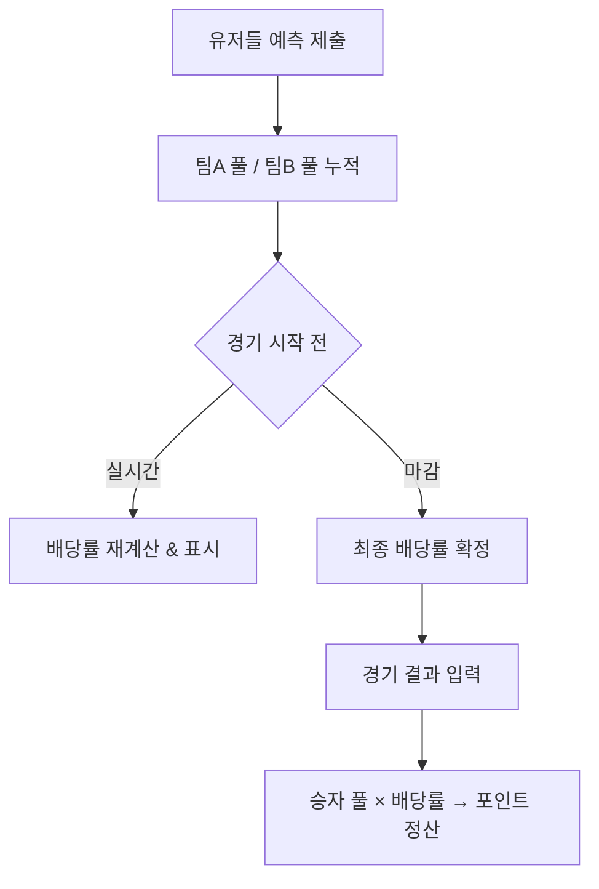

# 파리뮤추얼 배당률 계산 — 유저 예측 분포가 배당률을 결정하는 원리

> 작성일: 2026-05-07
> 태그: #개념정리 #게임설계 #배당률 #예측
> 출발점: 경기 예측 게임의 배당률 방식을 파리뮤추얼로 선택한 이유와 계산 구조 이해
> 원본 기록: [../06-dev-log.md](../06-dev-log.md) — "주요 결정 & 트레이드오프" 표

## 한 줄 요약

파리뮤추얼은 내가 얼마나 맞힌다가 아니라 "다른 유저들이 어디에 얼마나 몰렸는가"가 배당률을 결정한다 — 동조하면 수익이 줄고, 역행하면 수익이 커진다.

---

## 배경 지식

### 고정 배당(Fixed Odds)이란

북메이커(운영자)가 경기 전에 배당률을 미리 확정한다.

```
T1 승: 1.40배  /  GEN 승: 2.80배
```

- 예측자는 배팅 시점에 이미 "이기면 얼마 받는다"를 안다
- 운영자가 리스크를 전부 진다 → 이길 팀에 돈이 몰리면 운영자 손실
- 그래서 북메이커는 실시간으로 배당률을 수동 조정하거나, 언더라이팅 마진을 두꺼이 쌓는다

### 파리뮤추얼(Pari-Mutuel)이란

프랑스어 **pari mutuel** = "상호 베팅(mutual wager)". 1867년 프랑스 경마에서 Joseph Oller가 고안.

운영자와 베팅하는 게 아니라 **참여자들끼리 풀을 형성하고 나눠 갖는** 구조.

- 운영자는 하우스 피(수수료)만 가져가고 나머지는 풀에 남김
- 배당률은 경기 시작 전까지 계속 변한다
- 최종 배당률은 **배팅 마감 후 풀 분포가 확정돼야** 계산 가능

경마·복권·일부 스포츠 예측 게임이 이 방식을 씀.

---

## 동작 원리 / 메커니즘

### 수식

```
배당률 = (전체 풀 × (1 - 하우스 피)) / 승자 풀
```

**이 프로젝트의 구현** ([src/lib/odds.ts](../../src/lib/odds.ts)):

```ts
export const HOUSE_FEE = 0.05        // 5% 수수료
export const MIN_ODDS = 1.05         // 최소 배당 (원금 손실 방지)

export function calcOdds(winnerPool: number, loserPool: number): number {
  if (winnerPool <= 0) return MIN_ODDS
  const totalPool = winnerPool + loserPool
  const odds = (totalPool * (1 - HOUSE_FEE)) / winnerPool
  return Math.max(MIN_ODDS, Math.round(odds * 100) / 100)
}
```

`winnerPool`은 "내가 예측한 팀에 몰린 총 포인트". `loserPool`은 반대편.

### 단계별 흐름



### 수치 예시

상황: T1 vs GEN, 총 10,000pt 베팅

| 시나리오 | T1 풀 | GEN 풀 | T1 배당 | GEN 배당 |
|---|---|---|---|---|
| 50:50 균등 | 5,000 | 5,000 | 1.90배 | 1.90배 |
| T1 쏠림 (80%) | 8,000 | 2,000 | 1.19배 | 4.75배 |
| T1 쏠림 (95%) | 9,500 | 500 | **1.05배** | **19.0배** |

계산 검증 (T1 80% 쏠림):
- 전체 풀 10,000 × 0.95 = 9,500 (수수료 5% 제외)
- T1 배당 = 9,500 / 8,000 = **1.1875 → 1.19배**
- GEN 배당 = 9,500 / 2,000 = **4.75배**

T1에 몰릴수록 T1 배당은 바닥을 향하고, GEN 배당은 천장을 향한다.

### 하우스 피의 역할

수수료 5% = `(winnerPool + loserPool) × 0.05` 가 운영자 수익.

수수료 없이 50:50 이면 배당 = 2.0배. 수수료 있으면 1.90배.
→ **"풀 전체에서 5%를 떼고 나머지를 나눠 갖는다"** 가 핵심.

풀이 어떻게 쏠리든 운영자 수익은 항상 **총 베팅액의 5%**로 고정. 고정 배당처럼 운영자가 이길 팀을 예측할 필요 없음.

### MIN_ODDS = 1.05의 의미

승자 풀이 전체 풀보다 커질 수 없으므로 이론상 배당 하한은 `(1 - 하우스 피) = 0.95`. 즉 원금 손실도 가능.

`MIN_ODDS = 1.05`를 두면 **어떤 상황에서도 5% 이익은 보장**. 극단적 쏠림(한 팀에 99%)이 와도 원금 손실 없음.

---

## 어떤 상황에서 마주쳤나

`docs/06-dev-log.md` Phase 1 (2026-04-23~04-27)에 "배당률 방식: 파리뮤추얼 / 이유: 유저들의 예측 분포가 배당률에 반영됨"이 결정으로 기록돼 있다.

봇 유저([2026-05-07-봇-유저를-처음부터-넣은-이유.md](./2026-05-07-봇-유저를-처음부터-넣은-이유.md))를 Phase 1부터 넣은 이유가 여기에 직결된다 — 파리뮤추얼은 **풀이 비어있으면 배당 계산이 불가**(또는 MIN_ODDS 고정). 봇이 양쪽에 베팅해서 풀을 채워야 의미있는 배당이 생긴다.

---

## 해당 상황을 반복하지 않으려면 어떤 조치를 취해야 하나?

1. **풀 크기 모니터링**: `winnerPool`이 0인 상태로 경기가 시작되면 MIN_ODDS 고정. 봇 베팅이 정상 동작하는지 확인 필요.
2. **배당 상한 없음 주의**: GEN 배당 19배처럼 이상 수치가 나올 수 있다. UX에서 상한을 표시하거나, 유저에게 "현재 배당률은 변동됩니다" 고지.
3. **정산 시점의 배당**: 경기 시작 직전 확정된 배당률로 정산해야 함. 실시간 변동 배당을 정산에 쓰면 race condition 발생 가능.

---

## 헷갈렸던 부분 / 함정

- **"파리뮤추얼은 배당이 낮다"고 생각했는데** — 틀림. 역방향(소수파)에 베팅하면 고정 배당보다 훨씬 높은 배당이 나올 수 있다. 낮은 건 다수파 배당.

- **배당이 경기 전날과 달라지는 이유를 처음엔 몰랐음** — 파리뮤추얼은 정의상 최종 배당이 "마감 후"에만 확정. 실시간으로 보이는 배당은 전부 **추정치**다.

- **하우스 피와 배당의 관계**: `HOUSE_FEE = 0.05`는 전체 풀 대비 수수료율이지, 각 배당에서 5%를 빼는 게 아님. `odds = totalPool × 0.95 / winnerPool`. 개별 배당에서 직접 차감하는 방식이 아니다.

- **고정 배당의 "리스크"를 과소평가하기 쉬움**: 고정 배당은 확실성을 제공하지만 운영자가 언더라이팅 손실 위험을 진다. 팬 예측 게임처럼 운영자가 리스크 관리 전문성이 없는 경우 파리뮤추얼이 안전하다.

---

## 응용·확장

- **배당 표시 UX**: 실시간 변동 배당을 보여줄 때 "현재 배당 (변동 가능)" 레이블을 붙이면 유저 혼선 줄어듦
- **복수 선택지**: 파리뮤추얼은 2-way(팀A/B)에서 3-way(팀A/무/팀B)로도 자연 확장 가능. `calcOdds`에 풀 배열을 넘기도록 수정하면 됨
- **Prediction Market**: 파리뮤추얼의 확장 개념. 배당률 자체가 시장의 "확률 추정치"로 해석됨 (효율적 시장 가설)

---

## 참고 자료

- [Parimutuel betting — Wikipedia](https://en.wikipedia.org/wiki/Parimutuel_betting) — 역사·수식 모두 있음
- [Pari-Mutuel vs Fixed-Odds — TwinSpires](https://www.twinspires.com/edge/racing/pari-mutuel-vs-fixed-odds-wagering-how-are-they-different/) — 두 방식 비교 명확
- [Parimutuel vs Fixed-Odds Markets (학술 논문)](https://web.econ.ku.dk/sorensen/papers/pvfom.pdf) — Ottaviani & Sørensen, 두 시장의 정보 집약 효율 비교
